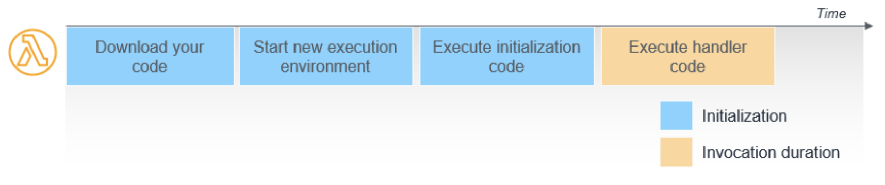

## AWS Lambda 동작 원리

Lambda 핸들러는 크게 4단계를 거쳐 실행된다:

1. 코드를 다운로드 받는다.
   - 주로 S3에서 아티팩트를 다운받는다.
2. 새로운 execution environment를 구성한다.
3. 코드 중 <u>initialization code</u>를 실행한다.
   - 핸들러 바깥에 정의된 전역 코드를 실행하는 단계이다.
4. 코드 중 <u>execution handler code</u>를 실행한다.
   - 핸들러 내부에 정의된 execution 함수를 실행하는 단계.

이 중 1-3번의 과정을 초기화(initialization)이라고 하며, 보다 익숙한 말로는 **cold start**라고 부른다. 그리고 마지막 4번과정을 **warm start**라고 부른다.

> ##### Cold Start와 Warm Start
>
> cold start
>
> - 람다를 호출할 때 배포 패키지의 크기과 코드 실행시간 및 코드의 초기화 시간에 따라 새 실행환경으로 호출을 라우팅할 때 발생하는 지연시간
>
> warm start
>
> - 이미 실행 준비가 완료된 상태. 바로 코드를 실행한다.

지속적으로 lambda가 호출된다면, 실행환경인 람다 컨테이너는 유지되고 cold start 단계는 스킵된다. 바로 warm start하게 되는 것. 

Lambda 컨테이너를 초기화하고 다시 cold start부터 시작하게 되는 주기는 <u>5분</u>이다.

##### Lambda는 EC2 위에서 돌아간다. 

모든 클라우드 컴퓨팅 유닛의 기초는 EC2이며, 서버리스도 이 위에 얹혀진 파생상품일 뿐···

##### initialization code의 사용

오래걸리는 코드, 혹은 후속 lambda가 모두 공유하는 코드는 전역으로 빼두는 것이 좋다. 

예를들어 DB Connection을 생성하는 코드같은 경우는, 매 handler 호출마다 실행하는 것보다는 아예 전역에서 한 번 초기화를 해두고 이를 다른 후속 lambda warm start가 공유하도록 하는 것이 당연히 효과적이다.

## Lambda의 동시성 옵션

동시성이란 특정 시각에 함수가 제공하는 요청의 수이다. 함수가 호출되면 Lambda는 함수의 인스턴스를 할당하여 이벤트를 처리하고 실행을 마치면 다른 요청을 처리할 수 있다. 만약 <u>요청을 처리하는 와중에 함수가 호출되면 다른 인스턴스가 할당되어 함수의 동시성이 증가</u>한다.

이런 느낌··· lambda에 대한 1번 호출 처리 도중에 다른 요청이 들어오면, 새로운 인스턴스가 할당되어 cold start부터 시작한다. 

- 이 경우는 동시성을 2개까지 활용한 셈이다.

> Lambda는 **기본적으로 1000개의 concurrency 제한**이 있다. 즉, 동시에 Lambda 함수를 위한 실행 환경이 1000개까지 생성되어 병렬적으로 실행될 수 있다는 말이다. 
>
> 또한, 최대 동시성을 개별 Lambda에 지정할 수 있다.

##### Unreserved Concurrency (예약되지 않은 동시성)

기본 옵션. 디폴트로 하나의 람다에 대해 10개의 동시성을 보장한다.

##### Reserved Concurrency (예약된 동시성)

하나의 Lambda에 대해 최대 동시성 수를 설정할 수 있다. reserved concurrency 옵션에는 별다른 요금이 부과되지 않는다.

##### Provisioned Concurrency (프로비저닝된 동시성)

항상 warm start 단계에서 실행할 수 있도록 요청된 동시성 수만큼의 실행환경 (container)를 초기화해놓는다. 

- 즉, 정해진 시간만큼 N개의 EC2 인스턴스를 활성화해놓는다고 생각하면 된다··· cold start가 이미 끝난 실행환경을 N개 만큼 준비해두는 것이니.

 

## cold start부터 다시 시작하는 조건

5분이 지났거나, 실행 도중에 다른 요청이 오는 경우 (동시성)

##### 런타임 별 cold start 시간이 다르다.

python, go, node가 가장 짧았다. 

### cold start 문제 해결하기

##### Lambda 메모리를 늘려 해결하기

인스턴스 사양 자체가 올라가 처리 속도 자체가 빨라진다. 현업에서는 cold start 문제가 생겼을 때, 메모리를 올리는 것으로 대응해서 해결된 사례가 꽤 나오는 편이라고 한다. 

Lambda의 과금 메커니즘은 [메모리 * 요청 처리 시간 * 요청 수] 이므로 메모리를 늘려 요청 시간이 유의미하게 줄어든다면, 오히려 최종 비용이 떨어질 수도 있다. Lambda는 메모리를 늘릴 수록 CPU도 같이 성능이 향상되는 구조를 갖고 있기 때문.

##### 5분마다 재호출하기

Lambda는 한 번 호출되고, 다음 호출이 <u>5분 이내</u>인 경우 후속 호출에 Lambda Container를 <u>재사용</u>하는 특징을 가지고 있다.

- 즉, Lambda를 5분마다 강제로 trigger되도록 설정하면 cold start 문제를 해결할 수 있다!

수동으로 5분 주기 trigger를 돌리는 방식은 다음과 같이 구현할 수 있겠다:

- CloudWatch를 통해 Lambda를 5분에 한 번씩 지속적으로 호출한다.
- Route53에서 Health Check를 Lambda가 바라보고 있는 API Gateway Endpoint로 5분마다 보낸다.

##### provisioned concurrency 옵션

### Lambda의 제약사항 

##### Lambda의 최대 실행시간은 15분이다.

함수의 실행시간이 15분을 초과하면 Lambda는 함수 실행을 중지하고 exception을 던진다. 장시간 돌아가는 CPU intensive한 작업이나, 하나의 batch 프로세스를 하나의 lambda에서 한꺼번에 돌리는 일은 피하자.

- 분할 가능한 task로 나누어 실행시키도록 하자.

##### 환경 변수의 최대 크기가 4KB이다.

환경 변수를 사용해 함수에 configuration 정보를 제공할 수 있다. 아주 복잡한 configuration 정보의 경우 4KB를 초과할 수 있기 때문에, 이와 같은 경우는 다른 데이터 소스에서 환경 변수를 가져와야 할 수도 있다.

##### 메모리는 128MB ~ 3008MB를 할당 가능하다.

메모리를 늘릴수록 함수가 더 빠르게 실행된다. 하지만 그만큼 메모리 사용 비용도 늘어나게 된다. 

Lambda의 과금 메커니즘은 [메모리 * 요청 처리 시간 * 요청 수] 이므로 메모리를 늘려 요청 시간이 유의미하게 줄어든다면, 오히려 최종 비용이 떨어질 수도 있다. 

##### 로깅 및 디버깅이 제한적이다.

CloudWatch로 제공되는 로그 그룹을 제공하긴하지만, 이는 프로덕션 수준의 로깅에는 미치지 못하며 종종 충분하지 않다.

또한 lambda 함수 별로 로그 그룹이 생성되기 때문에 통합적으로 판단하기 힘들때도 있다.

https://hashdork.com/ko/aws-lambda-interview/

##### MongoDB와의 Connection 문제

Client를 함수 바깥에서 정의할 것. container가 warming된 상태라면, 다른 함수 handler 호출에서 이미 이어진 connection을 이용할 수 있다.

https://blog.devkr.info/posts/211103_ec2_to_serverless/

각 lambda 인스턴스들이 Mongo와 커넥션을 맺게 됨. max connection pool size를 넘어버린다면? 

AWS의 RDS proxy는 db 연결 전용 proxy 함수를 생성하여 이를 경유하도록 문제를 해결했다. db proxy를 이용해 이미 연결되어있는 db 세션을 재활용할 수 있음. 

##### Provisioned Concurrency 옵션 가격 계산에 대해서

https://aws.amazon.com/ko/lambda/pricing/

##### 람다 실행환경에 대해서

https://docs.aws.amazon.com/lambda/latest/operatorguide/execution-environments.html