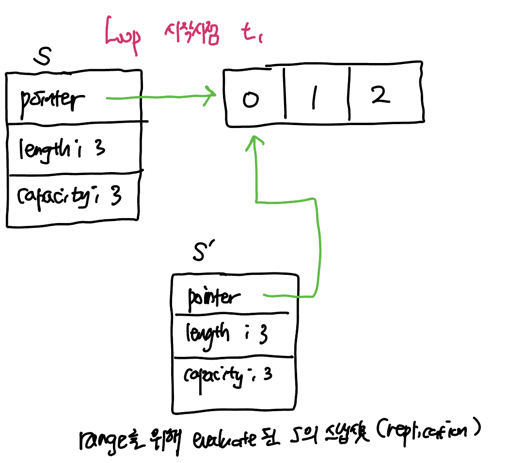
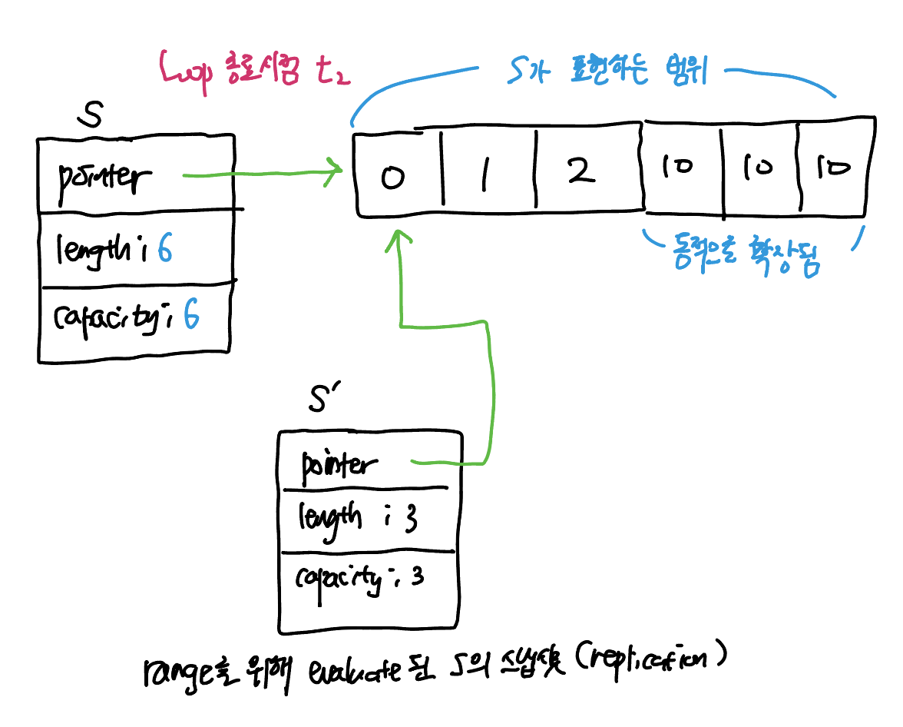

Golang의 looping은 다른 언어와 생김새는 비슷하지만 큰 차이가 있다. 가령 Golang에는 `do`나 `while`이 없고 general하게 looping을 `for`를 이용해서만 처리한다. Golang의 iteration과, 특히 `range`에 집중해서 araboza.

`range`는 다음과 같은 data type에 대해서 iterate 할 수 있다.

- string
- array
- slice
- map
- channel (receiving만 가능)

기본적인 사용법을 복습해보자.

``` go 
// 1. index와 element 모두 이용하고 싶은 경우
for i, v := range arr { /** */ }

// 2. element만 이용하고 싶은 경우
for _, v := range arr { /** */ }

// 3. index만 이용하고 싶은 경우. element를 생략해도 된다.
for i range arr { /** */ }

// 4. arr의 length만큼 loop하는 것이 목적인 경우
for range arr { /** */ }
```

## Range Loop은 시작 전에 단 한번 evaluate된다

`range` loop은 loop을 *시작하기 전에 '딱 한번' evaluate*된다. 무슨 의미일까? 여기서 evaluate이란, `range`의 대상이 임시 변수에 복제된 뒤, 해당 복제된 대상에 대해서 iteration을 실행한다는 뜻이다. 

예를들어, 다음과 같이 slice를 `range`를 이용해 iterate하면서 내부에서는 slice의 원소를 append한다면 loop은 끝날 수 있을까? 

``` go 
s := []int{ 1, 2, 3 }
for range s {
  s = append(s, 10)
}
```

해당 `range` loop은 기존 `s`의 length인 3번만큼 loop을 돌고 종료된다. 그 사이에 `s`에 원소가 추가되어 length가 변하는 것은 loop과는 무관하다. `range`를 시작할 때 복제본을 evaluate하고, 해당 evaluation에 대해서 순회하는 것이기 때문이다. 그림으로 보면 다음과 같다.

Loop을 시작할 시점:



Loop을 종료할 시점:



`range`와는 반대로, for loop을 traditional한 방식으로 작성할 경우 for loop을 지속할 것인지 평가하는 조건식은 매 loop마다 새롭게 평가된다. 따라서 다음과 같은 구문은 무한 loop에 빠지게 된다.

``` go 
s := []int{ 0, 1, 2 }
for i := 0; i < len(s); i ++ {
  s = append(s, 10)	
}
// i < len(s) 조건식은 매 loop마다 새롭게 평가된다.
```


## Golang에서 모든 대입연산은 복제로 처리한다

Golang에서 모든 대입 연산(`=`  혹은 `:=`)은 값에 의한 할당(복제)로 처리한다. primitive type(`int`, `float`, `bool`, `string` 등)의 경우 원본 값 자체가 대상 변수에 새롭게 복사되고 (stack 영역), reference type의 경우 해당 data를 가리키는 참조가 복제된다. 

> ##### composite type (struct)의 경우엔? 
>
> `struct`로 생성한 composite type의 경우엔 일단 1차적으로는 `struct` 자체를 복사한다. 즉, `:=`로 생성한 새로운 구조체는 기존 구조체와는 연관이 없는 <u>값 자체의 복제본</u>이다.
>
> 하지만 해당 대입 연산에 따라서 기존 데이터와의 참조관계가 완전히 끊기는가? 에 대한 답은 *"경우에 따라 다르다"* 이다. 기존 데이터와의 참조관계가 끊길 수도 있고, 아닐 수도 있다. struct의 field가 전부 primitive type일 경우 완전히 끊기지만, field에 refence type을 포함할 경우엔 해당 field는 '참조값'을 복사해두므로 완전히 참조관계가 끊겼다고 볼 수는 없다.
>
> 동일한 원리로 구조체를 function의 parameter로 전달할 때 pass by value로 전달되는 것이고, 대상 instance의 field를 mutate하는 메서드를 선언할 때 `func (m *material)`과 같이 pointer를 전달하는 것이다. 
>
> 아무튼,,, struct의 복제가 과연 원본과의 참조관계를 완전히 끊어낼 것인가? 에 대한 판단엔 알잘딱깔센이 필요하다. 

다음 `range` loop의 예시를 확인해보자:

``` go 
type account struct {
  balance float32
}

accounts := []account{
  { balance: 100. },
  { balance: 200. },
  { balance: 300. },
}
for _, a:= range accounts {
  a.balance += 1000
}
fmt.Println(accounts) 
```

`accounts`의 balance 값은 적절하게 mutate 되었을까? No. 그대로 각각 `100.`, `200.`, `300.`이다. 왜냐하면 `range` loop을 통해서 특정 iteration에 대해 `a`에 전달된 구조체 instance는 `accounts ` 내부의 원소를 가리키고 있는 참조가 아니라 새롭게 복제된 값 그 자체이기 때문이다. 

이와 같은 잘못된 접근을 방지하기 위해서는 2가지 방법이 있다. 

1. slice의 원소에 접근할 때 index를 이용해 접근한다.

   ``` go 
   for i := range accounts {
     accounts[i].balance += 1000
   }
   ```

2. slice type을 pointer로 업데이트해서 loop한다.

   ``` go
   accounts := []*account{
     { balance: 100. },
     { balance: 200. },
     { balance: 300. },
   }
   for _, a := range accounts {
     a.balance += 1000
   }
   ```

   이렇게 하면 배열 안에 담기는 것은 구조체가 아니라 해당 구조체를 참조하는 pointer가 담기므로, `:=`을 통해 복사된 값 역시 참조값이기 때문에 올바르게 접근할 수 있다.

두번째 방식엔 두 가지 큰 단점이 있다. 1) loop을 위해서 원본 slice의 type을 pointer로 업데이트 해야한다.  경우에 따라 추후에 굉장히 불편한 상황이 생길수도 있다. 2) 아울러, slice를 pointer에 대해서 반복하면 cpu cache의 cache locality를 달성하기 어렵기 때문에 배열의 효율성을 누리기 어려워질 수 있다. 

따라서 원래부터 pointer의 배열을 의도적으로 설계할 것이 아니라면, 첫번째 방식처럼 index를 통해 접근하는 것이 바람직하다.

