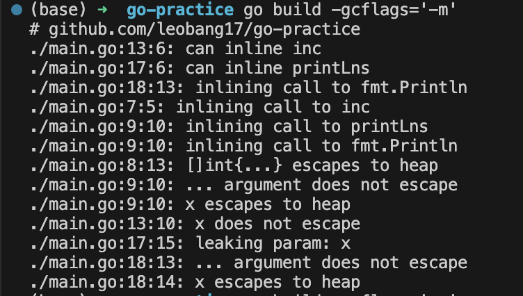

Go의 변수는 Go 프로세스의 어느 memory section에 저장될 것인가? programming context에서의 memory allocation에 대해서 먼저 알아보자. 

## Stack과 Heap 

운영체제 시간에 배웠던 그림이 또 나올 시간이다. stack은 thread끼리 공유하고, heap은 프로세스 레벨에서 공유하고··· 등등.! 간단히 복습해보자.

**Stack**

- Stack은 thread끼리 (golang의 경우 lightweight thread인 goroutine이 되겠다.) 독립적인 공간을 보장받는 메모리 영역이다. 
- stack은 `stack frame`이라는 블록 형태가 LIFO style로 쌓여있는 모습인데, Stack 영역과 관련된 layout은 **프로그램이 compile되는 시점**에 결정된다. 물론 stack memory 영역에 **allocate 되는 것은 runtime**에 수행된다.

- 함수가 return할 경우 stack frame 블록은 메모리 영역에서 해제되어 *unused* 상태가 되고, 다음 호출될 시점을 기다리게 된다. 

**Heap**

- heap은 stack과 달리 reserved되는 방식에 순서가 존재하지 않는다. 따라서 heap allocation은 프로그램에 의해 manual하게 수행되어야 한다. (개발자가 할 필요는 없다. 각 언어의 runtime이 GC를 지원하는 경우가 대부분이기 때문에.)
- heap memory allocation은 **run time**에 수행된다. 

당연히 **Stack 메모리 영역이 더 성능이 좋다**. 메모리 공간이 항상 contiguous하기 때문이다. (물리적으로는 아닐지라도, 적어도 virtual memory 매핑된 상태에서는) LIFO 형태로 관리되기 때문에 각 stack frame의 메모리 할당, 해제에 대해서 골머리 썩일 일도 없다. head stack frame에 pointer만 유지하면 되기 때문이다. 특히 Stack의 allocation/deallocation은 *CPU 명령어 2개*로 끝난다.

Heap의 경우엔 언어의 runtime의 memory allocation/deallocation에 대한 오버헤드가 발생한다. 해당 언어가 GC를 지원한다면 runtime의 오버헤드만 발생하겠지만, 개발자가 manual하게 메모리 관리를 해줘야 하는 언어라면 잘못 코딩할 경우 오버헤드보다 끔찍한 메모리 누수가 일어날 것이다.


## What is Escape Analysis

Go에서는 다른 programming language처럼 변수가 stack 메모리 혹은 heap 메모리에 위치할 수 있다. 위에서 말했다시피 stack allocation이 heap allocation 보다 빠르고 효율적이기 때문에, 변수를 메모리 어느 영역에 할당할 것인가는 퍼포먼스에 영향을 미치는 의사결정이다. 

Go는 **Escape Analysis**를 통해 compile time에 *각 변수가 함수를 escape하는지* 판단하여 해당 변수를 stack 영역에 할당할지, heap 영역에 할당할지를 결정한다. 

메커니즘은 단순하다. escape한다고 판단한다면 heap 영역에, escape하지 않는다고 판단하면 stack 영역에 할당하게 된다.

물론 Case by Case를 따지자면 끝도 없겠지만 일반적으로 escape하는 상황은 메모리에서 stack이 어떻게 관리되는지를 생각해보면 직관적으로 유추할 수 있다. *변수가 함수 범위를 벗어나 다른 곳에서 참조될 수 있다면*, 해당 변수는 escape한다고 판단한다. 반대로 *변수가 함수 내에서만 존재하고 함수의 실행이 끝남과 동시에 더 이상 필요하지 않다면*, escape하지 않는다고 판단한다. 

가장 일반적인 상황들을 나열하자면 다음과 같겠다:

- 함수가 pointer를 반환하는 경우 (stack frame이 pop되었음에도 해당 변수에 참조해야한다. escape!)
- closure를 이용하는 경우 (closure 함수가 참조하는 변수는 이미 반환된 함수 레벨에서 선언되어있다. escape)

코드의 예시로 확인해보자. 

```go
func printInt(x int) {
 fmt.Println(x)
}

func main() {
 x := 42
 printInt(x)
}
```

- `main` 함수는 `printInt`함수를 호출하는데, 이 때 argument를 pass by value로 전달한다. 이 경우 `x`은 stack 영역을 벗어나지 않는다.


``` go 
func main() {
  n := answer()
  fmt.Println
}

func answer() *int {
  x := 42
  return &x
}
```

- `answer`의 function level에서 선언된 변수인 x가, pointer를 반환함으로서 `answer`가 return되어 stack에서 제거된 후에도 `main` 함수에 의해 참조되고 있다. 이 경우 명백한 escape.

> 아래에 설명하겠지만, 사실 위의 *예시는 변수를 모두 escape한다고 판단*한다. **print로 출력하는 행위에 전달된 변수는 escape**한다고 Go compiler가 판단하기 때문이다. 그러니 너무 엄밀히 생각하지말고, 출력이 아니라 다른 일반적인 예시를 생각한다고 치자.

#### Pass by Reference, 혹은 pointer를 사용하면 모두 escape하는가? 

답은 아니오입니다.

``` go 
func main() {
	k := &[]int { 1, 2, 3}
	printLns(k)
}

func justsum(x *[]int) {
	sum := 0
	for _, e := range *x {
		sum += e 
	}
}
```

`main` 함수는 slices를 생성하고 해당 slices의 pointer를 반환한다. 그냥 slice를 전달해도 pass by reference이지만, 일부러 pointer 타입을 전달해봤다. 

slice `k` 가 `justsum`함수에게 reference로 전달되어 뭔가 *escape*하는 것 같지만, `justsum`함수가 stack 메모리에 올라오고, 해제되는 모든 lifecycle 동안에도 `k`가 참조되는 원래 공간인 `main` 함수의 stack frame은 stack memory위에 올라와 있는 상태이기 때문에 Go compilier는 해당 상황을 escape하지 않는다고 판단한다. 


## 직접 눈으로 확인해보자

go build 커맨드의 gcflag를 -m으로 설정함으로서 Go compiler가 각 변수를 escape한다고 판단하는지를 눈으로 확인할 수 있다.

```
go build -gcflags='-m'
```



Go 컴파일러가 각 line을 확인하며 변수가 escape하는 경우가 있는지 판단한다.

정확히 왜 인지는 Println 메서드를 자세히 확인해봐야 알겠지만, 아무튼 <u>출력 함수에 인자를 넘길 경우 항상 escape 한다고 판단</u>한다. 아까 말했듯이, Go Compiler는 변수가 전달되는 경로를 모두 확인하고, 해당 변수가 한 번이라도 escaping하는 경우가 있다고 판단하면 해당 변수를 heap으로 escape 시킨다. 

따라서 어디선가 print문을 실행하고 있다면, stack allocation만으로도 충분한 변수가 heap에 할당되고 있을 수도 있다··· 주의할 것

