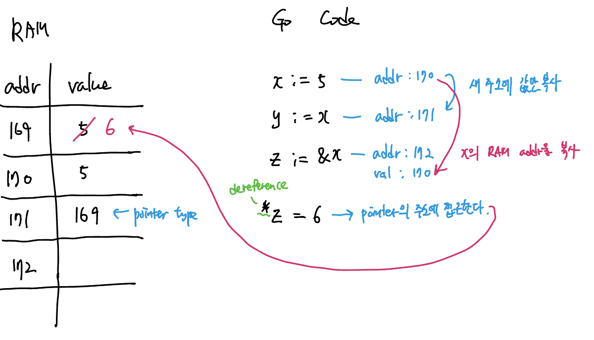

C언어를 처음 배운 이후로 pointer는 정말 오랜만에 다뤄본다. variable은 값이 저장된 RAM 메모리를 나타내는 *'named location'*이다. 그리고 variable의 일반적인 primitive type들은 RAM 메모리 위치에 저장된 "값"을 나타낸다. 이에 반해 pointer type은···

## Pointer as a variable

pointer는 변수의 *memory address* 자체를 저장하는 변수 type이다. 이말인즉, pointer는 값 자체를 나타내는 것이 아니라 *값이 위치한 addr을 가리키는 값*인 것이다.

다른 language와 비슷하게 `*`을 이용해 pointer 변수 타입을 선언할 수 있다.

``` go 
var p *int
```

> pointer 타입의 *zero value*는 `nil`이다.

`&` operator는 뒤에 오는 변수의 pointer(해당 변수의 address value 그 자체)를 반환하는 연산자이다.

``` go 
myString := "hello"
myStringPtr := &myString
```

`*`은 pointer type을 나타낼 때 뿐아니라, dereference를 위해서도 이용된다. `*`를 이용해 pointer type을 dereferencing하게되면, 해당 pointer가 가리키는 주소공간의 값에 접근할 수 있게 된다.

아래의 간단한 예시를 통해 확인하자.



pointer를 이용하는 이유는 다양하지만, function parameter로 값을 전달할 때, pass by value를 pass by reference로 확장하고자 할 때 가장 많이 이용한다.


## Nil Pointers 

만약 pointer가 초기화되어있지 않는 상태에서 `*`를 이용해 dereference한다면 process는 runtime error (panic)를 발생시키고 비정상 종료될 것이다. 어떤 상황에서든 pointer가 `nil` 상태가 아님을 확실히 하고 작업을 수행하도록 주의하자.


## Pointer Receivers 

struct의 method를 정의할 때, method의 receiver type이 pointer로 제공될 수 있다. 이 경우엔 해당 struct의 instance에 대한 memory 주소가 제공되는 것이다.

Go에서 function argument는 일반적으로 *pass by value*이고, 이는 struct의 경우에도 해당된다. 따라서 method에 전달되는 receiver가 struct 그 자체일 경우, 이는 복사된 struct의 value만을 전달한다. 그래서 struct를 전달할 경우 다른 programming language처럼 (`this` 를 이용하는 것과 같이) 해당 인스턴스의 field를 수정하는 작업을 할 수 없다.

**메서드의 동작이 일반적으로 receiver의 원본을 mutate 해야하는 요구사항이 많기 때문에, pointer receiver는 value receiver보다 보다 흔한 사례**이다.

pass by value 대신 pass by reference로 receiver를 정의하는 과정을 코드를 통해 확인하자.

``` go 
type car struct {
	number int
	name   string
}

func (c car) cannot_mutate(number int, name string) {
  // 전달되는 c는 복사된 value이기 때문에, 원본 instance에 영향을 주지 않는다.
	c.number = number
	c.name = name
}

func (c *car) can_mutate(number int, name string) {
  // 전달된 c는 원본의 주소를 가리키는 pointer이므로, 원본 instance를 mutete할 수 있다.
	c.number = number
	c.name = name
}

func main() {
	fmt.Println("Hello, 世界")
	// 변수에 할당
	newCar := car{
		name:   "leo",
		number: 13,
	}
	newCar.cannot_mutate(11, "bill")
  fmt.Println(newCar)									// { "leo", 13 } > 변경  x
	newCar.can_mutate(100, "Jason")	
  fmt.Println(newCar)									// { "Jason", 100 } > 변경 o

}
```

