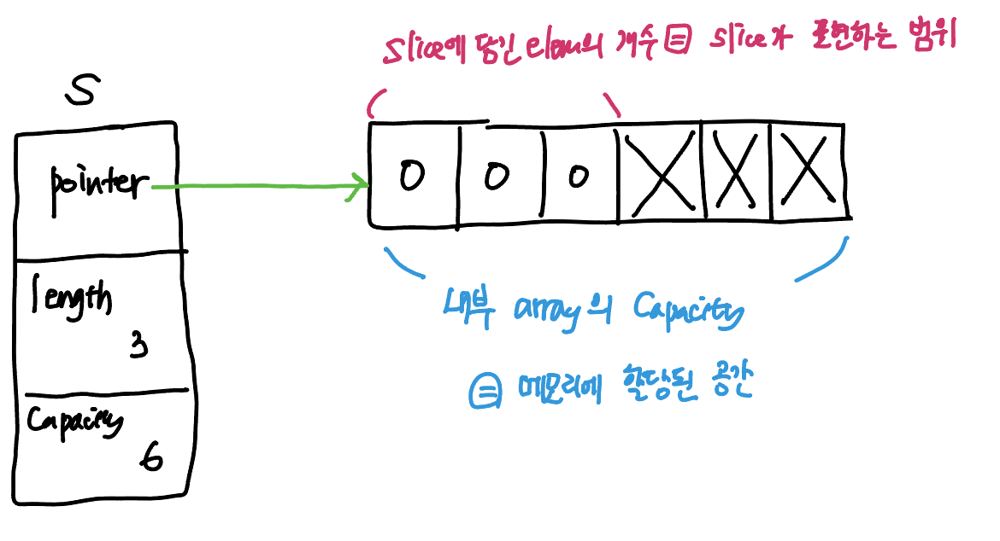
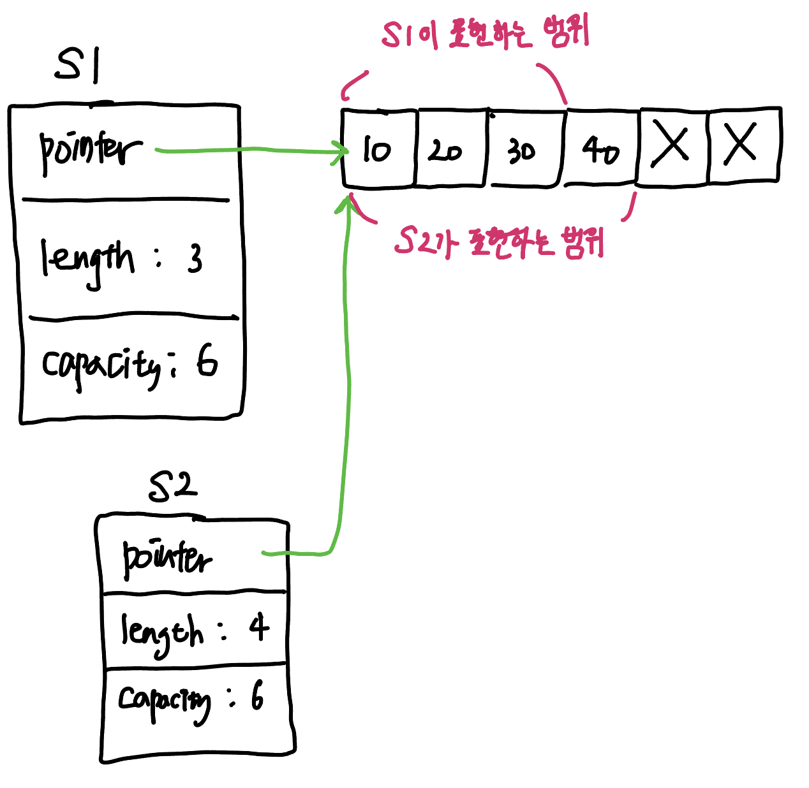
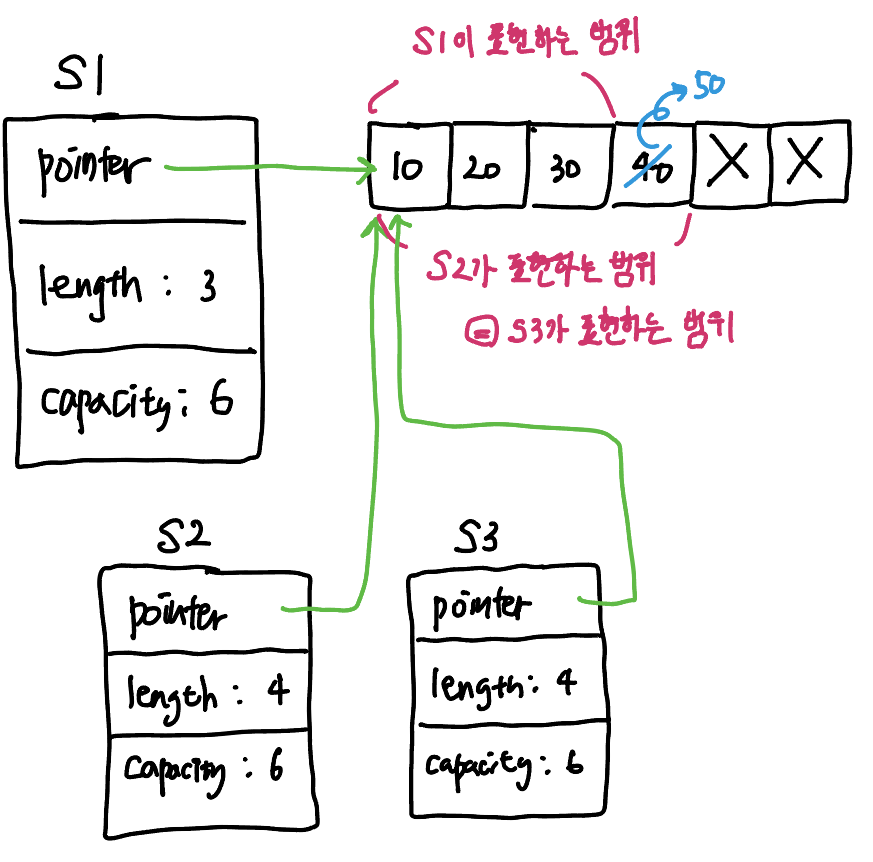
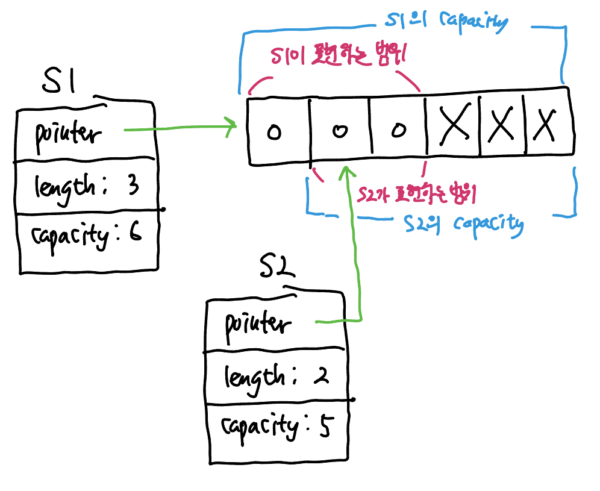
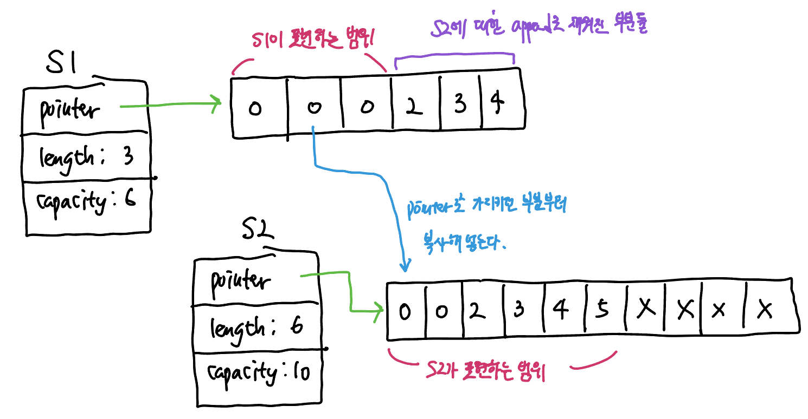

Golang의 dynamic array를 구현한 slice는 다른 프로그래밍 언어와 비교했을 때 미묘하게 주의해아할 점들이 있다. slice 초기화, append를 이용한 element 추가, slice 복제, slicing 등을 올바르게 처리하려면 slice의 **length**와 **capacity** 개념을 올바르게 이해해야한다.

## Slice의 표현

Golang에서 slice는 내부적으로 array (가장 기본적인 static array)를 기반으로 제공된다. slice의 구조는 다음 3가지 요소로 표현된다. 

1. 내부 array에 대한 pointer
2. 현재 slice에 담긴 length = 내부 array의 어디까지 표현할 것인가
3. 내부 array의 capacity

초기화 및 원소 추가를 수행하며 확실하게 알아보자.

```go 
s := make([]int, 3, 6)
// s는 length=3 capacity=6 인 slice이다.
```

> `make`를 이용해서 slice를 초기화한다면 2번째 parameter인 length는 꼭 지정해주어야 한다. 하지만 3번째 parameter는 optional인데, 만약 지정해주지 않는다면 length = capacity인 slice가 초기화되게 된다.

길이를 `3`으로 지정했기 때문에 내부 배열의 맨 앞 세 element는` int` 타입의 zero value `0`으로 초기화된다. 이 상황에서 `s` 를 화면에 출력하면 `[0, 0, 0]`을 볼 수 있다.



slice의 *length는 slice가 표현하는 범위*이고, slice의 capacity는 *현재 실제 내부 array가 메모리에 할당된 크기*이다. (초기화 후 아직 동적으로 확장되지 않았다고 가정하자.) **slice는 length를 벗어나는 element에 접근할 수 없다.** 내부 array로는 할당된 공간임에도 그렇다. 예를들어, `s[4] = 0` 과 같은 시도는 index error를 발생시킬 것이다.


#### append의 동작 메커니즘 

이제, slice의 빈공간을 활용하는 `append`를 이용해보자. Golang의 `append`는 특이하게 반환값이 있고, 언어 수준에서 이 반환값을 이용하도록 강제하고 있다. `append`의 메커니즘은 다음과 같다.

1. slice.length의 다음 공간에 새로운 element를 저장한다.
   - 만약 capacity를 초과하는 `append` 호출이라면, capacity가 늘어난 새로운 내부 배열을 생성하고 기존 내부 배열의 값을 옮겨넣은 뒤 새로운 element를 저장한다.
   - 이 때 pointer는 새로 생성한 내부 array를 가리키게 된다. 기존의 slice를 저장한 표현이 있다면, 해당 표현과는 length, capacity는 물론 pointer까지 바뀐 완전히 새로운 slice를 표현하게 된다. 
2. slice에 대한 표현을 반환한다. 

> ##### Golang에서 Dynamic Array의 새 배열 capacity를 정하는 방법
>
> element의 개수가 *1024개 이하일 때에는 내부 array의 크기가 2배씩* 늘고, *1024개를 넘어가면 25%* 씩 늘어난다.

`append`는 slice에 대한 *갱신된* 표현을 반환한다. slice에 대한 `append`작업은 <u>해당 slice의 내부 array를 참조하고 있는 것은 맞지만, 반환되는 slice에 대한 표현은 기존의 slice에 대한 표현과는 다른 'value'처럼 취급</u>된다. 다음의 예시로 확인해보자.

``` go 
// len: 3, cap: 6이라고 가정하자.. 이렇게 리터럴로 할당할 경우 len = cap이 되어버려서 다음 append에 새로운 내부배열을 생성한다.
s1 := []int{ 10, 20, 30 }	
s2 := append(s1, 40)
```

지금까지 일반적으로 경험했던 프로그래밍 언어에 기반하면, `s1`을 출력해도 `s2`를 출력해도 둘은 동일하게 `[10, 20, 30, 40]`이 화면에 표시되어야 한다. 둘은 같은 'Array에 대한 표현'를 참조하고 있기 때문이다. 하지만 Golang은 다르다.

``` go 
fmt.Println(s1) // [10, 20, 30]
fmt.Println(s2) // [10, 20, 30, 40]
```

말했듯이 `append`의 반환은 'slice에 대한 갱신된 표현'이고, 이는 기존의 표현과는 별개의 '값'이다. pointer, length, capacity를 나타내는 값 struct가 반환된다고 생각하는게 편하겠다. pointer는 참조값이기에 두 slice의 표현은 여전히 하나의 내부 array를 가리키지만 length가 다르기 때문에 두 slice가 실제로 표현하는 결과가 다른 것이다.



그림에서 보듯, 내부 배열에 대한 정보는 동일하다. 다만 `s1`과 `s2`가 slice를 표현하는 정보가 다르다. `s1`은 아직 length가 3이기에 세번째 원소까지만 다룰 수 있는 것이다. 

그럼, 이번에 또 `s1`에 `append`를 해보자.

``` go
// 마찬가지로 리터럴로 초기화했지만 length: 3, capacity: 6으로 가정하자...
s1 := []int{ 10, 20, 30 }	
s2 := append(s1, 40)
s3 := append(s1, 50)
```

이미 `s1`과 `s2`는 표현이 다른데··· `s1`의 표현에 대해서 `append`를 수행했다. 그런데 내부 array는 이미 4번째 element까지 값이 차있는데 어떻게 될까? 

``` go
fmt.Println(s1) // [10, 20, 30]
fmt.Println(s2) // [10, 20, 30, 50]
fmt.Println(s3) // [10, 20, 30, 50]
```

이렇게 된다. 왜 이렇게 되는지에 대해서는 위의 `append`의 메커니즘을 참고하면 이해가 쉽다. `append`는 *제공된 slice.length의 다음 공간에 주어진 값을 저장*한다. `s1`의 length는 3이니 4번째 공간에 `50`을 저장하고, 해당 slice에 대한 갱신된 표현을 반환한 것이다. 그림으로 보면 다음과 같다.




#### slicing 연산

slicing 연산에 대해서도 알아보자. slicing은 array나 slice에 대한 <u>half-open range</u> 연산이다. 즉, 첫번째 index는 포함하고 두 번째 index는 제외한다. slicing 연산을 직접 눈으로 확인해보자.

```go 
s1 := make([]int, 3, 6)		// length: 3, capacity: 6
s2 := s1[1:3]							// length: 2, capacity: 5
```



두 slice는 동일한 내부 array를 참조하기 때문에 둘의 표현이 겹치는 index 1-2 구간을 변경하면 둘 모두에서 확인이 가능하다. 하지만 둘은 내부 array의 시작점 (pointer)와 length, capacity가 다르다.

만약 slicing한 배열에 element를 계속해서 추가해서 내부적으로 새 array를 생성하도록 하면 어떻게 될까? 

``` go
s2 = append(s2, 2, 3, 4) // 이 시점에서 length: 5, capacity: 5로 임계지점에 도달한다.
s2 = append(s2, 5)			 // 새로운 공간을 동적으로 확장할 시점.
```

새 array의 크기는 capacity가 1024 이하일 경우엔 2배로 확장한다. `s2`의 capacity는 5이므로, 내부적으로 길이가 10인 내부 배열이 생성된다. 그리고, 기본 배열의 값을 `s2`의 pointer가 가리키는 지점부터 시작해서 복사해넣는다. 이를 그림으로 표현하면 다음과 같다.



##### full slice expression으로 slicing의 capacity 제한하기


## Slice의 초기화 방식

slice를 초기화하는 방식은 크게 4가지로 나눌 수 있다. code로 먼저 확인하자.

``` go 
// 1. nil slice를 생성한다. (할당되지 않음)
var s []string

// 2. nil slice를 생성한다. (할당되지 않음)
s := []string(nil)

// 3. literal을 이용해 empty slice를 생성 & 할당한다.
s := []string {}

// 4. make를 이용해 empty slice를 생성 & 할당한다.
s := make([]string, 0)
```

각 방식은 쓰기에 따라 유용한 use case가 다르다. 각 case가 유용한 경우를 살펴보자.


#### slice의 최종 길이를 아는 경우: optimization

slice를 초기화해야할 때 해당 slice가 쓰이는 최종 크기를 아는 경우가 있다. 음··· 대표적으로는 코딩테스트에서 조건에 따라 slice를 초기화하는 예가 있겠다. 이 경우엔 **최종 크기 만큼의 capacity를 미리 지정**해두는 것이 효율적이다. 

길이가 1,000인 slice를 각 index에 1부터 1000까지의 정수로 초기화한다고 생각해보자. 먼저 좋지 않은 예를 확인해보겠다:

``` go 
func initSlice() {
  N := 1_000
  s := make([]int, 0)	// 혹은 다른 어떤 방식이던, capacity = 0인 empty slice를 초기화하는 경우
  for i := 0; i < N; i++ {
    s = append(s, i + 1)
  }
	return s
}
```

slice의 최종 길이가, 혹은 어느정도의 크기가 예상되는데도 불구하고 capacity가 0인 slice로 초기화할 경우, Golang에서 내부적으로 slice의 크기를 동적으로 확장하는 과정에서 새 array를 할당하고 복사하며 불필요한 overhead가 발생할 수 있다. 

capacity를 0으로 초기화할 경우 for loop을 N번 도는 동안 동적 확장은 다음 만큼 수행된다.


- N `<=` 1024 구간: k번 (2^k^ `<` N을 만족하는 최대 정수 k) 일어나게 된다. 
- 1024 `<=` N 구간:  k + m번 (1024 * 1.25^m^ `<` N을 만족하는 최대 정수 m) 일어나게 된다.


array를 새로 할당하고 값을 linear하게 복사하는 일은 slice를 다룰 때 피할 수 있다면 피해야하는 overhead이다.


따라서 **최종적인 길이를 알거나, 어느 정도 크기가 예상되는 경우엔 capacity를 그만큼 처음에 지정**하여, empty slice를 생성하더라도 <u>동적확장이 요구되는 임계지점을 최대한 늦추는 것</u>이 좋다. 

``` go 
func initSlice() {
  N := 1_000 
  s := make([]int, 0, N)		// length: 0, capacity: 1000 인 slice 초기화.
  for i := 0; i < N; i++ {
    s = append(s, i + 1)
  }
	return s
}
```

이렇게 초기 capacity를 지정해주면 해당 초기화 로직 실행 동안 동적 확장이 일어나는 것을 피할 수 있다.


#### nil slice != empty slice

nil slice와 empty slice는 다르다. 일종의 포함관계라고 볼 수 있겠다. 모든 nil slice는 empty slice이지만, 모든 empty slice는 nil slice가 아닐 수도 있다.

nil slice는 할당하지 않아도 되기 때문에 empty slice보다는 nil slice를 이용하는 것이 좋다. 게다가 Golang의 `append` 메서드는 nil slice를 parameter로 받을 경우 empty slice로 판단하고 문제없이 연산을 지원한다.

``` go 
func f() []string {
  var s []string
  if foo() {
    s = append(s, "foo")
  } 
  if bar() {
    s = append(s, "bar")
  }
  return s
}
```

- `s`는 nil slice일 수도 있고, length가 1인 slice일 수도 있다. 

이와 같이 *최종 길이를 모르고, slice가 빌 수도 있는 경우*엔 nil slice를 이용해서 간결하게 표현하는 것이 좋다.

하지만 nil slice와 empty slice는 엄연히 다르다는 것을 명심해야한다. `encoding/json` 패키지의 마샬링 같은 경우엔 nil과 empty slice를 엄격하게 구분한다. 혹은 unit test 시 자주 활용되는 `reflect`에서도 `DeepEqual`을 사용하면 두 비교를 false로 return한다.

> **encoding.json의 Marshal() 결과**
>
> nil slice: `{ "name": "leo", "slices": null }`
>
> empty slice: `{ "name": "bang", "slices": [] }`


또한 nil 과 empty slice를 다루는 'provider' 측면에서 주의해야할 점은, 두 경우에 대한 context나 의미가 달라지면 user 입장에서 처리하기 복잡해진다는 것이다. Golang의 공식문서에서는 <u>interface를 디자인할 때 nil slice와 empty slice를 구분하지 말 것</u>을 권장한다. 미묘한 의미 차이를 user 입장에서는 충분히 고려하기 힘들다.

예를들어, nil slice인 경우와 empty slice인 경우에 대해서 전달하고자 하는 context가 달라, 각각의 경우에 처리가 따로 필요하다면 다음과 같이 분기처리를 해줘야 한다.

``` go 
func couldbeEmptyOrNil() []string { /** */ }

func userFunc() {
  s := counldbeEmptyOrNil()
  
  if s == nil {
    // nil 일 경우 처리 
  } else if len(s) == 0 {
		// empty 일 경우 처리     
  } else {
    // element가 있을 경우 처리 
  }
}
```

이보다는 예외 상황을 나타내고 싶다면 `error` 값을 반환하고, `len()`을 이용해서 해당 slice가 비었는지 정도만 check하도록 하는 것이 좋다.


#### 초기화할 값이 존재하는 경우: literal 사용

다음과 같이 초기화할 값이 존재하는 경우 literal 표현을 이용해서 slice를 초기화할 수 있다. literal을 이용해 초기화된 slice는 **literal에 주어진 원소의 개수만큼 length와 capacity가 동일하게 정해진다**. (= 다음 append 시 동적 확장이 일어난다.)

``` go 
s := []string { "apple", "banana", "grape" }
```

