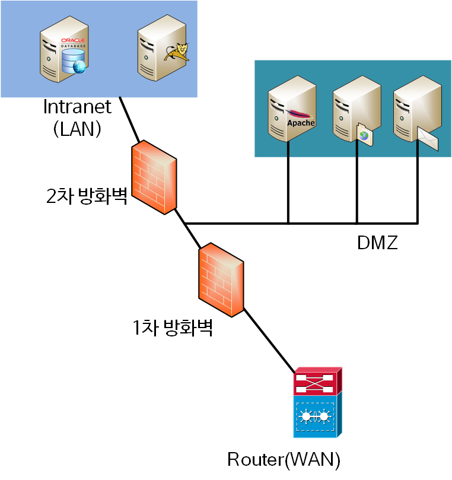

# Web Server와 WAS

## Web Server란 

HTTP/HTTPS 요청을 처리하고 HTML, CSS, 이미지 파일과 같은 **정적 리소스를 제공하는** 소프트웨어를 Web Server라고 한다. 보통 `HTTP 서버`를 의미한다.

웹서버는 정적인 콘텐츠만을 서빙할 수 있다. 따라서 **동일한 HTTP 요청** (동일한 URL, 동일한 메서드 등)에는 **항상 동일한 리소스**가 반환된다.

> Web Server를 구현한 예시로는 *NGINX 서버, APACHE 서버* 가 있다. 

웹 서버는 하드웨어와 소프트웨어 두 분야에서 정의할 수 있다. Application 개발자가 주로 다루는 분야는 **소프트웨어 분야의 웹 서버**이다.

하드웨어로서의 웹 서버란, 웹 서버의 기능을 할 수 있도록 설계된 컴퓨터 하드웨어 그 자체를 말한다. 소프트웨어로서의 웹서버는 위의 설명을 충족하는 소프트웨어를 뜻한다.

## WAS (Web Application Server)

WAS란 동적인 웹 애플리케이션을 동작하기 위한 플랫폼을 제공하는 소프트웨어를 말한다. WAS는 서버사이드 처리를 요하는 복잡한 비즈니스 로직들 (i.e. 데이터베이스 접근, 유저 인증, 세션 관리 등)을 위해 이용된다. 

> WAS의 예시로는 Apache Tomcat, IBM WebSphere, Oracle WebLogic 등이 있다.

웹서버는 정적인 콘텐츠만 다룰 수 있는 반면, WAS는 정적인 콘텐츠와 동적인 콘텐츠 모두 제공할 수 있다. 

### 웹 서버 vs WAS?

사실은 둘의 용어도 경게도 모호하다. 웹 서버도 프로그램을 실행시키는 기능을 포함하기도 한다. 또한 WAS 역시 위에 적어놓았듯이 웹 서버의 기능을 포함하는 것이 일반적이다. WAS는 애플리케이션 코드를 실행하는데 특화되어있지만 경계가 명확하지는 않다!

### WAS가 정적인 리소스를 커버할 수 있음에도 웹서버를 같이 구성하는 이유

물론 WAS만으로도 웹 시스템을 구성할 수 있다. **대부분의 WAS는 Web Server의 기능도 제공하므로 WAS가 혼자서 서비스를 제공해도 된다**. 하지만 그럼에도 WAS와 웹 서버를 동시에 이용하는 이유는...

1. 웹서버는 WAS에 비해 비교적 구성이 편리하다.
   -  정적인 콘텐츠를 서빙하기에 더 효율적이라 말할 수 있다. (보다 적은 노력으로 콘텐츠 서버를 구축할 수 있으므로)

2. 낮은 resource utilization 
   - 웹서버가 정적인 콘텐츠를 서빙하기 위해 디자인되어있으므로 일반적으로 **WAS보다 CPU와 메모리 리소스를 적게 이용**한다.

3. 퍼포먼스
   - 정적 콘텐츠를 서빙하는데 있어서는 일반적으로 WAS보다 높은 퍼포먼스를 낸다. 
   - 또한 정적인 콘텐츠를 웹서버에게 모두 위임함으로서 **WAS는 필요없는 부하를 줄이고**, 동적인 로직에만 집중할 수 있어 전체적인 퍼포먼스의 증가를 가져올 수 있다.
4. 확장성
   - 정적인 콘텐츠를 제공하는 웹 서버를 따로 두는 것은 수평적 확장에 효과적이다. 
5. **리버스 프록시**로서 기능한다.
   - 가장 핵심적인 이유. 프록시 서버에서 설명한다.

이러한 이유로 Web Server와 WAS를 동시에 이용하는 것이 일반적이다. 

# 프록시 서버

프록시 서버는 client 혹은 server 네트워크 통신의 single point를 만들어주는 중간 대리자 역할을 수행한다. 웹 서버 애플리케이션을 이용해 프록시를 구현한다.

> **Apache 웹 서버**에는 `mod_proxy`라는 모듈에서 포워드 프록시와 리버스 프록시를 제공한다. **NGINX**는 필요한 기능을 제공하는 고성능 웹서버에 맞게 리버스 프록시만 제공한다.

client의 request에 대한 single point를 만들어 인터넷으로 전파하는 역할이 **포워드 프록시**, 웹 서버 (주로 WAS) 앞 단에서 request/response에 대한 single point를 만들어주는 것이 **리버스 프록시** 이다.

- private network의 구분점 역할을 수행하기에 보안 수준을 높일 수 있다.
- 캐싱 혹은 compression을 이용해 퍼포먼스를 증대할 수 있다. 
- 악의적인 공격 혹은 요청을 필터링 해주는 레이어 역할을 수행하기도 한다.

## Forward Proxy

다수의 Client로부터의 outbound request를 받아 인터넷으로 forward하고, 그 response를 다시 돌려주는 서버를 **포워드 프록시**라고 한다.

예를들어 client 중 하나가 google.com에 웹페이지를 요청하면 client pc가 직접 HTTP 요청을 연결하는게 아니라 포워드 프록시 서버가 request를 받은 후 forward한다. 

- 대부분 캐싱을 제공하므로 자주 사용되는 콘텐츠라면 퍼포먼스 향상을 기대할 수 있다.
- 정해진 사이트만 연결하도록 설정하는 등 웹 사용환경을 제한할 수 있어 보안이 중요한 기업 환경에서 많이 사용한다.

## Reverse Proxy

인터넷으로부터의 inbound request를 받아 뒷단 다수의 worker들(주로 WAS)에게 forward하고 response를 받아 다시 인터넷에 돌려주는 서버를 **리버스 프록시** 라고 한다.

#### 보안 강화

보통 기업의 네트워크 환경은 비무장 지대(DMZ; Demilitarized Zone) 라고 하는 내부 네트워크와 외부 네트워크 사이에 위치하는 구간이 존재한다.

WAS를 DMZ에 두고 서비스해도 되지만 보통의 WAS는 DBMS와 연결되어있는 경우가 많다. 만약 WAS가 최전방에 존재한다면 WAS가 털릴 경우 DBMS와 관련 서버까지 모두 털리는 참사가 발생할 수도 있다. 따라서 **DMZ 존에 웹 서버를 리버스 프록시로 설정하고, WAS는 내부 망 (Intranet)에 위치하도록 설계**한다.

리버스 프록시로 동작하는 웹서버만 내부 WAS와 연결하도록 설정한다. 1차적으로 웹 서버가 해킹당해도 2차 방화벽을 다시 뚫어야 하므로 보안을 강화할 수 있다.

특히 RedHat이나 CentOS라면 SELinux를 켜놓으면 웹 서버는 사전에 정해진 포트 (i.e. WAS의 8080, 8009)만 접근할 수 있으므로 웹 서버가 해킹당해도 2차 피해를 최소화할 수 있다.

#### 퍼포먼스와 안정성 

리버스 프록시 개념을 이해하고 구성하면 이 앞에 캐시 서버를 붙이거나 SSL 하드웨어 가속기를 연동하는 등 아키텍처 측면에서 성능 향상을 꾀하기 용이해진다.

심플하게 생각하면 **cloudflare나 akamai 같은 CDN도 리버스 프록시로 동작하는 캐시 서버 일 뿐이니까.**  CDN을 연동한다면 DDOS 공격을 효과적으로 방어하고 서비스를 빠르고 안정적으로 제공할 수 있다.

#### 신뢰성 증대 

리버스 프록시를 cluster로 구성해놓으면 avaliability를 높일 수 있고 사용자가 증가하는 상황에 맞게 웹 서버나 WAS를 유연하게 늘릴 수 있는 장점이 있다.

리버스 프록시 앞에 L4나 로드 밸런서를 붙이면 RoundRobin, Least Connection 등 상황에 맞는 분배 알고리즘을 적용해 서비스 신뢰성을 높일 수 있다.

#### SSL 암호화 

각 클라이언트에 대한 SSL/TLS 통신의 암호화 및 암호 해독은 WAS의 경우에는 비용이 많이 들 수 있다. 리버스 프록시가 모든 inbound request를 decode하고 outbound request를 encrypt한다면 뒷단의 worker의 리소스를 보호할 수 있다.

### 리버스 프록시 구현 방법

일부는 자체 리버스 프록시를 구현하지만, 이를 위해서는 인프라 구성 비용이 크다. 리버스 프록시의 모든 이점을 얻는 가장 쉽고 비용 효율적인 방법 중 하나는 CDN 서비스에 가입하는 것이다. 

---

##### NGINX란? 

NGINX는 오픈소스 웹 서버 소프트웨어. 리버스 프록시, 로드 밸런서, HTTP 캐시로 이용된다. 이미지, CSS, JS 파일과 같은 정적인 콘텐츠를 서빙하는데 이용된다. 동적인 컨텐츠를 위한 다른 웹서버로 요청을 프록시하는데 이용되기도 한다. mail이나 TCP/UDP 프록시 서버로 이용될 수도 있다. 

##### NGINX 가 프록시 서버로 이용되는 이유? 

NGINX가 리버스 프록시 서버로 이용되면 동적 콘텐츠를 서빙하는 WAS는 인터넷에 직접적으로 노출되지 않음으로 보안을 위한 추가적인 레이어를 제공한다.

NGINX는 동적인 컨텐츠들을 캐싱함으로서 애플리케이션 서버의 부하를 줄이고 퍼포먼스 향상을 노릴 수 있다.

 NGINX는 또한 request routing을 수행할 수 있다. request URI, HTTP 헤더 쿠키 등을 기반으로 하여. 

- 요청마다 특정 요구사항에 맞게 다른 application server로 요청을 분산할 수 있다.

##### Express.js는 WAS인가? 

자바진영의 WAS는 apache tomcat이다. 자바 서블릿, JSP, 웹소켓 기술의 오픈소스 구현 소프트웨어. 

톰캣은 자바 기반의 웹 애플리케이션에 웹 서버 환경을 제공하며, standalone server로도 이용될 수 있고 다른 자바 어플리케이션에 내장된 컴포넌트로 동작할 수도 있다. 

반면 Express.js는 WAS가 아니다. Express.js는 웹 애플리케이션을 구축하기 위한 편의기능들을 제공하긴 하지만, WAS의 범주에 해당되기 위한 웹 서버 환경은 제공하지 않는다. 오히려 WAS 위에서 돌아가는 웹 애플리케이션을 구축하기 위한 프레임워크라고 볼 수 있다. 

Node.js는 내장된 HTTP 서버를 가지고 있으며 런타임 자체로도 WAS로서 동작할 수 있다. 

Node.js는 내장 `http`, `https` 모듈을 이용해 WAS를 구축할 수 있다.  (express는 이 내장된 통신 모듈을 이용해 라이브러리를 구축했다.)

Node.js는 V8 엔진 기반의 JS 런타임 (실행기)이며, 그 자체로 WAS 기능을 구현할 수 있다. 

##### Spring Framework은 WAS인가? 

Spring은 자바 환경을 위한 **웹 애플리케이션 프레임워크**이다. WAS라고는 말할 수 없다. Spring은 자바 기반의 웹 애플리케이션을 구축하기 위한 편의 기능들을 제공한다. 하지만 Spring은 그 자체로는 웹서버로 동작할 수 없다. Spring 기반 웹 애플리케이션을 돌리기 위해서는 Apache Tomcat이나 Jetty, JBoss와 같은 **Web Application Server**가 필요하다.

WAS는 웹 요청과 웹 응답을 제공하는 환경을 가지고 있어야 한다.

# References

- [포워드 프록시, 리버스 프록시](https://www.lesstif.com/system-admin/forward-proxy-reverse-proxy-21430345.html)
- [CloudFlare - forward proxy, reverse proxy](https://www.cloudflare.com/ko-kr/learning/cdn/glossary/reverse-proxy/)