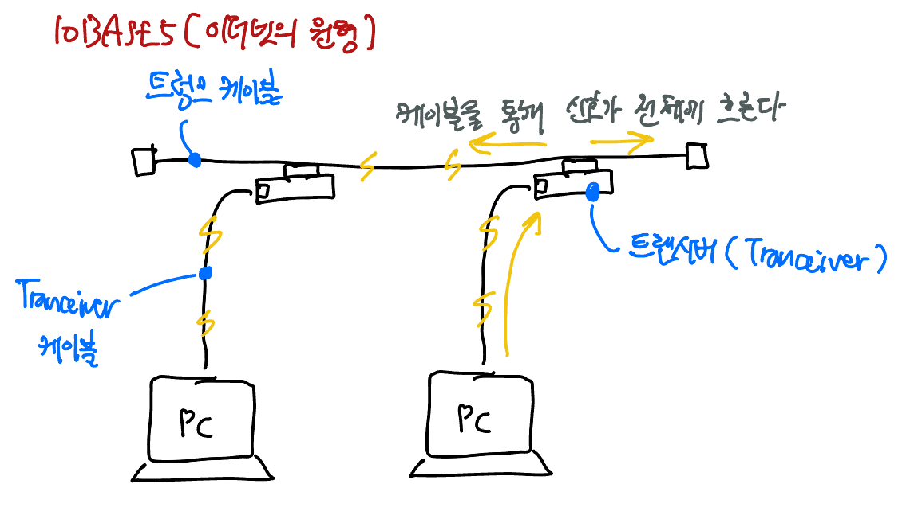
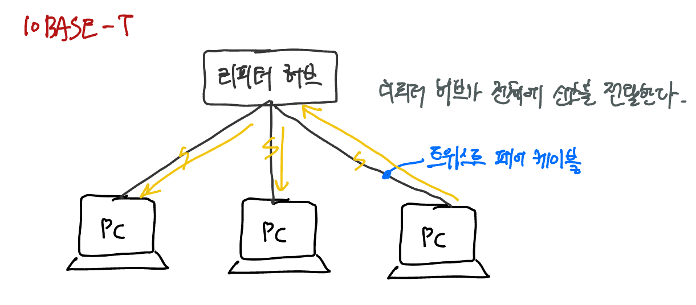
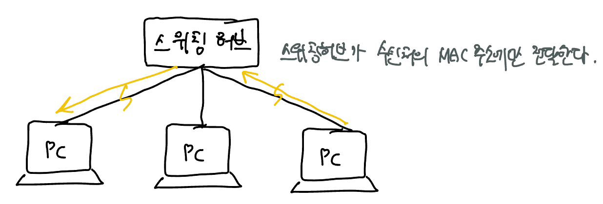
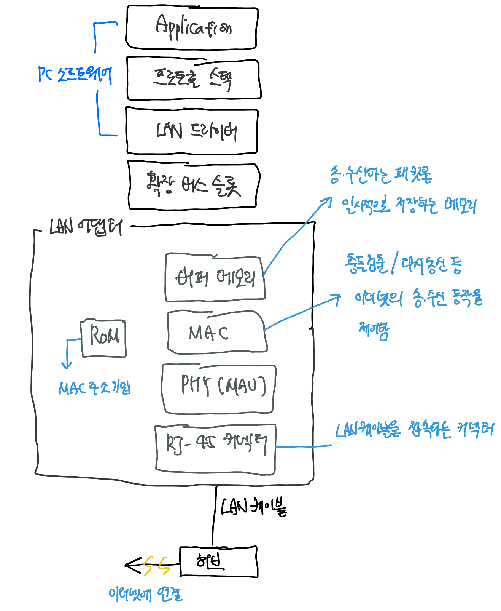
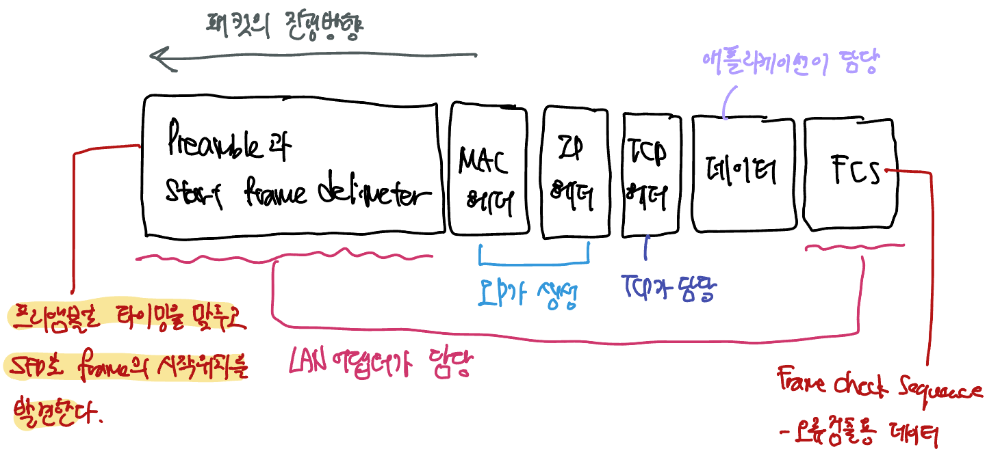

TCP 담당 부분은 IP 담당 부분에게 **데이터를 패킷의 모습으로 만들어 송신**하는 작업을 위임한다. 패킷은 '헤더'와 '데이터' 두 부분으로 구성된다. 일반적으로 TCP 헤더 + 데이터 조각이 패킷의 '데이터' 부분을 나타낸다.

수신했을 때의 MAC 헤더는 버리고 송신할 때 새로운 MAC 헤더를 만들어 여기에 새 MAC 주소를 기록한다.

IP와 이더넷에서 역할을 분담한다고 했는데, 이더넷 부분은 다른 것으로 대체할 수 있다. **무선 LAN, ADSL, FTTH 등 IP의 의뢰를 받아 패킷을 운반할 수 있는 것이면 무엇이든지 이더넷 대신 사용할 수 있다.** 단, 이더넷 이외의 것으로 대체할 경우에는 MAC 헤더가 통신 기술의 spec에 적합한 헤더로 대체된다.

IP 담당 부분은 패킷을 상대에게 송출만한다. 상대가 있는 곳까지 실제로 패킷을 운반하는 일은 Hub나 Router 같은 네트워크 기기의 역할이다. IP 담당 부분은 패킷을 운반하는 전체에서 입구에 불과하다. 앵그리버드의 발사대 역할을 한다고 생각하면 된다.

TCP 담당 부분은 데이터에 TCP 헤더를 붙여 IP 담당에게 건네준다. 이 'TCP 헤더 + 데이터'가 패킷의 body가 되며, 동시에 통신 상대의 IP 주소를 나타낸다. 

IP 담당 부분은 이 body를 하나의 디지털 데이터로 간주하고, 그 앞에 제어 정보를 기록한 IP 헤더와 MAC 헤더를 부착한다. IP 헤더는 IP 프로토콜에 규정된 바에 따라 IP 주소로 표시된 목적지까지 패킷을 전달할 때 사용하는 제어 정보를 기록한다. MAC 헤더는 이더넷 등의 LAN을 이용해 가장 가까운 라우터까지 패킷을 운반할 때 사용하는 제어 정보를 기록한다. 

이제 만들어진 패킷을 네트워크용 하드웨어에 전달한다. 하드웨어는 이더넷이나 무선 LAN 등을 말한다. LAN 어댑터 혹은 네트워크 인터페이스라고 통용하도록 하자.

LAN 어댑터에 건네줄 때의 패킷은 binary 데이터로, 이것이 LAN 어댑터에 의해 ㄹ전기나 빛의 신호 상태로 바뀌어 케이블에 송출된다. 

##### TCP와의 차이

TCP는 데이터 송/수신 단계에 몇가지 단계가 있으며 각 단계에서 다양한 역할을 가진 패킷이 등장했다. IP 패킷 송/수신 동작은 패킷의 역할에 관계없이 모두 동일하다. IP는 TCP헤더와 데이터 조각을 한 덩어리의 binary 데이터로만 간주한다. 그 내용을 보지 않으므로 TCP헤더와 데이터 조각이 들어있는지, 아니면 TCP 헤더만 있는지 전혀 신셩쓰지 않는다. TCP의 동작단계도 신경쓰지 않는다. 패킷의 오류같은 것도 신경쓰지 않는다. 

그저 의뢰받은 내용물을 패킷의 모습으로 만들어 상대에게 송신하거나, 전달받은 패킷을 수신할 뿐이다.

라우팅 테이블. 라우팅 테이블은 macOS에서는 `netstat -rn` 커맨드로 표시할 수 있다.

Gateway는 TCP/IP 세계에서 라우터를 가리키는 용어이다.

넷마스크가 0.0.0.0인 라우팅 테이블. 기본 Gateway를 나타낸다. 다른 곳에 일치하는게 없으면 이 행이 해당하는 것으로 간주한다.

IP의 Fragmentation 역할도 넣자.

#### 이더넷용 MAC 헤더를 만든다

IP 헤더의 수신처 IP 주소에 패킷을 전달하는 목적지가 쓰여있으므로 이를 보면 패킷을 어디로 운반해야할지 판단할 수 있는데, **이더넷에는 TCP/IP 개념이 통용되지 않는다**. 이더넷의 수신처 판단 구조로 사용하는 것이 MAC 헤더이다.

MAC 헤더는 이더넷에서 사용하는 헤더로서 수신처나 송신처의 MAC 주소 등이 기록되어있다.

이더넷의 경우 Ether Type까지가 MAC 헤더이고, 그 뒤에 이어지는 것이 패킷의 body라고 판단한다. 그리고 그 body가 무엇인지를 ether type으로 나타낸다. 이더넷의 body는 IP나 ARP라는 프로토콜의 소켓이며, 각각에 대응하는 값이 규칙으로 정해져있으므로 여기에 값을 기록한다.

자체의 LAN 어댑터의 MAC 주소를 설정한다. MAC 주소는 LAN 어댑터를 제조할 때 그 안에 있는 ROM에 기록되므로 여기에 기록되어있는 값을 읽어와서 MAC 헤더로 설정한다.

Destination MAC 주소는 다소 복잡하다. 패킷을 건네주는 상대의 MAC 주소를 기록해야하지만 이 시점에서는 아직 누구에게 패킷을 건네주어야 할지 모른다. 따라서 누구에게 패킷을 건네주어야 할지 라우팅 테이블을 query해본다. 라우팅 테이블에서 찾은 row의 "Gateway" 항목에 기록되어있는 IP 주소의 디바이스가 패킷의 수신자가 된다. 이제 수신자의 IP 주소는 알아냈지만 여전히 수신자의 MAC 주소는 모르는 상황이다. IP 주소를 이용해 MAC 주소를 query해야한다. 

여기서 사용하는 것이 **ARP**(Address Resolution Protocol)이다. 연결되어있는 전원에게 broadcast를 이용해 IP 주소와 일치하는 디바이스의 MAC 주소를 요청한다. 자신과 같은 네트워크에 존재하면 이것으로 MAC 주소를 알 수 있다. 

한번 query한 IP:MAC 주소 대조표는 **ARP 캐시**라는 메모리 영역에 보존해 다시 이용한다.

ARP를 이용해 MAC 주소도 알아냈으니 이제 Destination MAC address

# 이더넷

이더넷은 하나의 spec 혹은 interface와 같다. 이더넷은 다음 3가지 성질을 요구한다.

1. MAC 헤더의 Destination MAC Address에게 패킷을 전달한다.
2. MAC 헤더의 Sender MAC Address로 송신처를 나타낸다.
3. MAC 헤더의 Ether type으로 패킷의 내용물을 나타낸다.

이 3가지 성질을 만족하는 것은 이더넷으로 볼 수 있다. 실제로 이더넷을 구현한 방식은 지금까지 다양하게 발전해왔다. 

> 이더넷에 대한 Spec은 무선 LAN에도 해당한다. 따라서 케이블 형식의 이더넷 대신 무선 LAN을 사용할 수 있다.

##### 10BASE5 (이더넷의 원형)

Tranceiver를 통해 전기 신호를 보낸다. 케이블에 연결된 모든 대상에게 신호가 흘러가는데, 이 때 수신한 디바이스는 패킷의 MAC 헤더에 적힌 Destination MAC address를 보고 자신에게 온 것인지 확인한다. Destination에 해당하는 디바이스만 패킷을 수신하고 나머지 디바이스는 패킷을 폐기한다.

##### 10BASE-T (리피터 허브를 이용)

트렁크 케이블이 **리피터 허브**로 바뀌고 Tranceiver 케이블이 트위스트 페어 케이블로 바뀌었다. 신호가 리피터 허브를 통해 전원에게 전달된다는 성질은 변하지 않는다.

##### 스위칭 허브를 이용한 형태

스위칭 허브는 패킷의 MAC 헤더를 까보고 Destination MAC address를 가진 디바이스를 향한 케이블에만 신호를 흘려보낸다. 

IP가 만든 패킷은 메모리에 기억된 binary 형식의 디지털 데이터이다. 디지털 데이터를 전기나 빛의 신호로 변환하여 네트워크 케이블에 송출하는게 송/수신 동작의 본질이라고 할 수 있다. 이 동작을 실행하는게 **LAN 어댑터**이다.

LAN 어댑터는 하드웨어이므로, 이를 PC에서 제어해줄 소프트웨어가 필요하다. LAN 어댑터를 제어하는 소프트웨어가 **LAN 드라이버**이다.

LAN 어댑터는 사용하기에 앞서 초기화 작업을 진행하야한다. OS를 시동할 때 LAN 드라이버가 하드웨어(LAN 어댑터)의 MAC 주소를 초기화한다. MAC 주소는 LAN 어댑터의 ROM에 기록된다. 

> MAC(Media Access Control) 주소는 전세계에서 유일하다.

#### Frame (= Packet)의 구성

LAN 드라이버는 IP 담당 부분에서 패킷을 받으면 그것을 LAN 어댑터의 Buffer 메모리에 복사한다. 복사를 마친 후 패킷을 송신하도록 MAC 회로에 명령을 보내면 MAC 회로가 Ethernet Frame을 만들기 시작한다. 

MAC 회로는 송신 패킷을 Buffer 메모리에서 추출하고 맨 앞에 **프리앰블**과 **Start Frame Delimeter**라는 두 개의 데이터, 마지막에는 **Frame Check Sequence** (FCS)라는 오류 검출용 데이터를 부가한다.

프리앰블과 SFD는 각각 56bit와 8bit의 데이터로, 프리앰블은 타이밍을 맞추고 SFD는 프레임이 시작하는 부분을 나타낸다. SFD가 패킷의 시작을 나타내는 표시이므로 수신측은 이를 잘 감지하고 패킷이 시작되는 부분을 발견하는 것이다. 

**FCS**는 패킷을 운반하는 도중 잡음 등의 영향으로 파형이 흐트러져 데이터가 변한 경우 이를 검출하기 위해 사용한다. 32bit의 비트열이며 패킷의 맨 앞부분에서 맨 끝까지의 내용을 토대로 만들어낸 것이다. 수신측에서 계산한 FCS가 송신할 때 계산한 것과 일치하지 않는다면 데이터가 변화한 사실을 검출하게된다. 해시 함수로 검증하는 것과 동일한 원리라고 생각하면 될듯? 

#### 패킷을 수신할 때의 동작을 잠시 회고해보자

수신은 송신의 역이다. 리피터 허브를 이용한 반이중 (half-duplex)모드로 가정하자. 

리피터 허브를 이용한 Half-duplex의 이더넷에서는 1대가 송신한 신호가 리피터 허브에 접속된 케이블 전부에 흘러간다. 수신 동작은 이러한 신호를 전부 받아들이는 것부터 시작한다. 

신호의 맨 앞에는 프리앰블이 있으므로 파형에서 타이밍을 계산해 Start Frame Delimeter가 나오면, 그 다음 bit부터 디지털 데이터로 변환해 동작을 개시한다. 이는 송신할 때와는 반대로 PHY (MAU) 회로에서 MAC 회로 쪽으로 진행한다.

1. PHY(MAU) 회로에서 신호를 공통형식으로 변환해 MAC 회로로 보낸다.
2. MAC 회로에서 신호를 맨 앞부터 차례대로 디지털 데이터로 뱐환해 Buffer 메모리에 저장하낟.
3. 신호의 마지막에 이르면 FCS를 검사한다. 
   - 패킷의 맨 앞부터 계산식을 적용해 수신측에서 직접 FCS를 계산하고
   - 이를 마지막의 송신측이 전달한 FCS와 대조한다.
4. MAC 헤더의 Destination MAC address를 확인해 자신에게 온 Frame인지 대조
   - LAN 어댑터를 초기화할 때 자체 설정한 MAC 주소와 비교
5. 패킷을 버퍼 메모리에 저장한다.

6. MAC 회로의 할 일이 끝났다. 패킷을 수신한 사실을 컴퓨터 본체에 통지한다. (Interrupt)

이 "통지"는 **Interrupt**라는 구조를 사용한다. 컴퓨터 본체는 LAN 어댑터를 주시하고 있지 않는다. 송/수신 작업을 위임할 때에만 LAN 어댑터에게 관심을 가지고, 위임 작업이 끝나면 다른 작업을 실행하러 간다. 그래서 LAN 어댑터측에서 패킷을 수신했다는 사실을 직접 알려주지 않으면 컴퓨터 본체는 이를 알아차리지 못한다. 컴퓨터 본체에 앞서, LAN 드라이버 역시  컴퓨터 본체 측에서 돌아가는 프로세스이므로 패킷의 도착을 알아차리지 못한다. 이러한 상태일 때 컴퓨터 본체가 실행하고 있는 작업에 끼어들어 LAN 어댑터 쪽에 주의를 돌리는 것이 **Interrupt**이다.

LAN 어댑터가 확장 버스 슬롯 부분에 있는 Interrupt용 신호선에 신호를 보낸다. 이 신호선은 컴퓨터 본체 측의 Interrupt 컨트롤러를 통해 CPU에 연결되어있으며, 신호가 흘러오면 CPU는 실행하고 있던 작업을 일시적으로 보류하고 OS 내부의 인터럽트 처리용 프로그램 쪽으로 전환한다. LAN 드라이버가 호출되어 LAN 어댑터를 제어하면서 송/수신 동작을 실행한다.

Interrupt에 의해 LAN 드라이버가 동작하고 LAN 어댑터의 Buffer 메모리에서 수신한 패킷을 추출하면, LAN 드라이버는 MAC 헤더의 타입 필드의 값으로부터 프로토콜을 판별하고, 타입 필드 값에 대응하는 프로토콜 스택에 패킷을 건네준다. (아직까지는 어떤 애플리케이션에게 전달된 내용인지 모름. Port 번호를 까보지 않았으므로. 이것은 프로토콜 스택이 확인할 영역)

### UDP

TCP의 동작은 상당히 복잡했다. 이처럼 복잡한 원리를 사용한 이유는 데이터를 확실하면서도 효율적으로 전달하기 위해서이다. 데이터가 올바르게 전달되었는지 확인하고, 아니라면 재전송하는 방식으로 말이다. 

#### UDP의 특성

- 수신 확인이 없다.
- Window protocol이 없다.
- 접속이나 연결 끊기 단계가 없다.
- 오류가 발생해 패킷이 없어져도 모른체 한다.
  - 프로토콜 스택은 신경쓰지 않는다. 
  - 상대 application이 알아채고 데이터를 한 번 더 보낸다.

appcliation에서 데이터를 받으면 여기에 UDP 헤더를 부가하고 이를 IP에 의뢰해 송신하는 것은 동일하다.

#### 언제 UDP를 이용할까? 

어떤 상황에서는 TCP처럼 복잡한 구조를 사용하지 않아도 효율적으로 데이터를 다시 보낼 수 있다. 하나의 패킷에 담아보낼만큼 데이터의 크기가 작은 경우이다. 패킷이 한 개 밖에 없다면, 데이터를 전부 다시 보낸다 해도 패킷 하나이므로 낭비가 아니다. 

DNS 서버에 대한 조회 등 제어용으로 실행하는 정보 교환은 한 개의 패킷으로 끝나는 경우가 많으므로 TCP가 아니라 UDP를 사용한다.

혹은 음성이나 영상 데이터를 보낼 때도 UDP를 사용한다. 

- 실시간으로 데이터를 건네주는게 더 중요하다. 
- 영상이나 음성은 계속 streaming되는 데이터로 순간적인 오류나 loss는 크게 중요하지 않다. 이 정도는 허용할 수 있기 때문이다.
- 재생 타이밍을 끊임없이 맞추어주는게 중요하다.