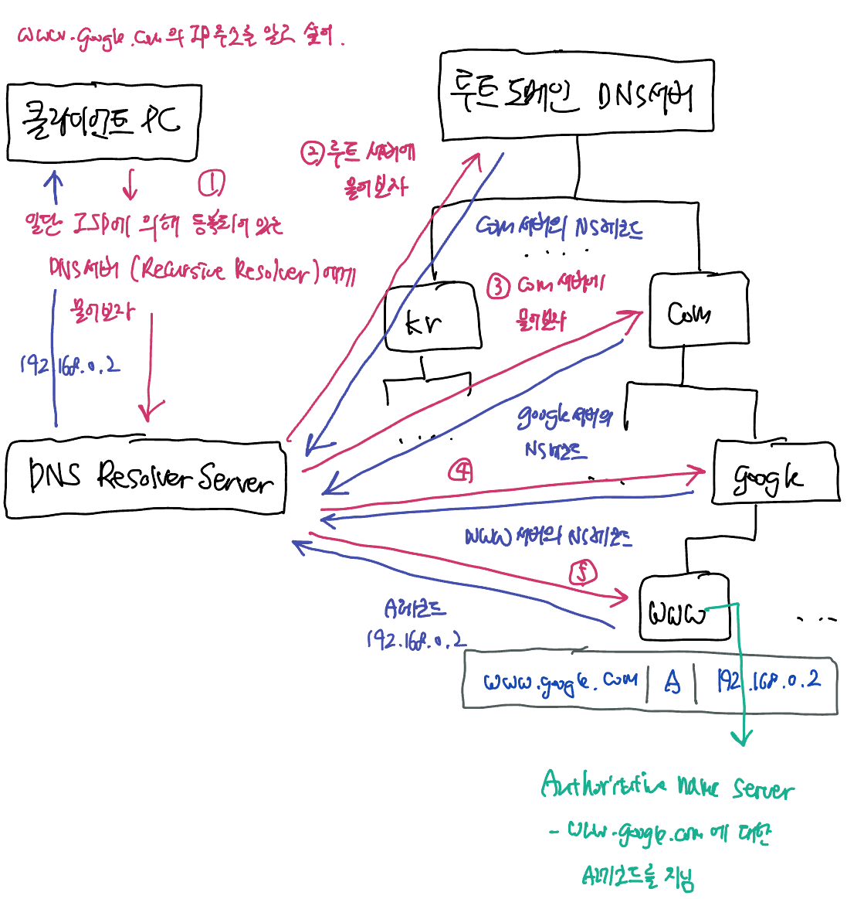
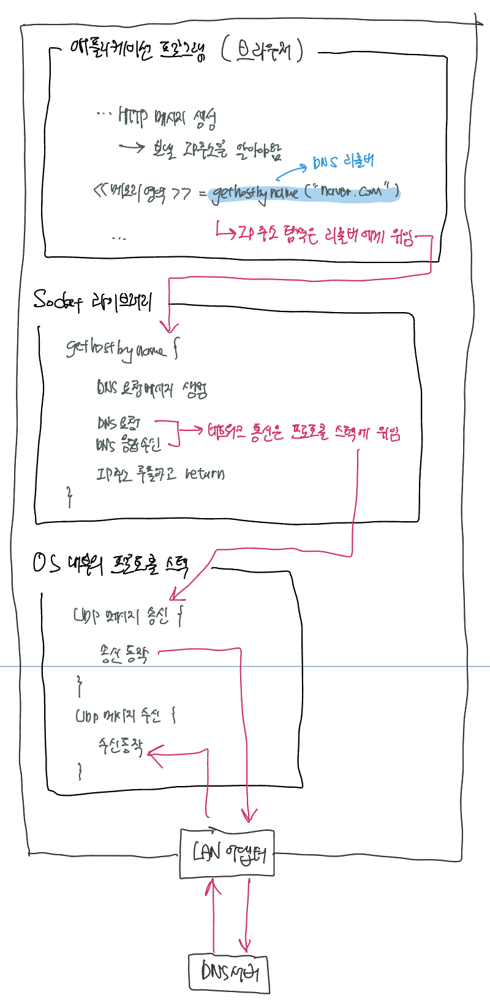
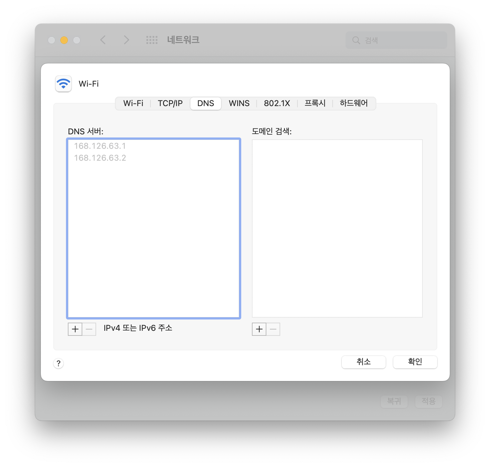
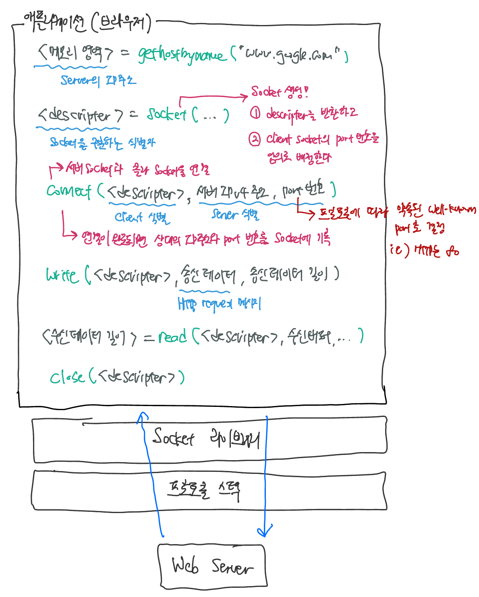
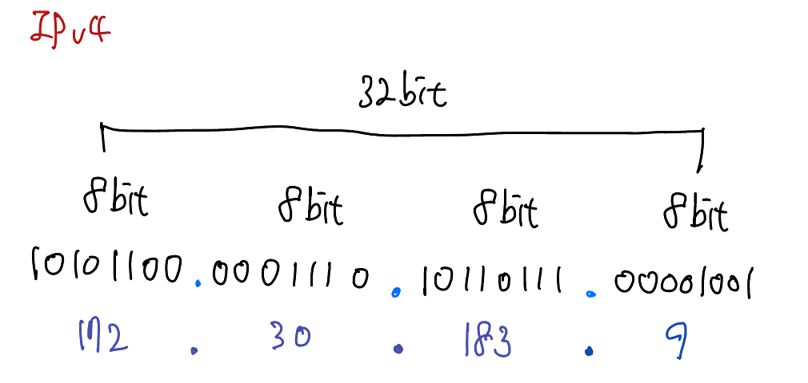
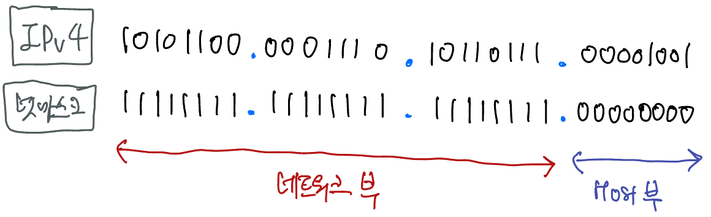

# 

# 브라우저가 Web 서버와 HTTP 통신하기까지...

브라우저는 HTTP 통신을 다음과 같은 순서로 수행한다. 

1. HTTP 규격에 맞는 메시지를 생성한다.
2. DNS를 통해 도메인에 맞는 IP 주소를 query한다.
3. HTTP 요청을 보내고, 그에 따른 응답 메시지를 수신한다.

이 중 브라우저 애플리케이션이 직접 수행하는 작업은 HTTP 메시지를 생성하는 일 뿐이다. 브라우저는 URL을 해석하거나 HTTP 메시지를 만들 수는 있지만 메시지를 네트워크에 송출하는 기능은 가지고 있지 않다. 나머지 DNS query 및 HTTP 통신은 **Socket 라이브러리**에게 위임한다. Socket 라이브러리 역시 네트워크 통신 자체는 **OS 내부의 프로토콜 스택**에게 위임한다.


## DNS (Domain Name System)

OS에 HTTP 송신을 의뢰할 때는 도메인 명이 아닌 IP 주소로 상대를 지정하기 때문에 브라우저가 도메인 명과 대치되는 IP를 찾아주어야 한다. 이 때 이용하는 것이 DNS 프로세스이다. DNS 프로세스는 DNS query를 ISP에서 제공하는 DNS Resolver 서버에 송신하는 것으로 시작되며, name resolution 과정은 다음과 같이 진행된다.



### 4가지 DNS 서버

DNS query에는 4가지 DNS 서버 역할이 존재한다.

#### 1. Recursive Resolver (= DNS Recurser, DNS Resolver)

DNS query의 첫 단계이다. DNS recurser는 client PC의 DNS query 요청을 받아 **domain name resolution**을 실행한 후 얻어낸 IP 주소를 client PC에게 반환하는 역할을 한다. 이 과정 중 DNS Resolver는 Authoritative name server에서 획득한 **A 레코드를 캐싱**한다. 

대부분의 Client PC는 ISP (Internet Service Provider)에서 제공하는 DNS Recurser를 이용한다.

#### 2. Root Name Server 

인터넷의 도메인은 com이나 kr의 상위에 또 하나의 **루트 도메인**이라는 도메인이 있다. 루트 도메인에는 com이나 jp와 같은 도메인 네임이 없으므로 보통 도메인을 쓸 때는 생략한다. 하지만 루트 도메인을 명시적으로 표기해야하는 경우에는 `www.google.com.`과 같이 *끝에 마 침표를 찍어* 루트 도메인을 나타낸다. 

루트 도메인의 DNS 서버는 인터넷에 존재하는 모든 DNS Recurser에게 NS레코드로 등록된다. 이렇게 해서 어느 DNS Recurser도 루트 도메인에 바로 엑세스할 수 있게 된다. 

루트 네임 서버는 전 세계에 **13개** 밖에 없고 좀처럼 변경되지 않으므로 이를 각 DNS Resolver에 등록하는 일은 그리 어렵지 않다.  실제로 루트 도메인의 DNS 서버에 관한 정보는 DNS 서버 SW와 함께 config 파일로 배포되어있으므로 DNS 서버 SW를 설치하면 자동으로 등록이 되어있는 상태로 설치된다.

> **Root 네임 서버 13대로 전세계의 DNS 통신이 가능할까?**
>
> Root 네임 서버는 13개 이지만 서버 시스템 안에는 그 이상의 인스턴스 머신이 존재한다. 13가지 유형의 Root 네임 서버에 대해 각각의 사본이 존재하며, Anycast 라우팅을 사용해 빠른 응답을 제공한다. Root 네임 서버의 모든 인스턴스를 더한다면 전체 서버 수는 600개가 넘는다.

#### 3. TLD name Server 

Top Level Domain 네임 서버의 약어이다. 'com', 'kr', 'jp' 등 가장 최상위 도메인을 포함하는 DNS 네임 서버를 TLD name server라고 한다. TLD 네임 서버는 IANA가 관리한다. 

#### 4. Authoritative Server

실제로 IP에 대한 레코드를 (A 타입 레코드 혹은 CNAME 레코드) 보유한 **마지막 네임 서버**를 Authoritative server라고 한다. Authoritative server는 DNS Resolver에게 A 레코드 혹은 CNAME 레코드를 제공해야하며, CNAME 레코드를 제공할 경우 DNS Resolver는 해당 별칭에 대해 처음부터 다시 DNS query를 수행해야한다...


### DNS 리졸버 모듈 (= `gethostbyname`)

우선 IP 주소를 찾기 위해 브라우저는 등록된 DNS Recursive Resolver 서버에 DNS query를 요청한다. 이 때 query를 보내는, 즉 DNS 클라이언트에 해당하는 것을 **DNS 리졸버**라고 한다. DNS 리졸버는 Socket 라이브러리 안에 있는 `gethostbyname`라는 이름의 모듈이다.  

DNS 리졸버의 역할은 DNS 서버에 요청할 메시지를 생성하고 응답이 오면 응답 안에서 IP 주소를 추출하여 돌려주는 것이다. DNS 메시지 자체를 송신하는 네트워크 통신은 직접할 수 없다. 이 부분은 OS 내부에 포함된 **프로토콜 스택**에게 위임한다.

> Socket 라이브러리란 OS에 포함되어있는 네트워크 기능을 application이 호출할 수 있도록 모아놓은 것이다. 

IP 주소를 알려달라는 요청 자체는 DNS 리졸버 (Socket 라이브러리의 모듈)가 스스로 실행하는 것이 아니라 OS 내부에 포함된 **프로토콜 스택**을 호출해 실행을 의뢰한다. 리졸버도 브라우저와 같이 직접 네트워크에 연결해 데이터를 송/수신하는 기능은 없기 때문이다.

> 프로토콜 스택이란 OS 내부에 내장된 네트워크 제어용 소프트웨어이다. '프로토콜 드라이버', 'TCP/IP SW' 등으로도 불린다.



#### DNS Resolver 서버의 IP는 어떻게 알까? 

DNS 서버에 메시지를 보낼 때도 DNS 서버의 IP 주소가 필요하다. 단 이것은 **TCP/IP 설정 항목의 하나로 컴퓨터에 미리 설정**되어있으므로 다시 조사할 필요는 없다 . TCP/IP의 설정 방법은 OS의 종류에 따라 다르지만 맥의 경우 다음에서 확인할 수 있다.

`> 네트워크 유틸리티 > DNS`



해당 DNS 서버는 ISP (Internet Service Provider)가 제공하는 DNS 서버일 확률이 높다.  (커스텀 DNS 서버를 등록할 수도 있음) 해당 DNS 서버는 DNS name resolution 작업을 수행하며 DNS Recursive Resolver의 역할을 수행한다.


### DNS query의 content

DNS 리졸버가 생성하는 DNS query 메시지에는 다음 3가지 정보가 들어있다. 

##### 1. Query Type (QTYPE)

요청하는 DNS 레코드의 타입을 표기한다. 다음과 같은 타입들이 통용된다.

| QTYPE | 레코드                                             |
| ----- | -------------------------------------------------- |
| A     | IPv4 주소                                          |
| AAAA  | IPv6 주소                                          |
| CNAME | Canonical NAME (alias). 별칭                       |
| MX    | Mail eXchange 서버                                 |
| NS    | Name Server. 다른 DNS 서버의 IP 주소를 등록한 타입 |
| SOA   | Start Of Authority. 도메인 자체의 속성 정보를 등록 |
| TXT   | 텍스트 레코드                                      |
| PTR   | Pointer Record. 리버스 DNS lookup                  |

##### 2. Query Class (QCLASS)

query의 클래스를 표기한다. DNS를 처음 고안했을 때는 internet 이외의 네트워크의 이용까지 검토했었다. 이들을 서로 식별하기 위해 클래스라는 정보를 구비해두었으나 지금은 인터넷 이외의 네트워크는 소멸되었으므로 클래스는 항상 인터넷을 나타내는 'IN' 값이 들어간다.

##### 3. Query Name (QNAME)

query하고자 하는 도메인 이름


*DNS query의 예시이다:*

```
QNAME: www.example.com
QTYPE: A
QCLASS: IN
```


### DNS Query의 통신 방법

DNS query는 일반적으로 UDP나 TCP를 통해 보내진다. 알려진 port는 53번 port를 표준 DNS port로 이용한다. DNS query의 포멧은 DNS protocol 스펙에 명시되어있으며, 위 content를 일반적으로 요구한다.

현실의 인터넷에서는 한 대의 DNS 서버에 복수 도메인의 정보를 등록할 수도 있다. 현실에는 상위와 하위의 도메인을 같은 DNS 서버에 등록하는 경우도 있다. 

DNS 서버는 한 번 query한 도메인을 cache에 기록할 수 있다. query한 이름에 해당하는 정보가 cache에 등록되어있다면 위와 같은 재귀적인 query를 매번 실행하지 않고 cache에 등록되어있는 IP 주소를 빠르게 회답한다. cache 안에 저장된 정보는 올바르다고 단언할 수는 없다. DNS 캐시의 유효기간 동안 도메인의 IP 주소가 변경되었을 수도 있기 때문이다. 


---

### 이제 IP 주소를 알았으니 웹 서버에 메시지를 보내보자.

OS 내부의 프로토콜 스택에 메시지 송신을 위임할 때는 Socket 라이브러리 프로그램 모듈을 정해진 순서대로 호출한다. 메시지 송신 및 수신, 즉 네트워크 통신은 통신하는 서로를 pipe로 연결한 후 pipe에다가 전달하고자 하는 데이터를 쏟아붓는 것과 같다.

송/수신 작업을 하기 전에 송/수신 하는 client와 server 사이를 pipe로 연결해야한다. pipe의 양 끝은 socket이라고 부르는데, 우선 이 socket을 만들고 client와 serer를 pipe로 연결한다. 실제로는 먼저 server 측에서 socket을 만들어놓고 client가 대기 중인 socket에 pipe를 연결하기를 기다린다. client는 request를 원할 때 socket을 만들어 server의 socket과 pipe로 연결한다. 이후는 pipe 사이로 데이터를 쏟아부어 통신하게 되는 것이다. 

송/수신이 모두 끝난 후에는 pipe가 분리되고 socket이 말소된다. pipe를 연결할 때는 client 측에서 server 측을 향하여 연결했지만, pipe를 분리할 때는 어느 쪽에서 분리해도 상관 없다. 

데이터 송/수신 작업은 다음의 4단계로 요약할 수 있다.

1. socket을 만든다.
2. server 측의 socket에 pipe를 연결한다. (connect)
3. 데이터를 송/수신한다.
4. pipe를 분리하고 socket을 말소한다.

이 단계를 따라 Socket 라이브러리 안의 모듈을 호출하여 OS 내부의 프로토콜 스택에게 동작을 위임한다. 위 네 동작을 실제로 실행하는 것은 OS 내부의 프로토콜 스택이다.

위임 동작은 Socket 라이브러리의 모듈을 호출하여 실행되지만, Socket 라이브러리 속 데이터 송/수신용 모듈은 애플리케이션에서 위임받은 내용을 그대로 OS의 프로토콜 스택에 전달하는 중개역을 수행할 뿐 실질적인 작업은 하지 않는다. 하지만 Application과 프로토콜 스택 사이에 Socket 라이브러리와 같은 중개역이 있다는 것을 항상 잊지 말자.


애플리케이션 프로그램(브라우저)의 시점으로 다시 돌아와보자. DNS 서버에 query할 때와 같이 Socket 라이브러리의 모듈을 호출하는 것이 요점이다. DNS query의 경우 `gethostbyname`이라는 DNS 리졸버를 호출했지만, *이번에는 몇 개의 통신 모듈을 순서대로 호출한다.* 



1. socket을 생성한다.

   Socket 라이브러리의 `socket`이라는 모듈을 호출하여 socket을 생성한다. 호출된 `socket` 모듈 내부의 동작은 단순하지 않지만, 여기서는 호출하면 생성된다고만 알아두자. socket이 생기면 **descripter**가 반환된다. 애플리케이션은 이를 메모리에 기록해둔다.

   descripter는 각 socket의 식별자 역할을 한다.

2. pipe를 연결한다.

   Socket 라이브러리의 `connect` 모듈을 호출해 생성한 socket을 서버 측의 socket과 연결한다. `connect` 모듈을 호출할 때는 descripter, 서버 IP 주소, port 번호를 제공해야한다.

   서버 측의 port 번호는 수신하는 application의 종류에 따라 미리 결정된, well-known port number를 부여한다. 별다른 query 과정은 없다. 그냥 상호 규칙대로 port 번호를 부여한다. 예를들어, 브라우저에서 웹 서버에 http를 이용해 엑세스할 때의 port 번호는 80번으로 결정되어있다. 

   그렇다면 서버는 클라이언트의 socket을 어떻게 기억할까? 메시지를 수신하고, 다시 돌려줘야하는데 이 때 역시 클라이언트 머신의 application program을 지정하고 돌려줘야하는데 말이다. 이는 다음과 같이 된다.

   먼저 클라이언트 측 socket의 port 번호는 socket을 생성할 때 OS의 프로토콜 스택이 적당한 것을 골라 할당한다. 그리고 이 port 값을 프로토콜 스택이 서버측에 통지한다. socket을 생성할 때 application 단에서 port 번호를 지정할 수도 있지만 일반적인 방법은 아니다.

   connect를 호출하며 프로토콜 스택이 connect 동작을 실행한다. 상대와 연결되면 프로토콜 스택은 연결된 상대의 IP 주소와 port 번호 등의 정보를 생성된 socket에 기록한다.

3. 데이터를 송신한다.

   Socket 라이브러리의 `write` 모듈을 호출해 데이터를 송신한다. `write`를 호출할 때 송신 socket을 식별하는 decripter와 송신 데이터를 전달한다. 송신 데이터는 URL을 바탕으로 만든 HTTP request 메시지이다. 

4. 데이터를 수신한다.

   수신할 때는 Socket 라이브러리의 `read` 모듈을 호출해 프로토콜 스택에 수신 동작을 의뢰한다. 이 때 수신한 response 메시지를 저장하기 위한 메모리 영역을 지정하는데, 이 메모리 영역을 **수신 버퍼**라고 부른다. 

   응답 메시지가 돌아올 때 `read` 모듈이 받아서 수신 버퍼에 저장한다. 수신 버퍼는 애플리케이션 프로그램 내부에 마련된 메모리 영역이므로 버퍼에 메시지를 저장한 시점에 메시지를 애플리케이션에 돌려준다.

5. 연결을 종료한다.

   Socket 라이브러리의 `close` 모듈을 호출해 프로토콜 스택에게 socket을 말소하고 pipe를 제거하도록 의뢰한다 . 

   HTTP 프로토콜의 경우 response 메시지의 송신을 완료했을 때 서버 측에서 `close`를 호출하여 연결을 끊는다. 브라우저가 `read`로 수신 동작을 의뢰했을 때 `read`느 수신한 데이터를 건네주는 대신 송/수신 동작이 완료되어 연결이 끊겼다는 사실을 브라우저에 통지한다. 브라우저에서도 `close`를 호출하여 연결을 끊는다.  


## IP Address

IP 주소 = 네트워크 부 + Host 부

- 네트워크 부는 서브넷을 가리킨다. (동)
- Host는 서브넷 안의 디바이스를 가리킨다. (호수)


IPv4 주소는 32bit의 디지털 데이터이다. 이를 읽기 좋게 8bit (=1byte) 씩 4부분으로 구분하여 10진수로 표기한다. 각 부분을 2진수로 생각한다면 0 ~ 255까지의 데이터를 표시할 수 있다. 



그런데 IPv4는 그냥 표기만으로는 어디까지가 네트워크 부이고, 어디까지가 Host 부인지 알 수 없다. 이를 구분하기 위해 서브넷 마스크를 IP 주소 본체 뒤에 덧붙여 표기한다.

서브넷 마스크 (= 넷마스크)는 IP 주소에서 네트워크 부와 Host 부의 경계를 표기하는 방식이다. 서브넷 마스크의 기본형은 32bit binary를 이용해 네트워크 부를 1로, Host 부를 0으로 표기하는 것이다. 

예를 들어 서브넷 마스크가 `11111111.11111111.11111111.00000000`일 경우 다음과 같이 네트워크 부와 Host 부를 구분한다.



> **넷마스크는 한 byte 도중에 Host부로 변환되어도 된다.** 예를들어, `255.255.252.0` (=`/22`)의 넷마스크도 가능하다. 어차피 IP 주소 본체의 10진법 표기는 가독성을 위한 것일뿐, 실제로 전달되는 값은 32bit의 binary 데이터이기 때문이다. 

넷마스크를 IP 주소에 병기하는 방법은 2가지이다.

1. IP 주소 본체와 같은 방법으로 표기한다,
   - `10.11.12.13/255.255.255.0`
2. 네트워크 번호의 bit 수로 넷마스크를 표기한다.
   - `10.11.12.13/24`
   - 네트워크 부를 표기하는 1이 앞에서 24개 있으므로 1번과 동일한 넷마스크.


Host 부의 bit가 모두 0인 것은 서브넷 자체를 의미하며,

Host 부의 bit가 모두 1인 것은 서브넷 전체에 대한 **브로드캐스트**를 의미한다.