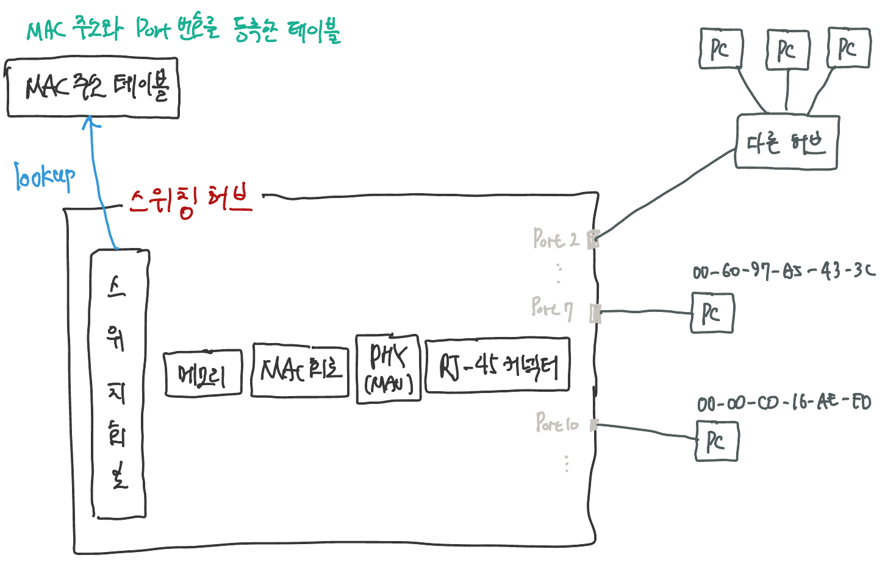
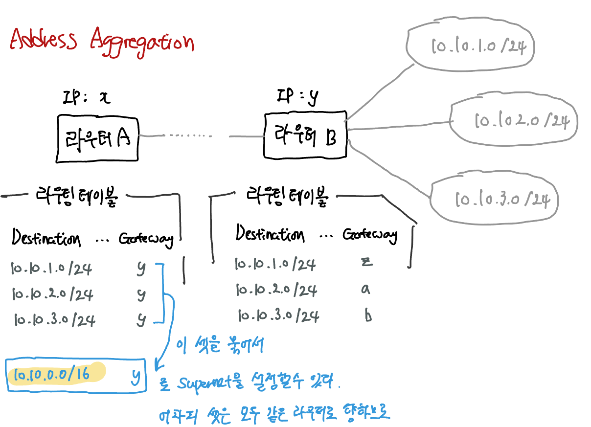

가정에서는 리피터 허브나 스위칭 허브가 내장된 라우터를 사용하는 경우가 많고, 단일 기능의 여러 개의 기기들을 연결해서 사용하는 경우가 적을 것이다. 하지만 단일 기능의 기기가 이해하기 쉬우므로 단일 기능의 기기의 관점으로 보자.

LAN 어댑터의 PHY(MAU)회로에서 전기 신호로 형태를 바꾼 패킷은 RJ-45 커넥터를 통해 트위스트 페어 케이블에 들어간다. 이더넷의 신호의 실체는 +/-의 전압이다. 

> ##### PHY와 MAU
>
> 이더넷에는 다수의 파생방식이 있는데, 각 장식별로 신호 송/수신 회로의 호칭이 다르다. 현재의 100mbps이상의 이더넷은 PHY라고 부르는데, 이전의 저속 방식 중에는 MAU라는 것도 있었다.

송출한 신호는 허브에 도착할 때쯤에는 신호가 약해져 있다. **케이블을 통과하는 사이에 신호의 에너지가 조금씩 떨어지므로** 케이블의 길이가 길어질수록 신호는 약해진다.

여기에 잡음까지 섞인다면 약해진 신호가 더욱 변형되므로 0과 1을 잘못 판독할 수 있는데, 이는 통신 오류의 원인이 된다.

잡음의 원인은 케이블의 주위에서 발생하는 전자파이다. 신호선을 마주 꼬면 잡음의 영향이 줄어들면서 케이블의 성능이 향상된다. 트위스트 페어 케이블을 이용하는 이유는 잡음을 막기 위해서이다. 

#### 리피터 허브 

리피터 허브에서 PHY(MAU) 회로의 수신부에 도달한 신호는 **리피터 회로**에 들어간다. 리피터 회로의 기본은 들어오는 신호를 리피터 허브의 커넥터 부분에 뿌리는데 있다. 리피터 회로의 기본은 신호를 그대로 뿌리는 것이므로 잡음의 영향을 받아 변형되고 데이터가 변화한 것 같은 신호라도 그대로 흘려버린다. (신호의 파형을 다듬고 오류를 억제하도록 나온 개선품도 있다.)

### 스위칭 허브

LAN 어댑터의 경우 수시한 패킷의 Destination MAC address가 자신에게 온 것이 아니라면 패킷을 폐기했다. 반면 스위칭 허브의 포트는 Destination MAC Address를 검사하지 않고 모든 패킷을 수신해 버메모리에 저장한다. 스위칭 허브의 포트에는 LAN 어댑터와 달리 MAC 주소가 할당되어있지 않다.

스위칭 허브는 MAC 주소 테이블에 MAC 주소를 query하고, 해당하는 포트에 신호를 송신한다. 갱신 동작은 다음 2가지이다:

1. 패킷을 수신했을 때
   - Sender MAC address와 수신할 때 이용한 port 번호를 MAC 주소 테이블에 업데이트한다.
2. timeout
   - MAC 주소 테이블에 등록된 정보는 사용하지 않고 일정 시간이 경과하면 삭제된다.

이렇게 해서 MAC 주소 테이블의 내용은 스위칭 허브가 자체적으로 등록/삭제를 반복하므로 manual하게 관리해줄 필요가 없다.

스위칭 허브는 패킷을 수신한 포트와 송신하는 포트가 동일할 경우 패킷을 중계하지 않고 폐기한다. 다음과 같은 사례가 존재한다. 

MAC 주소 테이블에 Destination MAC address에 대응하는 포트가 없을 경우

- 패킷을 수신한 포트 이외의 전체 포트에 패킷을 보낸다. (Flooding)

Destination MAC 주소가 브로드캐스트 일 경우 

- 패킷을 수신한 포트 이외의 전체 포트에 패킷을 보낸다.

스위칭허브는 들어온 패킷을 전송하기만 하고 자신이 송신처나 수신처가 되지는 않는다.

## 라우터

라우터의 내부는 매우 복잡하지만 중계 부분과 포트 부분으로 나눌 수 있다. 

중계부분은 내부의 라우팅 테이블을 조회하여 패킷의 중계 대상을 판단하는 동작을 담당하고, 포트 부분은 패킷을 송/수신하는 동작을 담당한다.

라우터의 중계 부분과 포트 부분의 분담은 프로토콜 스택의 IP 담당 부분과 LAN 어댑터의 역할 분담과 같다.

포트 부분이 패킷의 Sender 혹은 Destination이 된다. 예를들어 포트가 이더넷인 경우 라우터의 포트에는 MAC address가 할당되어 이더넷의 Sender 혹은 Destination이 된다. 

포트에는 IP 주소도 할당된다. 

패킷을 중계할 때는 먼저 라우터의 포트 부분이 Destination이 되어 이더넷의 패킷 수신 동작을 실행한다. 

> 라우터의 각 port에는 MAC 주소와 IP 주소가 할당되어있다.

중계부분의 개념 및 역할 자체는 스위칭허브와 비슷하다. 스위칭 허브는 내부의 MAC 주소 테이블을 확인해 Destination MAC 주소에 해당하는 포트로 신호를 흘려보냈었다. 라우터 역시 라우팅 테이블을 조회해 수신처 포트로 패킷을 보내준다. 

하지만 구체적인 동작은 스위칭 허브와 다르다. 스위칭 허브는 MAC 헤더에 기록되어있는 MAC 주소를 이용해 중계 대상을 판단하지만, 라우터는 IP 헤더에 기록되어있는 Destination IP 주소로 대상을 판단한다. 라우팅 테이블에는 따라서 IP 주소가 등록된다.

라우터는 IP 주소의 Host 부는 무시하고 네트워크 부의 일치여부만 판단한다. 라우팅 테이블에는 대부분 Host 부의 bit가 0인 서브넷 주소가 등록되어있다. 그런데 서브넷에 실제로 할당된 넷마스크 값과 라우팅 테이블에 등록된 넷마스크의 값이 다를 수도 있다.

라우팅 테이블에 등록된 넷마스크 값은 실제 IP 주소의 넷마스크와 다를 수 있다. 역할로만 보자면 완전히 다르다. 라우팅 테이블은 네트워크 부 까지만 검사한다. 따라서 라우팅 테이블에 등록된 넷마스크 값은 순전히 '어디까지 검사할 것인가?'의 목적으로 마스킹 해놓은 것이다. 실제 IP 주소에 이용되는 넷마스크와 역할이 다르다.

#### Address Aggregation (= Supernetting = Summerization)

네트워크 정보를 요약하여 라우팅 테이블에서 다루어야 할 정보량을 줄여 메모리, CPU 등의 자원낭비를 막는다. 

Address Aggregation을 이용하면 몇 개의 서브넷을 모아서 한 개의 서브넷으로 간주한 후 묶은 서브넷을 라우팅 테이블에 등록할 수 있다. 그래서 실제로 할당된 넷마스크 값과 라우팅 테이블에 등록된 넷마스크의 값이 다를 수 있다는 것이다.

Host 부에 bit 값이 채워져 있는 개별 PC를 나타내는 IP 주소를 라우팅 테이블에 등록할 수도 있다. 넷마스크 값을 `255.255.255.255`, 즉 32bit을 전부 1로 등록하면 된다. 이렇게 하면 Host 부의 bit값이 전부 0으로 한 서브넷을 나타내는 주소와 Host 부의 값이 들어있는 개별 컴퓨터를 나타내는 주소를 동일한 메커니즘으로 취급할 수 있다. (어차피 라우팅 테이블은 네트워크 부만 검사하므로. 네트워크 부를 끝까지 늘려주면 검사한다.)

#### 라우팅 테이블

##### Gateway

패킷을 중계해줄 다음 라우터의 IP 주소. 엄밀히 말하면 디바이스가 라우터가 아닐 수도 있다.  하지만 네트워크 간 트래픽을 라우팅해주는 네트워크 디바이스라는 측면에서 거의 대부분 라우터의 IP 주소가 들어간다. 

Gateway로의 라우팅을 통해 로컬 네트워크 밖으로 패킷이 중계된다.

##### Interface

다음 목적지를 나타낸 Gateway와 통신하기 위한 인터페이스를 말한다. 라우터의 network interface를 생각하면 될 듯...? Host(여기서는 라우터)는 일반적으로 여러 개의 interface를 가지고 있다. 

네트워크 인터페이스들은 각각 자신의 IP 주소를 할당받고, 특정한 subnet과 연결된다. Interface는 로컬 네트워크에 대한 트래픽의 진입 혹은 진출 지점을 나타낸다.

'포트'의 개념으로 생각하면 된다. 실제로 역사적인 경위와 관례로 인해 interface와 port를 종종 혼용하기도 한다.

> Gateway vs Interface
>
> Gateway는 네트워크 상의 Host 기기이다. 거의 항상 Gateway 항목에 적힌 것은 거의 항상 다른 라우터의 IP 주소이다.
>
> 

| Destination IP                               | Netmask                                                      | Gateway               | Interface         | Metric                 |
| -------------------------------------------- | ------------------------------------------------------------ | --------------------- | ----------------- | ---------------------- |
| 수신처 IP 주소. 주로 서브넷 주소가 등록된다. | 네트워크 부가 어디까지인지 마스킹한다. (= 어느부분까지 대조할 것인지.) | 다음 라우터의 IP 주소 | 연결되어있는 포트 | 다음 목적지까지의 거리 |

라우터가 라우팅 테이블에 row를 등록하거나 갱신하는 동작은 패킷을 중계하는 동작과 분리되어있다. 스위칭 허브는 스위칭과 동시에 테이블을 꾸준히 갱신했었다. 라우팅 테이블은 라우팅할 때 테이블에 손대지 않는다.

라우팅 테이블을 조작하는 방법은 크게 2가지가 있다: 

1. manual하게 라우트를 CRUD
2. 라우팅 프로토콜을 이용해 라우터끼리 route 정보를 교환하고 라우터가 스스로 라우팅 테이블에 등록 

라우팅 프로토콜은 ROP, OSPF, BGP등이 있다.

#### 라우터의 패킷 수신 동작

라우터의 포트에는 MAC 주소가 할당되어있다. 라우터는 자신의 주소에 해당하는 패킷만 수신하고 해당하지 않는 패킷을 폐기한다. 이를 수신하는 것은 이더넷의 규칙에 위반하는 행위이기 때문이다. (이더넷 포트 기준) 수신한 패킷은 수신 버퍼 메모리에 저장한다. LAN 어댑터의 역할과 거의 비슷하다. 이더넷 규격에 맞는 동작을 하기 때문이다. 

패킷 수신 동작이 끝나면 맨 앞의 MAC 헤더를 폐기한다. MAC 헤더의 역할은 이 라우터에 패킷을 건네주는 것이다. 

> 라우터를 들렀다가는 패킷의 Destination MAC 주소에는 라우터의 포트에 할당된 MAC 주소가 기록되어 있다. 

MAC 헤더 뒤의 IP 헤더의 내용을 확인하고 패킷 중계 동작에 들어간다. 

- Destination IP address에서 넷마스크로 마스킹된 네트워크 부만을 대조한다.
- 일치하는 여러 개의 row가 있다면 넷마스크 값이 큰 것을 선택한다. (더 자세한 주소이므로)
- 넷마스크 값이 동일하다면 메트릭 값이 적은 쪽으로 선택한다.
  - 네트워크 번호의 길이가 같은 것이 여러 행 존재하는 것은 라우터의 고장이나 케이블의 단선 등을 고려해 우회로를 두는 경우에 해당한다.

- 해당하는 row가 하나도 없다면 라우터는 패킷을 폐기하고 **ICMP 메시지**로 송신처에 이 사실을 통지한다.

  - 전의 IP 담당이 패킷에 오류가 있을 때 ICMP 메시지로 통지했다. 라우터의 중계 부분은 IP 담당과 유사하다.

  - 스위칭 허브는 이런 경우 모든 연결된 디바이스에 Flooding 했다. 스위칭 허브는 기껏해야 수천대가 연결되어있으므로 이러한 방식도 괜찮다. 하지만 라우터가 가정하는 네트워크, 즉 인터넷의 규모는 헤아릴 수 없이 크므로 동일한 방식으로 처리한다면 네트워크 혼잡을 야기할 것이다. 

#### default route

Destination IP 주소와 넷마스크 값이 `0.0.0.0`으로 설정되어있는 row이다. 넷마스크가 `0.0.0.0`이라는 것은 비교를 수행하지 않아도 된다는 뜻으로, 모든 주소와 일치하는 IP 주소이다. 

이 row의 Gateway 항목에 인터넷으로 outbound하는 라우터를 등록한다. 이 때 등록된 라우터를 **default gateway**라고 하며, 이 행을 **default route**라고 한다. 

#### TTL 

패킷에는 유효기한이 있다.

라우터는 중계 대상을 찾아내면 패킷을 outbounding port (= Interface)로 옮겨 바깥으로 송신하는데, 라우터는 그 전에 몇가지 해야할 일이 있다. 

라우터를 경유할 때마다 이 값을 1씩 줄이다가 이 숫자가 0이 되면 패킷을 폐기한다. 

패킷이 같은 장소를 끊임없이 순환하는 사태를 막기 위한 것이다. 

Sender가 처음 패킷을 송신할 때 64 혹은 128이라는 값을 설정한다. 현재의 인터넷은 지구의 반대편까지 엑세스할 때도 경유하는 라우터 수는 많아야 수십 대 정도이다. 

#### Fragmentation

https://www.cloudflare.com/ko-kr/learning/network-layer/what-is-mtu/

Fragmentation을 이해하기 위해서는 먼저 MTU에 대해 알아야 한다. MTU(Maxumum Transmission Unit)란 네트워크에 연결된 장치가 받아들일 수 있는 최대 데이터 패킷 크기를 말한다.

**MTU 보다 큰 데이터 패킷은 작은 조각으로 잘라 MTU에 맞추어 분할 발송**할 수 있다. IP 프로토콜에 규정된 이 기술을 Fragmentation이라고 한다. MTU의 단위는 byte이며, 최대 MTU는 1,500byte이다.

네트워크 기기들은 각자 다른 크기의 MTU를 가질 수 있다. 이더넷의 spec에 MTU에 대한 명시는 없으므로 각 네트워크 기기들이 구현된 사양에 따라 MTU 크기가 상이할 수 있다. 라우터의 포트 부분은 이더넷 뿐 아니라 무선 LAN이나 다른 네트워크 기기로 대체될 수 있으므로 Fragmentation 기술이 필요하다. 

> TCP의 데이터 분할과 다른 점 
>
> 이 Fragmentation은 TCP가 데이터를 조각으로 분할하는 것과는 다르다. TCP는 '데이터'를 분할해 패킷에 담았다. Fragmentation은 이미 완성된 '패킷'을 분할한다.

Fragmentation은 다음 순서로 이루어진다:

모든 네트워크 라우터는 수신하는 IP 패킷의 크기를 다음 라우터의 MTU와 비교한다. 패킷의 크기가 다음 라우터의 MTU보다 크면 이 라우터는 payload (IP패킷이므로 TCP 헤더 + 데이터)를 2개 이상의 패킷으로 분할하고 각각 IP헤더와 MAC헤더를 부착한다. **즉, Fragmentation은 수신하는 라우터의 MTU를 기반으로 진행한다.**

이 때 수신 측은 조각화된 패킷을 재조립해야하므로 이를 재조립하기 위한 데이터를 IP헤더에 기록한다.

- DF (Don't Fragment) Flag: 이 패킷이 분할되도 되는지를 bit로 표기. DF 플래그가 서있다면 송신측은 fragmentation을 진행하지 않는다. 패킷 크기가 수신 측의 MTU를 초과한다면 라우터는 해당 패킷을 폐기하고, 패킷을 보낸 곳에 ICMP 메시지를 보낸다. 
- Identifier: 분할되기 전 원본 패킷의 ID
- Fragment Offset: 원본에서 어느 곳에 위치했었는지를 나타낸다.

Fragmentation은 네트워크 latency를 늘리고 비효율을 초래하므로 최대한 피하는 것이 좋다. IPv6 패킷의 경우 Fragmentation을 허용하지 않는다.

#### 라우터가 next-hop으로 송신한다.

이제 다시 라우터의 포트 부분이 패킷을 송신해야할 차례이다. 기종은 달라도 이더넷의 spec을 따르는 것은 동일하다. MAC 헤더를 다시 부가한다. 라우팅 테이블의 Gateway 항목에 해당하는 IP 주소로 일단 중계하기로 했었다. 해당 IP 주소에 대응하는 MAC 주소를 알아야 하므로 ARP를 이용해 MAC 주소를 조사하고, 결과를 Destination MAC address로 설정한다. 라우터에도 ARP 캐시가 있으므로 ARP 캐시를 먼저 조회한다.

라우팅 테이블에 Gateway 항목이 공란인 경우도 있다. 라우터가 아닌 실제 목적지로 향하는 경우이므로 IP 헤더에 있는 Destination IP Address를 이용해 MAC 주소를 조회한다. 

Sender MAC Address 역시 바꾸어주어야한다. 출력 측의 포트에는 각각 MAC address가 할당되어있는데, 이 값을 채워넣는다. 그리고 type field에 0800을 설정한다.

#### 라우터와 스위칭 허브의 관계

IP라는 구조는 스스로 패킷을 운반하는 수단이 없으므로 패킷을 운반하는 작업은 이더넷에게 의뢰한다. 라우터는 IP의 개념에 기초해 만들어졌고, 스위칭 허브는 이더넷에 기초해 만들어졌다. 라우터와 스위칭 허브의 관계는 IP와 이더넷의 관계와 유사하다. 즉, 라우터는 패킷을 운반하는 일을 스위칭 허브에 의뢰한다. 하지만 이러한 설명은 '순수한' 라우터와 스위칭 허브에만 해당한다. 

실제 라우터는 스위칭 허브를 내장한 기종이 있고, 가정에서 사용하는 인터넷 접속용 라우터는 유형이 많기 때문에 위 설명이 맞지 않을 수 있다. 또한 스위칭 허브를 이용하지 ㅇ낳고 크로스 케이블로 라우터의 포트를 직접 연결하는 것도 가능하다. 

**IP가 이더넷에게 의뢰하는 것은 최종 Destination까지 운반하는 것이 아니라 다음 라우터 (Gateway)에 패킷을 운반하는 것이다.** 이 동작을 반복해 패킷의 IP의 목적지, 즉 송신 상대까지 운반하는 것이다. 

즉, Destination까지 패킷을 전달하는 전체의 동작은 IP(라우터)가 담당하고, 이 동작 사이에 다음 라우터까지 패킷을 운반하는 일은 이더넷 (스위칭 허브)가 담당하는 것이다. 

원래라면 허브는 하드웨어 디바이스이고 라우터는 소프트웨어 디바이스이므로 허브는 저기능 고성능, 라우터는 고기능 저성능이다.

Layer 2 스위치 (L2 스위치)는 허브의 대형화 고성능 기종이다. 기본적인 역할은 같다.

### 라우터의 부가기능

#### NAT (Network Address Translation) 

> Private IP
>
> private IP 주소의 규칙은 어렵지 않다. private IP를 이용하려면 다음의 범위 안에서만 이용하면 된다.
>
> - 10.0.0.0 ~ 10.255.255.255
> - 172.16.0.0 ~ 172.31.255.255
> - 192.168.0.0 ~192.168.255.255

private IP를 가진 디바이스가 송신한 패킷이 인터넷으로 outbound하려고 할 때, private IP 주소 그대로 Sender IP Address에 기입이 되어있으면 안된다. 이를 위해 IP 헤더에 기재된 Sender IP Address와 Sender Port를 변환하는 기술이 필요한데, 이 기술이 **NAT**이다.

Sender IP에 기록되어있는 private IP를 NAT 디바이스에 할당되어있는 (이 장에서는 라우터 안의 NAT) Public IP로 변환하고, 동시에 포트 번호도 다시 할당한다. 이 때 포트 번호는 NAT 디바이스 측에서 미사용 중인 번호를 적당히 선택해서 이용한다.

Outbound packet에 대응하는 Inbound packet이 돌아오면, NAT 디바이스는 NAT 테이블에서 포트 번호에 맞는 원래 private IP와 포트 번호를 확인하고 다시 IP 헤더에 이 값들을 변환해 채워넣는다.

NAT 테이블의 구성은 다음과 같다:

| NAT IP (Public) | Port | Private IP | Port |
| --------------- | ---- | ---------- | ---- |
| 198.18.8.31     | 5436 | 10.10.1.1  | 1025 |
| 198.18.8.31     | 5437 | 10.10.1.2  | 3000 |
| 198.18.8.31     | 5438 | 10.10.1.3  | 5000 |
| ...             | ...  | ...        | ...  |

#### Packet Filtering

패킷을 중계할 때 MAC 헤더, IP 헤더, TCP 헤더에 기록되어있는 내용을 조사해 사전에 설정한 조건에 따라 패킷을 그대로 중계하거나 폐기하는 동작을 실행한다.

AWS의 Security Group을 이용해 firewall의 역할을 수행하는게 가장 일반적이고 단순한 패킷 필터링의 구현이다. 특정 IP를 whitelist하거나 blacklist하는 것. 

대부분의 방화벽 기기나 SW는 이 원리를 이용해 부정 침입을 방지한다.