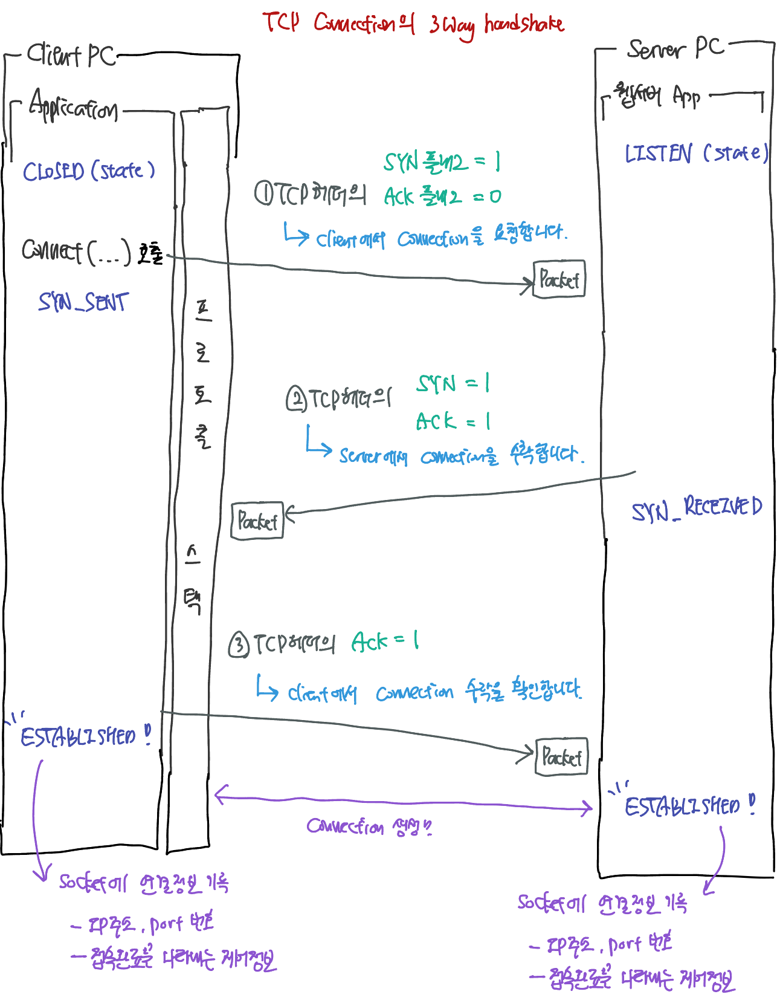
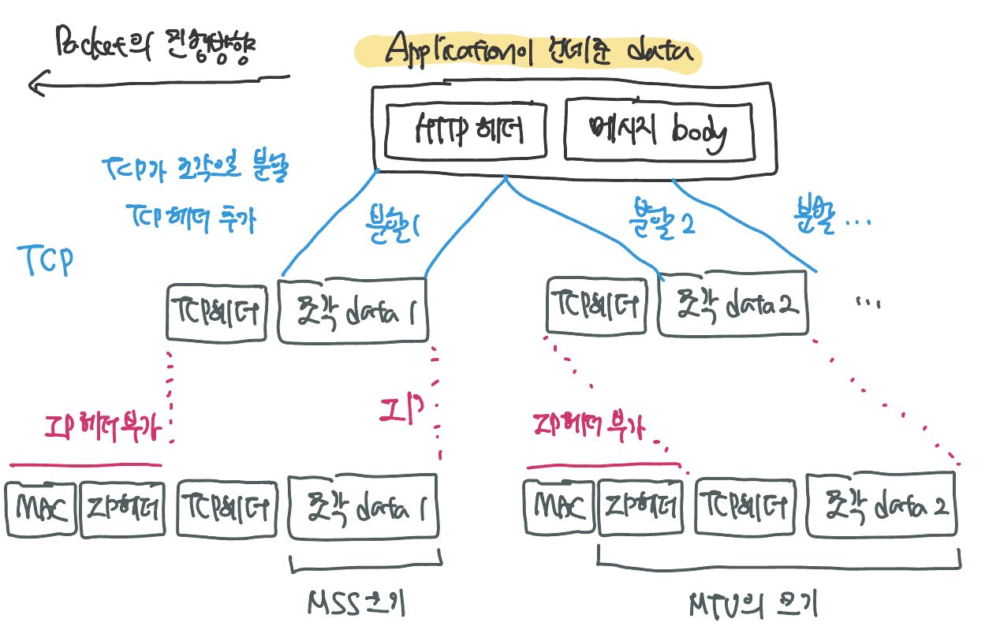
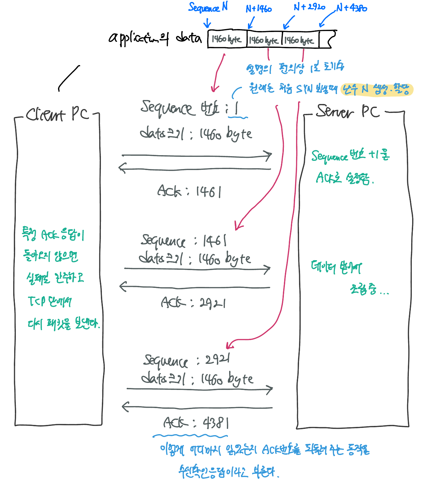

브라우저나 메일 등의 일반적인 application은 TCP를 사용하여 데이터를 송/수신한다. DNS query 등 짧은 제어용 데이터를 송/수신하는 경우에는 UDP를 사용한다.

IP

- IP 프로토콜을 사용해 패킷 송/수신 동작을 제어하는 부분
- 패킷을 통신 상대까지 운반하는 것이 IP의 주 역할
- ICMP
  - 패킷을 운반할 때 발생하는 오류를 통지하거나 제어용 메시지를 통지할 때 이용
- ARP
  - IP 주소에 대응하는 이더넷의 MAC 주소를 query할 때 사용

LAN 드라이버

- LAN Adapter의 하드웨어를 제어한다.

LAN Adapter

- 실제 송/수신 동작, 즉 케이블에 대해 신호를 송/수신하는 동작을 실행한다.

프로토콜 스택은 내부에 제어 정보를 기록하는 메모리 영역을 가지고 있다. 통신 상대의 IP 주소, port 번호, 통신의 진행상태 등을 기록한다. socket은 본래 개념적인 것으로 실체가 없다. 따라서 이렇게 메모리에 기록되는 제어정보 혹은 메모리 자체가 굳이 말하면 socket의 실체라고 할 수 있다. 

- 응답이 돌아오는지 여부
- 송신 동작 후의 경과 시간 등

프로토콜 스택은 socket에 기록된 제어 정보를 참조하면서 움직인다.

## socket을 생성한다.

`socket` 모듈 호출. 프로토콜 스택은 socket 한 개 분량의 메모리 영역을 확보한다. socket의 제어 정보를 기록하는 메모리 영역은 처음부터 존재하는 것이 아니므로 이를 확보해야한다. 이 때는 socket이 작성된 직후라서 아직 송/수신 동작이 시작되지 않은 초기 상태이므로 init 상태임을 나타내는 제어 정보를 socket의 메모리 영역에 기록한다. 이 때는 통신 상대가 누구인지도 모른다. 

socket이 만들어지면 이 socket을 식별하는 descripter를 application에 반환한다.

## connect

socket을 만들면 application은 Socket 라이브러리의  `connect` 모듈을 호출한다. 이더넷이나 통신 회선 등의 케이블은 항상 접속된 상태이므로 물리적으로 케이블을 연결하거나 분리하지는 않는다.

이더넷이나 통신 회선은 항상 케이블이 연결되어있으므로 언제나 신호를 보낼 수 있다. 그러므로 데이터를 신호로 변환하여 보내기만 하면 언제든지 통신이 가능하다.

그렇다면 '접속'의 의미는 무엇일까? 

클라이언트 입장에서는 `connect` 모듈을 호출해 통신 상대의 IP와 port번호를 입력하고, 규정에 맞는 port 번호를 결정해 기록하는 것을 말한다.

서버 입장에서는 listening 중인 socket을 만들어두긴 했지만 서버 측의 프로토콜 스택도 클라이언트와 마찬가지로 socket을 만들기만 해서는 통신 상대를 알 수 없다. 그래서 클라이언트에서 '이 곳의 IP주소는 xxx.xxx.xxx.xxx이고 port 번호는 yyy인데 연결을 요청합니다.'는 메시지를 보내 연결을 원하는 클라이언트가 있다는 것을 서버 측에 전달한다. 이제 서버의 프로토콜 스택도 클라이언트의 정보를 가지게 되었으니 접속할 수 있다. 

#### TCP socket의 state 및 lifecycle

https://users.cs.northwestern.edu/~agupta/cs340/project2/TCPIP_State_Transition_Diagram.pdf

#### TCP 패킷

##### TCP 패킷의 헤더 

| 필드                   | 길이 (bit) | 설명                                                         |
| ---------------------- | ---------- | ------------------------------------------------------------ |
| Source port            | 16         | 패킷을 보내는 측의 port 번호                                 |
| Destination port       | 16         | 패킷을 받는 측의 port 번호                                   |
| Sequence 번호          | 32         |                                                              |
| Acknowledge 번호 (ACK) | 32         |                                                              |
| offset (H.L)           | 4          | 데이터 부분이 어디서부터 시작하는지 나타낸다. (= 헤더의 길이를 byte 단위로 표시) |
| Control Flag           | 6          | 필드의 각 bit가 통신 제어상의 의미를 가진다. 6개의 bit로 이루어진다. |
| Window Size            | 16         | 수신 측에서 송신 측에 자신이 수용하는 하나의 buffer 크기를 byte 단위로 나타낸다. 통신하는 동안 수신자는 해당 필드를 통해 buffer 사이즈를 계속 변경한다. |
| Checksum               | 16         | 오류 유무 검사. 데이터가 전송중에 손실되지 않고 원본과 동일한지 검사한다. |
| Urgent Pointer         | 16         | control bit의 URG로 urgent flag를 설정했을 때 urgent 데이터의 마지막 byte의 일련변호를 Urgent Point에 저장한다. 긴급 처리해야할 데이터의 위치를 나타낸다. |
| Option                 | 가변길이   | 위의 필드 이외의 제어 정보를 기록한다.                       |

이 헤더 항목들은 고정되어있기 때문에 접속, 송/수신, 연결 끊기의 각 단계에서 클라이언트와 서버가 대화할 때마다 이 제어 정보를 부가한다.

송/수신 데이터를 일시적으로 저장하는 메모리 영역인 'buffer 메모리'를 확보하는 것도 실행된다.

접속 동작의 단계에서는 아직 데이터의 송/수신이 이루어지지 않으므로 데이터는 없고 패킷 헤더만 존재한다.

TCP 패킷, IP 패킷, 이더넷 패킷 등의 헤더에 있는 제어정보는 socket에 기록해 프로토콜 스택의 동작을 제어할 때 이용한다.

socket에 기록한 제어 정보는 상대측에서 볼 수 없다. 소통하는 각 프로그램의 머신 OS가 다를 수도 있다. linux나 window, unix가 프로토콜 스택을 만드는 방법이 다르므로 socket에 기록하는 제어정보도 각각 다를 것이다. 대신 서로에게 전달할 때의 약속만 지켜주면 문제 없다.

connection은 데이터 송/수신 동작을 계속하고 있는 동안, 즉 `close`를 호출하여 연결을 끊을 때까지 계속 존재한다. 이렇게 connection이 이루어지면 프로토콜 스택의 접속 동작이 끝나므로 `connect`의 실행이 끝나면서 application을 제어할 수 있게 된다.

#### 3 way handshake

양 쪽 모두 데이터를 전송할 준비가 되었다는 것을 보장하고, 실제로 데이터 전달을 시작하기 전에 다른 한쪽이 준비되었다는 것을 알 수 있게 해준다. 즉, connection을 생성하는 방식이다. TCP connection이 시작된 후 모든 segment에는 항상 ACK flag의 bit가 1으로 세팅된다. 

> ACK 번호와 ACK flag가 다름을 유의하자! ACK 번호는 16byte의 헤더정보이고, ACK flag는 control flag에 속하는 1bit 짜리의 헤더 정보이다.

## 데이터 송/수신 

Socket 라이브러리의 `write` 모듈을 호출해 송신 데이터를 OS의 프로토콜 스택에 건네준다. 프로토콜 스택은 받은 데이터의 내용이 무엇인지 알지 못한다. `write`를 호출할 때 데이터의 길이를 지정하지만, 프로토콜은 해당 길이만큼 binary 데이터가 1byte씩 나열되어있다고 인식할 뿐 내용은 알지 못한다.

### 데이터 패킷은 언제 송신될까? 

`write` 모듈을 호출한다고해서 곧바로 패킷이 전송되는 것은 아니다. 프로토콜 스택은 application에서 전달된 데이터를 곧바로 송신하지 않을 수도 있다. 보통은 프로토콜 스택 내부의 **송신용 Buffer 메모리 영역**에 데이터를 저장해두고 application이 다음 데이터를 건네주길 기다린다. 

##### 데이터 패킷을 언제 송신할지 판단하는 기준은 다음과 같다 

1. 패킷에 저장할 수 있는 데이터의 크기

   프로토콜 스택은 **MTU**(Maximum Transmission Unit)라는 argument로 최대 크기를 판단한다. MTU는 한 패킷이 운반할 수 있는 디지털 데이터의 최대 길이로, 이더넷에서는 보통 1,500byte이다. 

   MTU에는 패킷 맨 앞부분에 헤더가 포함되어있으므로 헤더를 제외한 데이터의 최대길이는 **MSS** (Maximum Segment Size)라고 한다.

2. 타이밍

   프로토콜 스택 내부에는 타이머가 있다. 해당 타이머로 일정 시간이 경과할 때마다 패킷을 송신한다. 보통 ms단위의 시간으로 길지 않다.

MTU 혹은 MSS에 가까운 길이에 이르기까지 데이터를 buffer에 저장하고 패킷을 전송하면 네트워크 효율이 올라간다. 하지만 반대로 애플리케이션의 송신 속도가 느려져 buffer를 채우는데 오래걸릴 경우 송신 자체가 지연될수도 있다는 단점이 있다.

타이밍을 짧게 잡으면 real-time에 가까운 송/수신을 지원하지만 그만큼 잘게 패킷을 쪼개 보내므로 네트워크 효율이 낮아진다는 단점이 있다.

이와 같이 양자는 trade-off가 명확하므로 용도에 맞게 절충해서 사용해야한다. TCP 프로토콜의 사양에 절충에 관한 규정은 없으므로 OS 종류나 버전에 따라 기본적인 policy가 결정된다. 

##### application 레벨에서도 판단 기준을 제어할 수 있다.

애플리케이션 레벨에서 송신의 타이밍을 제어하는 여지도 남겨두었다. 데이터 송신을 의뢰할 때 option을 지정할 수 있으며, 여기에서 'buffer에 머물지 말고 바로 송신할 것'이라 지정하면 프로토콜 스택은 buffer를 이용하지 않고 바로 송신동작을 실행한다.

브라우저와 같은 대화형 app은 응답시간이 중요하므로 위 옵션을 이용해 buffer를 이용하지 않는 경우가 많다.

### 데이터가 클 때는 분할해 보낸다

HTTP form request의 경우 한 개의 패킷안에 모든 데이터가 다 들어가지 않을 수도 있다. 이 경우 송신 buffer에 저장된 데이터가 MSS의 길이를 초과하므로 다음 데이터를 기다릴 필요가 없다. 따라서 TCP는 송신 buffer에 들어있는 데이터를 맨 앞에서부터 차례대로 MSS의 크기에 맞게 분할하고, 분할한 조각을 한 개의 패킷에 넣어 각각 보낸다.

### ACK 번호 + Sequence 번호로 데이터 송신에 문제가 없는지 확인한다.

TCP에는 보낸 패킷이 상대에게 올바르게 도착했는지 확인하고 도착하지 않았으면 다시 송신하는 기능이 있다. 

sequence의 초기값은 1이 아닌 난수이다. sequence 번호를 항상 1부터 시작한다고 예측할 수 있으면 그에 맞춰 악의적인 공격을 할 수도 있기 때문이다. 이 sequence 난수는 3 way handshake의 첫번째 SYN=1을 보낼 때 함께 설정해 서버에 통지한다.

sequence와 ACK만으로는 충분하지 않은 경우도 있다. 위 설명은 단방향 통신만을 고려하고 있기 때문이다. TCP의 송/수신은 duplex를 지원하므로 두가지 흐름에 모두 대응해야한다.

TCP는  이 방법으로 상대가 데이터를 올바르게 받았는지 확인한다. 상대가 확인할 때까지 송신한 패킷은 송신용 buffer 메모리에 보관되어있는다. 그리고 송신한 패킷에 대응하는 ACK 번호가 돌아오지 않으면 패킷을 다시 보낸다.

이 때문에 LAN 어댑터, Buffer, 라우터 모두 회복조치를 취하지 않는다. TCP에 맡겨두면 오류가 발생해도 결국 데이터가 문제없이 상대에게 도착하기 때문이다.

단 도중에 케이블이 분리되거나 서버가 다운되는 등의 이유로 TCP가 아무리 다시 보내도 데이터가 도착하지 않는 경우가 있다. 이 때 한 없이 다시 보내면 곤란하므로 TCP는 몇 번 다시 보낸 후 회복의 전망이 없는 것으로 보고 데이터 송신을 강제로 종료하고 application에 오류를 통지한다.

#### TCP: timeout

ACK 번호가 돌아오는 것을 기다리는 시간을 timeout이라고 한다. timeout을 너무 짧게 잡으면 불필요한 재전송이 생기고, 길게 잡으면 재전송을 판단하기까지 너무 오랜시간을 기다려 속도 저하의 원인이 된다.

TCP는 timeout을 동적으로 산정하는 방법을 취하고 있다. ACK 번호가 돌아오는 시간을 기준으로 timeout을 계속해서 재산정하는 방식이다. Exponential Moving Average를 이용해 ACK 번호가 돌아오는 시간이 지연되면 timeout을 늘리고, 반대로 ACK 번호가 곧바로 돌아오면 timeout을 줄인다.

### TCP: Window Size을 이용한 Flow Control

#### Stop-and-Wait windowing protocol

#### Sliding Windows

핑퐁 방식은 패킷을 보내고 올바른 ACK 응답이 올 경우 다음 sequence의 데이터를 담은 패킷을 보낸다. 수신측의 능력을 초과하여 (= 수신용 buffer overflow) 패킷을 보낼 일이 없어 안전하지만 ACK 응답을 기다리는 시간이 낭비되는 단점이 있다.

윈도우 제어 방식은 ACK 응답을 기다리지 않고 차례로 패킷을 전송한다. 이 때 수신측의 appcliation이 수신된 데이터를 처리하는 작업이 느려서 수신용 buffer 메모리를 초과하는 양의 패킷을 보낸다면 overflow 현상이 발생해 오류가 발생할 수 있다. overflow 현상은 어떻게 피할 수 있을까? 

수신측에서 송신측에 수신 가능한 데이터 (= 수신 buffer에 여유공간)의 양을 통지하고, 송신측은 이 양을 초과하지 않도록 데이터를 전송하면 된다. 수신측은 **TCP 헤더의 Window 필드**를 이용해 여유 공간을 알린다. 여유 공간을 window size라고 한다.  

그렇다면 이 window 필드 응답은 언제 보낼까? window 통지가 필요한 경우는 수신측의 수신용 buffer에서 데이터를 추출해 application에 반환했을 때이다. buffer의 잔여공간이 변할 때인데 window 통지를 보내야할텐데, buffer의 잔여공간이 변하는 순간은 2가지가 있다.

1. 송신측이 패킷을 전송해 수신용 buffer의 잔여공간이 줄어든다.
2. 수신측이 수신용 buffer에서 데이터를 추출해 application에 반환해 수신용 buffer의 잔여공간이 늘어난다.

1번의 경우는 잔여공간을 송신측에서 스스로 계산할 수 있다. 이전 window 통지를 통해 받은 window size에서 패킷 크기를 제하면 되기 때문이다. 하지만 2번의 경우는 수신측이 알려주지 않는다면 송신 측에서는 알 수가 없다. 따라서 2번의 상황이 window 통지의 타이밍이다.

이제 종합해보면, 수신측이 송신측에 데이터를 보내는 경우는 2가지이다.

1. 패킷을 올바르게 받았다고 ACK 응답을 회신한다.
2. Window size의 변화를 통지한다.

ACK 응답과 window 통지를 매번 따로 보내면 수신측에서 송신측에 보내는 패킷이 많아져 효율성이 저하된다. 그래서 수신측은 ACK 응답은 최대한 압축해서 보낸다. ACK 번호의 송신을 대조할 때 window 통지가 일어나면, ACK 번호와 window 통지를 한 개의 패킷에 합승시켜 보낸다. 또, 복수의 ACK 응답이 연속해서 필요한 경우에도 패킷의 수를 줄이기 위해 최후의 ACK 응답만 패킷으로 보내고 도중의 것은 생략하기도 한다.

### TCP: Packet Loss와 Retransmission 

ACK 응답이 Loss되었을 경우에는? TCP timeout이 경과할 경우 패킷을 다시 보낸다.

데이터 송/수신이 끝나면 connection을 끊는다. HTTP의 경우 서버 측의 응답이 보내지고나서 connection 끊기 단계에 들어간다. 어느 시점에 connetion을 끊는가는 application마다 다르므로 프로토콜 스택은 어느 쪽에서 먼저 connection 끊기 단계에 들어가도 좋게 만들어져 있다. 우리는 HTTP의 경우를 생각해보자.

#### Connection 종료: 4 way Handshake

HTTP의 경우 서버측에서 시작해 4단계를 걸쳐 connection 종료가 이루어지는데, 이를 **4 way Handshake**라고 부른다.

1. 서버 application이 HTTP response를 마친 후, Socket 라이브러리의 `close`를 호출한다.
   - 서버 측의 프로토콜 스택이 FIN=1 인 TCP 헤더를 만들어 송신한다.

2. 클라이언트는 FIN flag를 확인하고 ACK 번호 응답을 회신한다.

   ACK 응답이 끝난 후 application이 수신 buffer에서 데이터를 가지고 갈 때까지 기다린다. 잠시 후 application이 `read`를 호출해 데이터를 가지고 간다. (FIN=1 패킷이 도착하기 전에 application이 `read`로 수신한 응답 데이터를 가져갈 수도 있다)

3. 클라이언트 application도 Socket 라이브러리의 `close`를 호출한다.
   - 클라이언트 측의 프로토콜 스택이 FIN=1 인 TCP 헤더를 만들어 송신한다.

4. 서버 측은 FIN flag를 확인하고 ACK 번호 응답을 회신한다.

