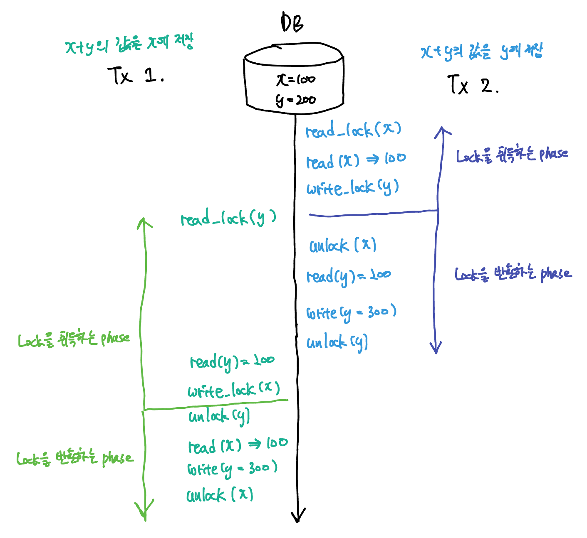

# Concurrency Control: Lock 활용하기

write operation은 단순히 값을 바꾸는 일보다 복잡한 작업이 될 수 있다. 만약 해당 table에 index가 걸려있는 경우에는 index에 대한 처리를 해주어야 할 수도 있다. 

write operation을 하고 있는 도중 같은 데이터에 또 다른 read/write opeation이 실행된다면 예상치 못한 결과를 가져올 수도 있다. 

이는 OS에서 배웠던, 멀티 스레딩 환경에서 공유자원을 다룰 때 발생할 수 있는 race condition과도 유사하다. **DBMS에서도 이러한 race condition을 <u>Lock</u>을 이용해 해결할 수 있다.** Lock을 취득해야 critical section에 들어갈 수 있고, Lock을 취득하지 못했다면 critical section 앞에서 해당 transaction은 대기하게 된다.

DBMS에서 Concurrency Control을 위해 제공하는 Lock은 다음 두 가지이다: 

1. write-lock (= Exclusive Lock) - 배타적 락 
2. read-lock (= Shared Lock) - 공유 락

#### Write Lock (= Exclusive Lock)

다른 말로 Exclusive Lock이라고도 한다. 의미상 Exclusive Lock으로 불리는 것이 더 적합할 듯하다. 핵심은 Exclusive하다는 것이고, read와 write 상황에 모두 이용될 수 있기 때문이다. 

- Read/Write 상황에 모두 이용할 수 있다.
  - Write 작업은 Insert, Update, Delete를 포함한다.
- 다른 Transaction이 <u>같은 데이터를 Read 혹은 Write</u>하는 것을 허용하지 않는다.

#### Read Lock (= Shared Lock)

- Read 상황에만 이용할 수 있다.
- 다른 Transaction이 해당 자원을 동시에 Read 하는 것은 허용하나, Write 작업에 대해서는 허용하지 않는다.

##### 그런데 Lock만으로는 모든 이상 현상을 제어할 수는 없다··· Serializability가 중요하다!

Lock을 사용하는 것만으로는 Transaction의 Serializability를 보장할 수는 없다. Lock을 사용했다고 하더라도 Serializability 속성을 획득하지 못한 Non-serial schedule, 즉, serial schedule과 conflict equivalent하지 않은 non-serial schedule을 실행할 경우 이상현상이 발생할 수 있다. 

이전의 serializability를 설명하며 어떠한 <u>프로토콜</u>을 이용해 schedule을 만들어낸다고 했었다. 이제 그 프로토콜에 대해 알아보자.

### 2PL Protocol (Two-Phase Lock Protocol)

Lock을 획득하거나 돌려놓는 행위를 두 phase로 분리하는 프로토콜이다. 정확히 말하자면, "Transaction에서 **모든 locking operation이 최초의 unlock operation 보다 먼저 수행**되도록 하는 것"가 2PL 프로토콜의 정의가 되겠다. 2PL 프로토콜에는 2가지 Phase가 있다:

1. Expanding Phase (= Growing Phase)
   - Lock을 취득하는 phase. 
   - 해당 phase에서 Lock을 반환하지는 않는다.
2. Shrinking Phase (= Contracting Phase)
   - Lock을 반환하는 phase.
   - 해당 phase에서 Lock을 취득하지 않는다. 

예제로 살펴보자: 

2PL 프로토콜은 serializability를 항상 보장한다! 

##### 하지만 2PL 프로토콜에는 데드락이 발생할 수도 있다. 

데드락의 경우 Lock을 이미 가지고 있으면서도 다른 Lock을 위해 대기하고 있을 때 발생했다. 서로가 서로에게 필요한 Lock을 가지고 있어 둘 다 영원히 대기만하는 그런 상황. 

- 해결하는 방식은 OS에서 데드락을 해결하는 방식과 유사하다.

#### Conservative 2PL Protocol 

이름 그대로 보수적인 2PL 프로토콜이다. **모든 Lock을 취득한 이후에 transaction을 시작**하는 프로토콜. 따라서 해당 transaction에 필요한 Lock을 모두 긁어모으는 것으로부터 transaction이 시작된다.

데드락이 발생하지 않는다는 장점이 있지만, 트랜잭션 자체를 시작하기 어려운 조건이므로 실용적인 방법은 아니라고 할 수 있다.

#### Strict 2PL Protocol (= S2PL Protocol)

schedule 시간에 배웠던 strict schedule을 보장하는 프로토콜이다. **write-lock을 취득했다면 그 transaction을 commit/rollback할 때 반환**히는 프로토콜.

recoverability를 무조건 보장한다.

#### Strong Strict 2PL Protocol (= SS2PL 혹은 Rigorous Protocol)

역시 strict schedule을 보장하는 프로토콜이다. S2PL과 다른 점은 write-lock과 read-lock을 모두 취급한다는 점이다. **write-lock 혹은 read-lock을 취득했다면 그 transaction을 commit/rollback할 때 반환**하는 프로토콜.

recoverability를 보장하며 S2PL보다 구현이 쉽다는 장점이 있다. 하지만 Lock을 그만큼 오래동안 쥐고 있으므로 transaction의 전체적인 처리량이 저하될 수 있다는 단점도 가지고 있다.

##### 근데 현대적인 DBMS는 2PL 잘 안쓴대요.

초창기 DBMS에서는 S2PL 혹은 SS2PL을 많이 사용했었다. 하지만 read-read 상황을 제외하고는 모든 transaction을 block 해버리니까 <u>처리량이 안습</u>이었다. write-write는 위험한 경우니 막더라도, <u>read-write 정도는 block하지 않고 동시에 허용할 수 있지 않을까?</u> 하는 고민들이 계속되었고, 결국 해결책으로 찾은 방법이 MVCC이다.

오늘날 대부분의 DBMS는 lock과 MVCC를 섞어서 활용한다.