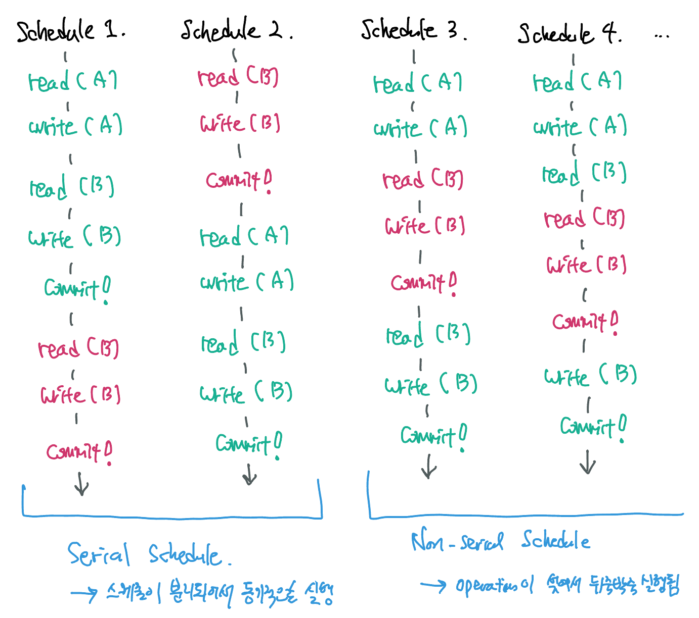
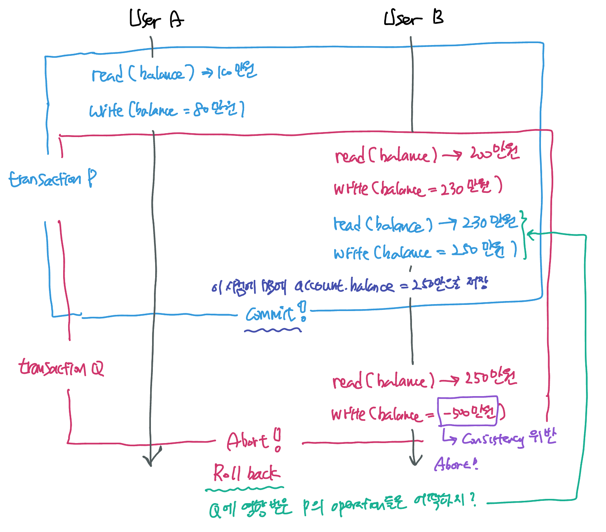
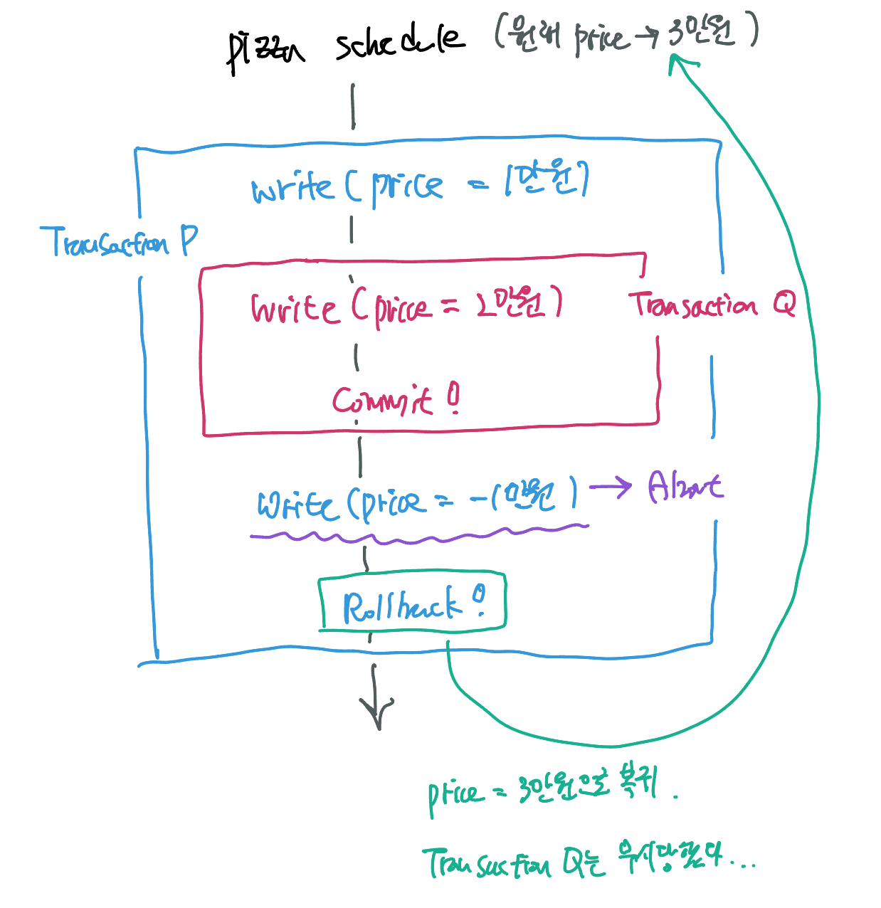
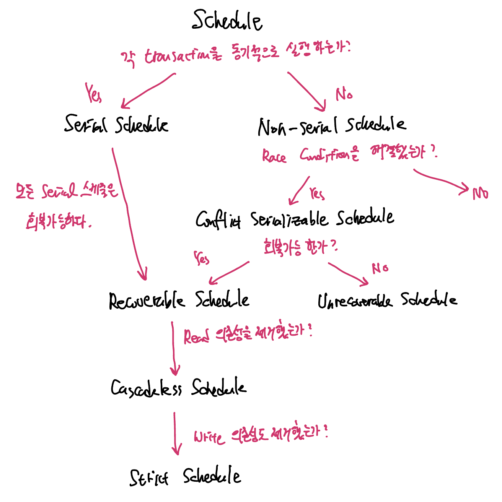

Transaction의 ACID 속성에서 Isolation의 그림을 다시보자. 

위와 같이 2개 이상의 transaction이 동시에 발생할 때, <u>실행되는 순서에 따라 결과가 달라</u>져 update하는 opreation이 Commit 시점에 무시되는 현상을 **Lost Update**라고 한다. 데이터베이스 transaction 상황에서의 race condition이라고 볼 수 있다.


## Schedule이란? 

Schedule을 정의하기에 앞서 먼저 Operation을 정의해보자. 

<u>Operation이란 각 transaction에 속한 최소 단위의 작업</u>을 말한다. read 혹은 write 단위로 나뉘어진 작업을 operation이라고 할 수 있겠다.

**Schedule이란 각 transaction에 속한 operation들이 실행되는 순서를 의미한다.** transaction이 한 시점에 하나만 실행된다면 schedule은 1가지 경우의 수만 가질 수 있지만, 동시에 실행되는 transaction의 수가 많을수록, 그리고 각 transaction 안의 operation 개수가 많을수록 가능한 Schedule의 수는 많아진다.

Lost Update 사례에서 가능한 schedule들이다: 



#### Serial Schedule이란

<u>transaction들이 한번에 하나씩 겹치지 않고 동기적으로 실행되는 schedule</u>을 말한다. 만약 transaction A와 B가 있다면 A에 해당하는 operation들을 모두 수행한 후 B에 해당하는 operation을 수행하거나, 그 반대의 경우로 실행하는 schedule을 serial schedule이라고 부른다.

Serial schedule을 이용하면 각 transaction을 완벽하게 isolate할 수 있어 race condition이 생기지 않지만 성능적인 문제 때문에 실제 DBMS에서 채택하는 schedule은 아니다.

> operation 대부분이 I/O 작업인 DB 특성상 transaction들을 상호 배제하며 동기적으로 수행하는 일은 매우 비효율적이다.


#### Non-Serial Schedule

<u>transaction들이 겹쳐서 (interleaving) 실행되는 schedule</u>을 말한다. 위 그림의 Lost Update를 야기하는 경우가 Non-serial schedule의 한 종류이다.

transaciton들이 겹쳐서 실행되기 때문에 동시성을 활용해 같은 시간에 더 많은 transaction들을 처리할 수 있다. 하지만 큰 단점이 있는데, 

- transaction들이 어떤 형태로 겹쳐서 실행되는지에 따라 이상한 결과가 나올 수 있다.
- lost update와 같은 race condition을 초래할 수 있다.


##### 고민: transaction의 성능과 race condition 방어를 동시에 얻을 순 없을까? 

이 말은 즉, serial schedule과 동일한 (equivalent) 결과를 보장하는 non-serial schedule은을 찾는 것과 같다. 

이를 위해선 *<u>serial schedule과 non-serial schedule이 동일한 결과를 산출하는 상황</u>*을 정의해야한다. 순서가 바뀌면 결과가 바뀌는 operation들이 문제니까··· 이 녀석들을 정의하는 것이 문제다. 여기에서 <u>Conflict</u>의 개념이 나온다.


##### Conflict한 Operation 이해하기

Conflict Operation는 다음 세 가지 조건을 만족하는 operation 쌍을 의미한다:

1. 두 operation은 서로 다른 transaction에 속한다.
2. 두 operation이 같은 데이터에 접근한다.
3. 두 operation 중 최소 하나 이상은 write operation이다. 

여기에서 3번 조건에 따라서 conflict operation의 이름을 달리 부르기도 한다.

- read-write conflict
- write-write conflict

중요한 점은, <u>conflict operation은 순서가 바뀌면 결과도 바뀐다</u>는 점이다! 


## Serializability를 획득하자

이제 문제의 근원인 conflict operation도 정의했다. 그러니까 이 race condition의 근원인 conflict operation만 잘 해결하면 non-serial schedule로 동시성도 챙기면서 결과의 안정성도 챙길 수 있다는거잖아! 

그렇다면 conflict operation이 어떨 때 안전할까? 바로 serial schedule과 실행 순서가 동일할 때 안전하다. 

##### Conflict Serializability의 속성을 가진 Non-serial Schedule 

2개의 schedule이 아래의 두 조건을 모두 만족하면 conflict equivalent 라고 하며, 해당 non-serial schedule은 Serializability의 속성을 획득하게 된다! 

1. 두 schedule은 같은 transaction들을 가진다.
2. <u>어떤 (any) confllicting operation의 순서도 양쪽 schedule 모두 동일하다.</u>

Conflict Serializable한 non-serial schedule을 실행시키면 동시성과 안정성 모두 잡을 수 있다. 

##### Conflict Serializability 실제로 확인해보기

2번 조건이 이해가 잘 가지 않을 수 있다. 두 Transaction의 conflict한 operation 먼저 정의해보자.

1. 동일한 자원에 접근하는 operation은 Transaction 1 소속의 `read1(B)`, `write1(B)`, Transaction 2 속의 `read2(B)`, `read2(B)`가 있다.
2. 다음 조합으로 conflict operation을 찾을 수 있다.
   - (`read1(B)`, `write2(B)`): read-write conflict 
   - (`write1(B)`, `read2(B)`): read-write conflict
   - (`write1(B)`, `write2(B)`): write-write conflict

이제 각 conflict operation들이 모두 serial schedule 중 하나와 동일한 순서로 실행되는지 체크하면 된다.

위 그림의 Schedule 3.의 경우 모든 conflict operation들의 순서가 serial schedule인 Schedule 2.와 동일하다. 따라서 conflict serializability 속성을 획득했다고 볼 수 있다.

반면 Schedule 4.의 경우 conflict operation들의 순서가 어떠한 serial schedule과도 동일하지 않다. Schedule 4.의 경우 serializable하지 않은 스케줄인 것이다.


##### DBMS는 Conflict Serializability를 어떻게 구현할까? 

Conflict Serializability를 가지는 schedule을 선택해서 transaction들을 동시에 실행시키면 될 것 같은데, 실제로 DBMS는 이 과정을 어떻게 구현할까? 

일일이 schedule 진행마다 확인하는 방법은 부담이 크다. 위의 예시는 고작 2개의 transaction이 겹쳐서 실행되는 상황이지만 실제 application의 경우 동시에 실행되는 transaction의 수는 훨씬 많아질 것이고 그 안의 operation들의 숫자도 더 많을 것이다. 경우의 수도 많으므로 매번 naive하게 확인하는 것은 비효율적이다.

그래서 여러 transaction을 동시에 실행해도 serializable하도록 보장하는 <u>프로토콜</u>을 적용해 schedule을 구성하고 이를 실행한다고 한다. 이는 뒤에서 더 다룬다.


## Concurrency Control: Recoverability

다음 두 transaction이 있다고 가정해보자. 이 때, account 테이블의 balance의 경우 0보다 큰 정수여야 한다는 제약조건이 걸려있다.

Transaction P:

``` sql 
START TRANSACTION;
UPDATE account SET balance = balance - 200000 WHERE user_id = 'user A';
UPDATE account SET balance = balance + 200000 WHERE user_id = 'user B';
COMMIT;
```

Transaction Q:

``` sql 
START TRANSACTION;
UPDATE account SET balance = balance + 300000 WHERE user_id = 'user B';
UPDATE account SET balance = -500000000000 WHERE user_id = 'user B';
COMMIT;
```

이 때, 트랜잭션 Q를 살펴보면 해당 트랜잭션은 두번째 UPDATE문은 때문에 절대 commit 될 수 없음을 알 수 있다. 트랜잭션의 결과가 테이블 제약조건에 어긋나기 때문에 ACID 중 Consistency를 위배하기 때문이다. 따라서 트랜잭션 Q는 반드시 rollback되게 된다.

하지만 문제는 rollback이 어느시점에 되는가이다. 다음의 Conflict Serializable한 schedule을 살펴보자: 



문제는 Transaction P는 이미 commit 되었기 때문에 rollback될 수 없다는 점이다. <u>한번 commit한 트랜잭션을 수정하는 일은 ACID의 durability 속성을 위배</u>하는 일이기 때문이다. 


### Unrecoverable Schedule을 회피하자

위와 같은 schedule을 **unrecoverable schedule**이라고 한다. 정확히 정의하자면 **schedule 내에서 commit된 transaction이 rollback된 transaction이 write했던 데이터를 읽은 경우**를 unrecoverable schedule이라고 한다. 

DBMS는 recoverable한 schedule만을 허용해야한다. 그렇다면 어떠한 schedule을 recoverable하다고 할 수 있을까? 

### 회복 가능한 schedule: Recoverable Schedule 

##### 단순 recoverable schedule

schedule내 transaction간 의존성이 있다면, 의존하고 있는 transaction의 commit을 미뤄주면 되지 않을까? 의존하고 있는 transaction을 먼저 commit해버린게 문제였으니까! 

이러다가 의존성을 제공하는 transaction이 rollback해버리면 의존하고 있는 transaction도 따라 rollback해버리면 된다.

이러한 룰을 지키는 schedule을 <u>recoverable schedule</u>이라고 한다.

하지만 단순한 recoverable schedule은 다음과 같은 단점이 있다:

- Cascading Rollback을 허용함으로서 트랜잭션의 퍼포먼스를 저하시킬 수 있다.

> ##### Cascading Rollback이란?
>
> 하나의 transaction이 rollback하면 그에 의존성이 있는 다른 transaction 역시 rollback을 수행하는 것. 여러 트랜잭션의 원상복구를 연쇄적으로 수행하므로 비용이 많이 든다.


##### Cascadeless Schedule 

Cascading Rollback이 생기지 않도록 schedule을 보다 정돈한 스케줄링 방법이다. Cascading Rollback의 근본적인 원인은 의존관계였다. 의존관계는 한 transaction이 반영된 결과를 읽어들이는 것에서부터 시작된다. 따라서 commit 되지 않은 write의 결과는 읽지도 않음으로서 의존성을 끊어낼 수 있다.

*<u>schedule 내의 어떤 transaction도 commit되지 않은 transaction이 write한 데이터를 읽지 않는다.</u>*

하지만 Cascadeless Schedule도 잡아내지 못하는 case가 있다. 다음의 두 트랜잭션을 가정해보자:

``` sql 
START TRANSACTION; # Transaction P
UPDATE pizza SET price = 10000 WHERE name = "페퍼로니";
UPDATE pizza SET price = -10000 WHERE name = "페퍼로니";	# 무조건 ROLLBACK된다.
COMMIT;
```

``` sql
START TRANSACTION;	# Transaction Q
UPDATE pizza SET price = 20000 WHERE name = "페퍼로니"; 
COMMIT; 
```

pizza.price는 음수가 될 수 없는 제약조건을 가졌다고 가정하며, 페퍼로니 피자의 원래 가격은 3만원이었다고 가정한다. 다음의 스케줄을 살펴보자.



- 기존의 transaction에 의존하지 않고(read하지 않음) write만 수행하므로 해당 schedule은 cascadeless schedule이며, recoverable한 schedule이다.

그럼에도 transaction Q가 씹혔다··· 더 엄격한 스케줄은 없을까? 


##### Strict Schedule

스케줄 내에서 어떤 transaction도 commit되지 않은 transaction이 write한 데이터를 "건드리지" 않는다. <u>read를 봉쇄하는 것도 모자라 write까지 막아버린다</u>. 

근데 사실상 이러면 serial schedule과 동일하지 않나···? 아무튼 rollback할 때 recovery가 쉽다. transaction 이전 상태로 돌리기만 하면 되므로.


## Schedule의 종류 총 정리

지금까지 언급한 스케줄들은 모두 별개의 개념이 아니라 그 성질에 따라 각종 포함관계로 연결되어있다. 다음의 그림으로 간단히 정리해보았다.



Concurrency Control은 스케줄에 serializability와 recoverablility를 제공한다. 그리고 이와 관련된 핵심적인 ACID 속성이 바로 Isolation이다! 

