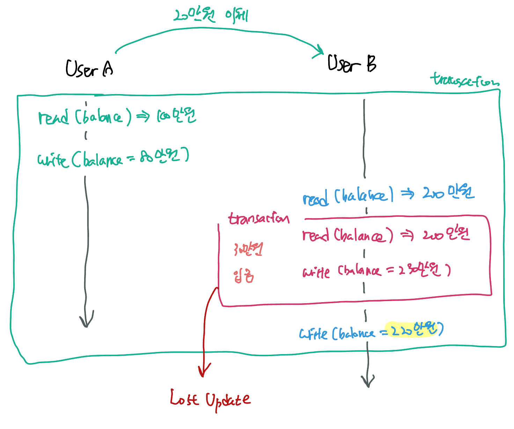

*user A가 user B에게 20만원을 이체*하려고 한다. 데이터베이스에 해당 행위를 영구적으로 기록하려면 어떤 SQL문이 필요할까? 

먼저, user A의 계좌 잔고에서 20만원을 제해야한다.

``` sql
UPDATE account SET balance = balance - 200000 WHERE user_id = 'user A';
```

그 다음 user B의 계좌 잔고에 20만원을 추가해준다.

``` sql 
UPDATE account SET balance = balance + 200000 WHERE user_id = 'user B';
```

이 때, <u>이체</u>라는 행위는 위 <u>두 SQL문이 모두 성공하거나 모두 실패</u>해야한다. 둘 중에 하나만 성공한다면 user A의 잔고만 줄어들거나, user A의 잔고는 그대로인데 user B의 잔고가 늘어나는 어이없는 상황이 일어날 수 있다.

즉, 둘 다 정상처리되어야만 성공하는 단일 작업이라고 볼 수 있다. 이와 같이 <u>SQL문이 모두 성공해야만 작업이 의미 있어지는 작업 단위</u>를 데이터베이스에서는 **transaction**이라고 한다.


## Transaction이란

단일한 논리적인 작업단위를 말한다. **논리적인 이유로 여러 SQL문들을 단일 작업으로 묶어서 나누어질 수 없게 만든 것**이 transaction이다. 따라서 transaction의 SQL 문 중 일부만 성공해서 DB에 반영되는 일은 일어나지 않는다.


##### Transaction은 어떻게 종료할까? Rollback과 Commit

Rollback이란 해당 transaction 안에서 일어난 작업들을 모두 취소하고 transaction 이전 상태로 되돌리는 명령어이다. + 이후 해당 transaction을 종료한다.

Commit이란 해당 transaction 안에서 일어난 작업들을 모두 DB에 영구적으로 저장하는 명령어이다. + 이후 해당 transaction을 종료한다.


##### 매 SQL line마다 자동으로 커밋해준다! AutoCommit이란

각각의 SQL 문을 자동으로 transaction 처리해주는 개념이다. SQL 문이 성공적으로 실행하면 자동으로 commit 해준다. 실행 중에 문제가 있다면 알아서 rollback한다. 

MySQL에서는 디폴트로 autocommit 기능이 켜져 있다. 대부분 DBMS에서도 같은 기능을 제공한다! 


##### 그렇다면 MySQL에서 transaction을 구현해보자.

``` sql 
START TRANSACTION;
UPDATE account SET balance = balance - 200000 WHERE user_id = 'user A';
UPDATE account SET balance = balance + 200000 WHERE user_id = 'user B';
COMMIT;
```

`START TRANSACTION`과 동시에 auto commit 옵션은 꺼지게 된다. UPDATE 쿼리가 도중에 실패한다면 두 실행 결과 모두 rollback되고, 두 쿼리 모두 성공했다면 DB에 저장된다.


##### Java로 코딩한다면 어떻게 되려나

``` java
public void transfer(String fromId, String toId, int amout) {
	try {
    Connection connection = ...;
    connection.setAutoCommit(false);
    // ...
  } catch (Exception e) {
    // ... 
		connection.rollback();
   	// ...
  } finally {
    connection.setAutoCommit(true)
  }
}
```

이 과정을 transaction과 관련된 부분은 `@Transactional` 어노테이션으로 감춰지고, 실제 업데이트 로직에 대해서만 작성하면 된다.


## Transaction의 네가지 속성: ACID 

Transaction을 정의하는 4가지 속성이 있다. ACID란 데이터베이스 내에서 일어나는 하나의 transaction의 안정성을 보장하기 위해 필요한 성질이다.

##### Atomicity (원자성)

일부만 성공해서는 안된다! All or Nothing. <u>나눌 수 없는, 원자성을 가진 (atomic한) 작업 단위</u>의 속성.

transaction은 논리적으로 쪼개질 수 없는 작업단위 이기 때문에 내부의 SQL문들이 모두 성공해야한다. 

##### Consistency (일관성)

데이터베이스의 상태가 consistency해야한다는 성질이다. 그렇다면 consistency는 어떻게 정의할 수 있을까?  "<u>하나의 transaction 이후에도 데이터베이스의 상태는 이전과 같이 유효해야한다</u>"로 정의할 수 있다.  

- constraints나 trigger 등을 통해 DB에 정의된 rule을 transaction이 위반했다면 rollback해야한다.

예를들어, 계좌 테이블을 생성할 때 잔고의 금액이 0 미만일 수 없다는 제약조건을 걸어두었다고 가정하자. 어떠한 transaction에서 특정 User의 계좌 테이블의 잔고를 0 미만으로 업데이트하는 작업이 있었다고 생각해보자. 

- 해당 transaction을 그대로 수행한다면 transaction 이후 데이터베이스의 상태가 유효하지 않게 된다. table의 제약조건을 어겼으므로! 
- 따라서 해당 transaction은 롤백한다.

##### Isolation (격리성)

user A가 user B에게 20만원을 이체하는 상황을 다시 생각해보자. 그런데 이번에는 또다른 user C가 user B에게 30만원을 또 이체하는 transaction이 도중에 일어나게 되었다! 



이와 같이 transaction 실행이 겹쳐 중간에 일어난 operation이 씹히는 현상이 나타날 수 있다. 

"<u>여러 transaction이 동시에 실행될 때도 혼자서 실행되는 것처럼 동작하게 만든다</u>"가 isolation의 핵심이다. 하지만 isolation을 엄격하게 지키면 지킬수록 DBMS의 퍼포먼스가 떨어지므로 DBMS는 여러 종류의 <u>isolation level</u>을 제공한다.

- 금융권 같이 데이터 일관성이 중요한 저장공간일수록 엄격한 isolation을 이용하겠지? 

뒤에서 언급할 concurrency control의 주된 목표가 isolation을 획득하는 것이다.

> isolation은 각 transaction을 실제로 고립시켜 서로 겹칠일이 없게 만드는 것이 아니다. 이러한 행위는 serial scheduling이라고 하며 모든 transaction chunk를 동기적으로 실행하는 방식이다.

##### Durability (지속성)

commit된 transaction은 DB에 영구적으로 저장한다. "영구적"이란 일반적으로 비휘발성 메모리 (HDD, SDD 등)에 저장함을 의미한다. 기본적으로 trasaction의 durability는 DBMS가 보장한다.

