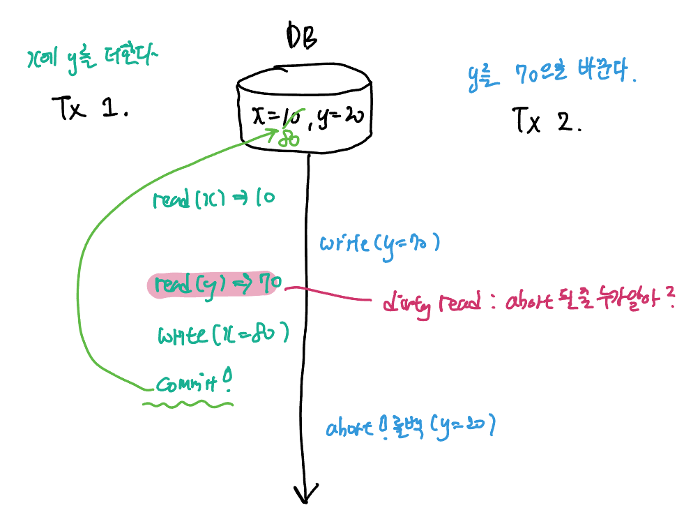
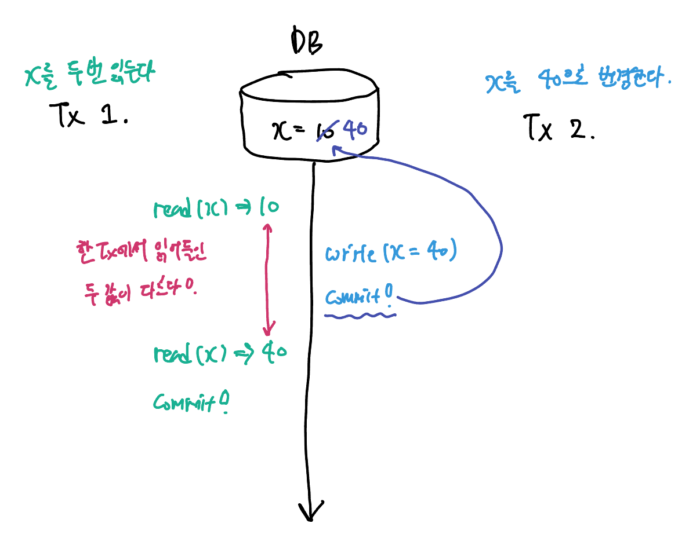
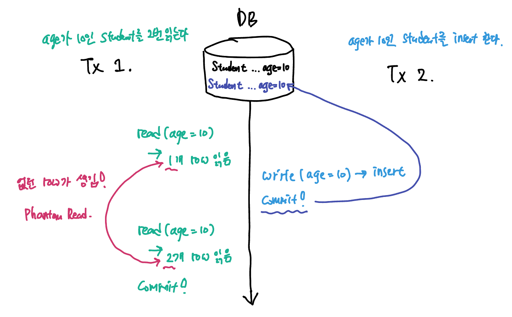

ACID 중 Isolation 속성은 <u>여러 transaction이 동시에 일어나더라도 혼자서 일어나는 것과 동일함을 보장</u>해야한다는 속성이다. 하지만 Isolation을 엄격하게 지키면 지킬수록 DBMS의 퍼포먼스는 떨어질 수 밖에 없으므로 대부분의 DBMS는 개발자에게 어느정도까지 Isolation을 보장할 것인지 선택지를 준다. 이 것이 Transaction Isolation Level이다.

Transaction Isolation Level은 SQL 표준 문서에서 제시하는 3가지 이상현상을 바탕으로, 어느 이상 현상까지를 수용할 것인지를 기준으로 구간을 나눈 것이다.

> 이상현상 (Abnomaly)이란 데이터의 불일치(inconsistency)를 가져오는 현상을 말한다. 

### SQL 표준에서 제시하는 3가지 이상현상

##### Dirty Read: Commit 되지 않은 변화를 읽어들임

<u>Commit 되지 않은 변화를 읽는 것</u>을 dirty read 라고 한다. commit 되지 않은 변경사항은 언제 abort되어 Rollback될 지 모르므로 읽어들인 데이터가 실제 DB에 저장된 값과 다를 수 있기 때문에 "너저분한 읽기"가 되는 것. 

다음 두 트랜잭션의 스케줄을 확인하자:

##### Non-repeatable Read: 같은 데이터를 2번 읽었는데 값이 다르다! 

<u>한 Transaction 안에서 읽었던 데이터를 다시 읽어들일 때 원래와 데이터가 변경되는 현상.</u> 다시 읽어들이기 전에 다른 transaction이 <u>데이터를 갱신</u>하고 <u>commit</u>하기 때문에 발생한다. 

- Dirty Read와 다른 점은 다른 transaction이 갱신 후 commit 했다는 점이다.

다음 두 트랜잭션의 스케줄을 확인하자: 

##### Phantom Read: 두 번 읽었는데, 없던 데이터가 생겨버렸다··· 

한 트랜잭션이 진행중에, 다른 트랜잭션이 <u>추가하거나 삭제한 행 (row)</u>의 데이터를 읽어 발생한다. 첫번째 읽기에는 있었던 행이 두번째 읽기 때 없어지거나, 없었던 행이 두번째 읽기 때 생기는 현상을 말한다.

다음 두 트랜잭션의 스케줄을 확인하자: 

### Isolation Level (격리수준)

트랜잭션의 Isolation level은 dirty read, non-repeatable read, phantom read를 어디까지 허용하는가에 따라 결정된다. isolation level은 다음과 같다.

> <u>대부분의 관계형 DBMS는 위 4가지 격리수준을 option으로 제공</u>한다. 물론 엔진마다 지원하는 option과 실제 의미가 다를수는 있으니 문서를 보고 잘 선택해야한다.

| Isolation Level  | Dirty Read | Non-repeatable Read | Phantom Read |
| ---------------- | ---------- | ------------------- | ------------ |
| Read Uncommitted | O          | O                   | O            |
| Read Committed   | X          | O                   | O            |
| Repeatable Read  | X          | X                   | O            |
| Serializable     | X          | X                   | X            |

**Read Uncommitted**: 다른 Transaction에서 Commit 하지 않은 데이터를 읽을 수 있다. 데이터의 정확도가 중요하지 않으면서 TX의 수행 시간이 긴 경우에 지정하여 사용할 수 있다.

**Read Committed**: 다른 Transaction에서 Commit한 데이터만을 읽는다.

**Repeatable Read**: 다른 Transaction에서 Commit한 데이터만을 읽어들이며, 추가로 트랜잭션 진행 중 읽었던 데이터를 다시 읽는 상황이 나타날 때 중간에 다른 트랜잭션이 해당 데이터를 갱신할 수 없다.

**Serializable**: Non-serial schedule로 실행하더라도 serial schedule과 동일한 결과가 나온다. 더하여 cascading rollback 현상도 없어야 한다. 정의된 3가지 이상현상 외에도 모든 이상현상을 막는 가장 엄격한 레벨이다.

### 추가적인 이상현상들

SQL 표준에서 Isolation Level을 제시하기 위해 정의한 세가지 이상현상들 말고도 트랜잭션의 동시성을 허용하며 발생하는 이상현상들은 더욱 많다. 

##### Dirty Write (Lost Update): 동시에 두 data를 갱신하려고 할 때, 하나의 write가 씹히는 현상 

가장 처음의 그림 사례의 Lost Update가 Dirty write에 해당한다. 한 트랜잭션이 데이터를 write한 후 다른 트랜잭션이 그 갱신된 값을 덮어씌우려 할 때 발생한다.

Rollback시 정상적인 recovery가 되는 것은 매우 중요하기 때문에 모든 isolation level에서 Dirty Right는 허용하지 않도록 막아야 한다.

##### Read Skew와 Write Skew 

영상을 다시 참고하자. 

### Snapshot Isolation 레벨

기존은 이상한 현상 3개를 정의한다음에, 걔네들을 얼마나 허용할지를 바탕으로 레벨을 정해두었다.

그런데 snapshot isolation은 concurrency control이 어떻게 구현방식을 바탕으로 정의한 레벨이다.

- 실제로 어떻게 동작하는지 이해해햐엒지? 

써주는건 snapshot에 써준다는 개념으로 받아들이면 됨. 

- commit하는 순간 snapshot을 DB에 적용한다.

각각의 transaction은 transaction이 시작한 순간으로 snapshot을 읽는다.

- 같은 데이터에 대해 write를 하고 있다면, Lost update가 일어날수도···.
- write write conflict가 발생했을때는 뒤에 시도하는 transaction을 abort 시킨다.

- 이런식으로 동작하는 것을 스냅샷 아이솔레이션이라고 한다.
- 얘는 사실 MVCC의 한 종류이다.

tx가 시작하기 전에 commit된 데이터만 보인다. 

또한 first committer win : write write conflict가 일어났을 때는 먼저 커밋한 사람이 이기셈 ㅋㅋ