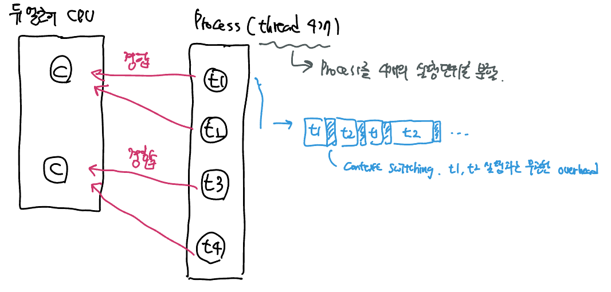

CPU란 메모리에 올라가 있는 프로세스의 명령어를 해석하고 실행하는 장치이다. 먼저 CPU burst와 I/O burst의  의미에 대해 알아보자.

**CPU 버스트 (burst)**

- 메모리에 올라가 있는 프로세스가 "CPU에서 연속적으로 실행되는 시간"을 말한다.
- 만약 어떤 프로세스의 CPU burst time이 10초라고 하면, 그 프로세스의 특정 작업이 완료하기 위해서 CPU가 10초동안 프로세스의 명령어를 연산하고 있다는 것

**I/O 버스트 (burst)**

- CPU가 I/O 작업을 요청하고 결과를 기다리는 시간. 이 시간동안은 CPU가 쉬고 있는다.

즉, 프로세스의 인생은 CPU 버스트와 I/O 버스트의 연속이다! 프로세스는 CPU가 명령어를 수행하다가, I/O를 기다렸다가, 해결이 되면 다시 CPU에서 남은 명령어를 실행했다가··· 를 반복한다. 

그렇다면 CPU bound 프로그램과 I/O bound 프로그램은 뭘까? 

##### CPU bound 프로그램

CPU 버스트가 프로세스의 대부분을 차지하는 프로세스를 말한다. CPU를 점유해서 실제로 연산을 미친듯이 돌려야 하는 작업들로 이루어진 프로세스가 CPU bound 프로세스이다.

예를들면, 동영상 편집 프로그램 혹은 머신러닝 프로그램등이 있다. CPU로도 연산 횟수가 모자라 GPU까지 이용한다.

##### I/O bound 프로그램

I/O 버스트가 프로세스의 대부분을 차지하는 프로세스를 말한다. CPU 연산을 실제로 요구하는 코드보다 네트워크 통신 등 오래 걸리는 I/O 작업이 많은 경우.

일반적인 백엔드 API 서버가 대표적인 I/O bound 프로세스이다. (물론 해당 API 서버가 머신러닝등 고연산 작업을 요구한다면 말이 다르겠지만) 사용자와 대화형으로 동작하는 프로세스는 모두 I/O bound 프로세스이다.

>대부분의 프로그램은 I/O bound 프로그램이라고 한다. 대부분의 프로세스들이 CPU burst가 8ms로 끝난다는 통계 결과가 있다.

#### CPU bound, I/O bound에 대한 궁금증

##### 1. 듀얼코어 CPU에서 동작할 CPU bound 프로그램을 구현한다면 몇 개의 thread를 이용하는게 좋을까? 

> 예를들면, 10억개의 사진을 읽어서 사진 속에 사람이 있는지 없는지를 마킹하는 프로그램을 상정하자.

무조건 thread를 많이 이용하는게 좋을까?  2002년 Goetz가 발표한 추천안은 *"CPU bound 프로그램에서 적절한 thread 수는 **number of CPUs + 1**"*이다. 

듀얼 코어 CPU에 동작할 process 안에 4개의 thread를 만들었다고 해보자. 단순하게 생각해보면 실행시간이 1/4로 줄어들 것이라고 생각할 수도 있다. 동시에 실행가능한 단위를 4개로 분할해서 돌리니까! 

하지만 해당 프로그램이 CPU bound 프로그램임을 다시 생각해보자. 어차피 코어는 한번에 하나의 thread만 실행시킬 수 있다. 2개의 코어를 점유하기 위해 4개의 thread가 경합하는데, 해당 thread 속의 작업 역시 CPU bound 작업들이다.  

thread 실행 동안 CPU가 쉴 틈 없이 연산을 요구하는 작업들이므로 사실상 코어당 1개의 thread를 만드는 것보다 빠를 것이 없다. 아니, 오히려 실행시간이 늘어난다!  

<u>2개의 코어를 4개의 thread가 경합하며 Context Switching이 일어나기 때문이다.</u> Context Switching은 프로세스의 실행과 무관하게 CPU 시간을 잡아먹는 overhead이다.

따라서 CPU bound 프로그램에는 thread 개수를 core의 개수만큼, 혹은 그에서 벗어나지 않는 수만큼만 두는 것을 추천한다.

##### I/O bound 프로그램은 thread 몇 개로 구현하는게 적절할까? 

CPU bound 프로그램과 같이 표준적인 답안이 정해져 있지는 않다. 실제 상황은 워낙 다양하기 때문이다. 

예를들어, API 서버가 thread per request 방식으로 요청을 처리한다고 가정해보자. 이 상황에서 API 서버 프로세스는 미리 thread pool을 생성해놓고 request가 올 때마다 놀고 있는 thread를 해당 reqeust와 매핑하는 방식으로 실행된다.

몇 개의 thread를 미리 만들어놓을지(= thread pool의 크기)는 여러 상황을 고려해서 결정하는 것이 중요하다. 

##### Thread를 많이 이용할수록 애플리케이션의 성능이 높아질까? 

thread 수와 실제 성능과의 상관관계에 대한 궁금증. multi thread 환경을 가정했을 때.

'thread를 많이 쓰면 쓸수록 동시에 더 많은 작업을 실행할 수 있다'는 명제에는 <u>해당 어플리케이션은 더 작은 작업들로 잘게 쪼개서 동시에 실행이 가능한 성격의 어플리케이션</u>이라는 전제가 필요하다.

- 만약 순차적으로 실행되어야 하는 성격이라면, 잘게 쪼개서 실행할 수 없는 애플리케이션이라면 thread를 계속 늘려봤자 별 이점이 없을 것이다.

Context Switching 작업을 위해 소모되는 CPU time은 애플리케이션과 직접적인 관련은 없지만 multi-threading을 구현하기 위해 필요한 overhead (간접비용)이다. 

- CPU의 코어 수를 고정하는데 thread를 계속 늘린다면 overhead가 계속해서 늘어날 것이다. 
- 임계점에 도달하면 overhead 때문에 성능면에서 한계에 직면할 수도 있다.

