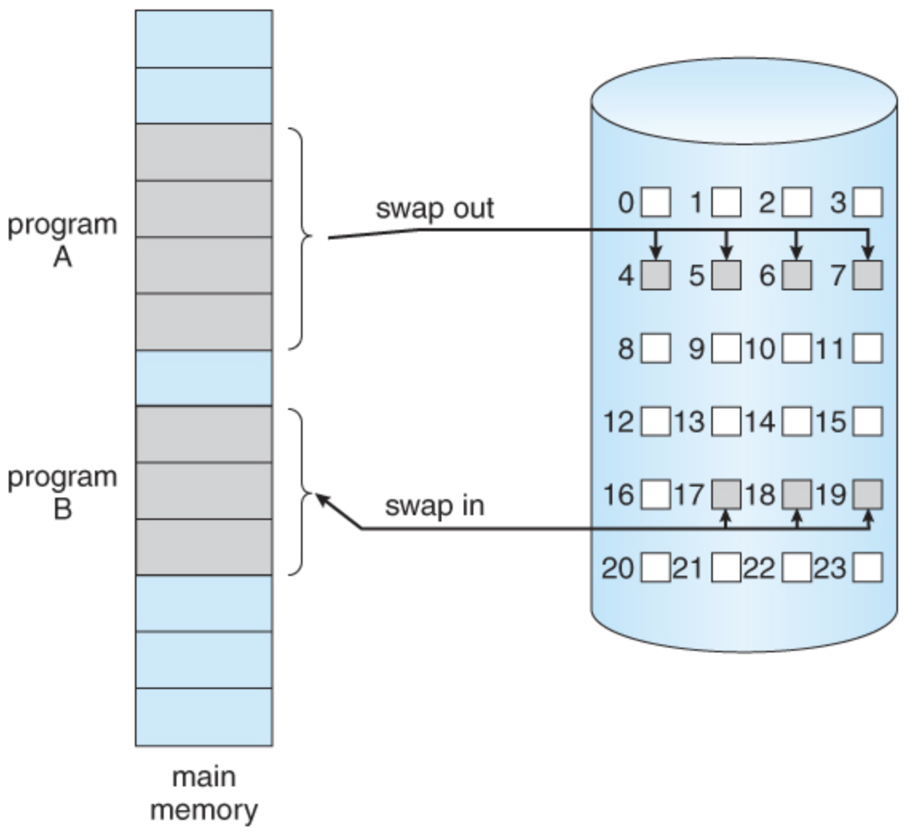

가상 메모리 공간을 어떻게 물리 메모리에 적재할 것인가에 대해 다룬다.

#### Contiguous Memory Allocation (연속 메모리 할당)

메인 메모리는 큰 관점에서 볼 때 두 부분으로 나뉘어져 있다. 

- OS가 점유하고 있는 공간 
- 유저 프로세스가 점유하고 있는 공간

연속 메모리 할당 방식은 하나의 프로세스가 연속된 공간을 할당 받는 것을 말한다.  마치 Array처럼, 프로세스 당 하나의 section을 통으로 할당받는 것이다.

이러면 논리 ↔️ 물리 address mapping이 굉장히 쉽다. reallocation resiger가 저장한 값을 offset 삼아 덧셈한 해주면 되기 때문이다.

하지만 이렇게 관리하지는 않는다. 비용이 너무 크기 때문이다.

- 외부 단편화가 심해진다. 남는 자투리 공간이 구멍 뚫리듯 늘어난다. 이러한 과정이 계속되다보면 남는 공간의 합은 충분한데도 연속된 공간은 쥐똥만큼이라 새 프로세스를 로드할 수 없게된다.
- 프로세스에게 필요한 물리 공간이 더 필요해졌는데, 바로 뒤 주소를 다른 프로세스가 차지하고 있다면···? 매번 array 삽입하듯이 밀어낼 수도 없는 노릇이다.

### 페이징

##### 페이징 기법

물리/가상 메모리 공간을 <u>크기가 동일한 작은 블록 단위</u>로 나눈다.

- 물리 메모리의 블록은 <u>Frame</u>이라고 부르고, 
- 가상 메모리의 블록은 <u>Page</u>라고 부른다.

그리고 이들 Frame와 Page를 각각 매핑하는 것을 페이징 방식이라고 한다. 크기가 고정된 작은 블록 단위들로 나누어 메모리 공간을 관리하므로 매핑만 잘해준다면 한 프로세스가 물리 메모리 공간을 연속적으로 차지하지 않아도 된다!

페이징 역시 OS (소프트웨어)의 로직과 HW의 협업이 필요하다. (메모리 엑세스이므로 하드웨어가 필수)

##### 페이지/프레임의 크기는 어떻게 정할까? 

이건 하드웨어에 종속적이다. 개발자가 관여할 부분은 아님. 다만 개념적으로 알아야 할 것은 2의 배수여야 한다는 점이고, 4KB ~ 1GB의 크기를 페이지 혹은 프레임 사이즈로 가져간다.

##### 페이징의 장점

1. 작은 블록 단위로 할당하므로 메모리를 효율적으로 적재할 수 있다.
   - 외부 단편화(External Fragmentation)를 피할 수 있다.
2. 특정 페이지를 여러 프로세스가 공유할 수 있다. (Shared 라이브러리)

> ##### 내부 파편화 (Internal Fragmentation)는 막기 힘들다. 
>
> 내부 파편화란 작은 블록 내부에서도 이용되지 않고 남겨지는 빈 공간을 말한다. 페이징 기법에서 나타나는 단점이지만, 외부 파편화보다는 훨씬 낫지 않을까··· 

##### 공유 페이지 

프로세스 간에 공유되는 페이지는 <u>각 프로세스의 page table에서 같은 Frame을 가리키도록</u> 만들어 메모리 사용량을 줄일 수 있다. 

각 프로세스는 text (code) 영역과 data 영역을 별도의 페이지로 분리해 Text 영역을 다른 프로세스와 공유하게 함으로써 메모리 활용도를 높일수도 있다.

- 물론 이렇게 필요에 따라 자꾸 페이지를 분리하다보면 내부 단편화가 더욱 심해질 수 있다. 

##### 빈 frame은 어떻게 관리할까? 

비어있는 frame의 리스트는 linked list로 묶어놓고 관리하게된다. 그래서 새로 할당 Framd을 찾을 때 linked list를 거쳐가며 찾는다.

##### 가상 메모리 주소로 물리 메모리에 접근하는 방법 (Logical Address )

페이징이 없을 때는 가상 메모리 주소를 `000FX0FX` 이런 식으로 줘야했다면, 이제는 가상의 주소에 접근할 때에는 딱 2가지 정보만 있으면 된다:

1. Page Number: (가상 메모리에서) 몇 번째 블록인지
   - 페이지 테이블을 이용해서 Page Number를 관리하게 된다. 
   - N번째 페이지 ↔️ 실제 물리 메모리의 몇번째 Frame인지 확인할 수 있도록
2. Page Offset: 해당 블록의 시작점에서 얼마나 떨어져 있는지

그냥 `N`번째 페이지의 `M`번째 부분을 가져와줘 처럼 표현할 수 있는 것.

##### 페이지 테이블의 시간 최적화

OS는 <u>각 프로세스마다 Page Table을 할당</u>한다. 페이지 테이블이 256개 이하인 경우 레지스터를 이용할 수 있지만, 대부분의 경우 <u>메인 메모리에 저장</u>된다.

> ##### Page Table이 저장되는 공간은 메인 메모리이다! 
>
> MMU안에 저장되지 않는다. Page Table은 하드웨어 적으로 관리하기는 어렵다. 워낙 크고 사이즈가 변동적이기 때문이다. 
>
> 그래서 메인 메모리에 두고 OS 커널이 관리하게 된다.

기본적으로 페이지 테이블을 이용해 물리 메모리에 도달하기 위해서는 2번의 메인 메모리 access가 일어난다.

1. 메인 메모리에 있는 Page Table에 엑세스한다. (PTBR 활용)
2. Page Table의 결과로 나온 물리 메모리에 엑세스한다.

PTBR과 PTLR 레지스터를 활용해 실행 속도를 높일 수 있지만, 여전히 2번의 메모리 엑세스 횟수는 동일하다. 이렇게 하려니까 너무 느리다 이거야. 메모리 엑세스는 굉장히 자주 일어나는 일이므로 오버헤드를 어떻게든 줄여야함.

- PTBR (Page Table Base Register): 페이지 테이블에 대한 메모리 주소를 저장
- PTLR (Page Table Length Register): 페이지 테이블의 크기를 저장. 메모리 공간 보호에 이용된다.

그래서 <u>TLB (Table Look-aside Buffer)라는 캐시 메모리를 CPU 안에 배치</u>한다. (정확히 말하면 CPU 안의 MMU 속에 존재함.) 아주 작고 look-up이 빠른 하드웨어 캐시 메모리를 활용한다.

##### 페이지 테이블의 공간 최적화

페이지 테이블은 꽤나 많은 물리 메모리 공간을 잡아먹는다. 공간 최적화를 위해 다음과 같은 기법을 활용할 수 있다.

1. Hierarchical Page Table: 페이지 테이블을 다시 페이징하는 방식
2. Hashed Page Table
3. Inverted Page Table

##### TLB (Table Look-aside Buffer)

주소 변환을 위한 고속의 메모리 장치. Page Number와 Frame Number가 key-value 형태로 저장되며, 용량은 주로 2KB 이하이다.

TLB까지 이용해서 CPU가 가상 메모리 주소를 물리 메모리 주소로 변환하는 메커니즘은 다음과 같다.

1. 가상 메모리 주소(page number + page offset)를 MMU에 의뢰한다.
2. MMU는 먼저 TLB 캐시에 저장되어있는 페이지 테이블을 확인한다.
   - TLB Hit의 경우 물리 주소를 바로 반환한다. 
   - TLB Miss의 경우 3번으로 이동한다.
3. PTBR을 참고해 메인 메모리의 페이지 테이블을 확인한다. (invalid-valid bit를 먼저 확인함)
   - Table Hit의 경우 해당 정보를 TLB에 갱신하고, 물리 주소를 반환한다.
   - Page Fault Trap의 경우:
     - invalid한 접근일 경우 (할당된 메모리가 아닌 경우) interrupt를 걸고 해당 프로세스를 종료한다.
     - valid한 접근일 경우 4번으로 이동한다.
4. 물리 메모리에 Free Frame을 확보한다. (Free Frame Linked List를 이용해서)
5. 원하는 페이지가 현재 물리 메모리에 올라와 있지 않은 상황이므로, Disk Operation (I/O)가 필요하다. 
   - 이 과정에서 disk I/O를 스케줄한 후 일반적으로 해당 process는 블록된다. 
   - I/O waiting 동안 다른 프로세스가 CPU를 점유하게된다.
6. I/O 작업이 완료되면 원하는 Page 블록이 4번에서 준비된 Free Frame에 적재된다. 
   - 이 과정에서 Page Table의 invalid bit를 갱신하게 된다. 다음 번에 조회하면 Page Fault가 나지 않도록.
7. Page Fault를 일으킨 instruction은 보통은 처음부터 (1번부터) 다시 시작하게 된다. 

이 때 3번 이후의 Page Fault Trap과정에는 <u>디맨딩 페이징</u>이라는 기법이 이용된다. 

##### 디맨드 페이징 기법

프로세스가 실행되는 동안 <u>필요한 페이지만을 메모리에 올리고, 필요하지 않은 페이지는 Disk(HDD/SSD)에 저장하여 메모리를 절약</u>하는 방법이다.

사실 별다른 건 없고, 그냥 일반적으로 페이지를 swap-in/swap-out하는 방식이다. 애초에 가상 메모리가 필요한 이유가 물리적 메모리 공간의 한계를 극복하기 위해서였으므로 당연한 이야기.

디맨드 페이징에는 다음 2가지가 있다.

1. Pure Demand Paging
   - Page Fault가 일어날 때만 물리 메모리에 가져온다.
   - 프로그램이 시작할 때부터 Page Fault가 일어나게 된다.
   - I/O waiting 때문에 속도는 느리지만, 물리 메모리를 절약할 수 있다.
2. PrePaging 
   - 지금 당장 필요하지 않아도 미리 몇 개의 페이지를 물리 메모리에 로드하는 것.
   - 속도는 빠르지만 메모리 낭비가 있다.

##### Page Fault Trap과 메모리 보호 메커니즘

일반적으로 Page Table은 메모리 프로세스 보호를 위해 각 row에 valid-invalid bit를 저장하게 된다. 

Page Table에 invalid bit가 기록되는 경우는 다음과 같다.

- 실행 중인 프로세스에 할당된 공간이 아닌 다른 곳의 주소를 가리킬 경우 (메모리 보호 - Illegal)
- 프로세스에 할당된 공간은 맞지만 (Legal), 현재 해당 페이지가 물리 메모리에 올라와있지 않은 경우

Page Table을 조회했을 때, <u>해당 key에 해당하는 Frame의 bit가 invalid할 경우 Page Fault</u>를 일으킨다.

후자의 경우 Disk에 대기 중인 페이지를 물리 메모리에 로드해야하므로

1. 따라서 실제 물리 메모리에 남아있는 <u>빈 frame</u>을 찾는다. linkedlist로 관리 중인 free frame list로 빈 frame을 찾고
2. secondary storage에 있는 원하는 페이지를 찾고, 이를 물리 메모리의 빈 frame에 적재한다. 이 과정에서 I/O waiting이 일어나므로 일반적으로 해당 프로세스는 block된다
3. 적재 후에는 page table을 수정한다.

#### 스와핑 

보조기억장치 (HDD/SSD)의 일부를 메모리 확장을 위한 가상 메모리로 활용하는 것. 그냥 위의 디맨딩 페이지 과정을 생각하면 된다.

Page Fault가 발생하면 Swapping이 발생한다.

##### 스왑 영역 (swap area) 

<u>페이지 파일 혹은 스왑 파일</u>이라고도 불린다. 가상 메모리 관리를 위해 사용되는 디스크 영역을 말한다. 

