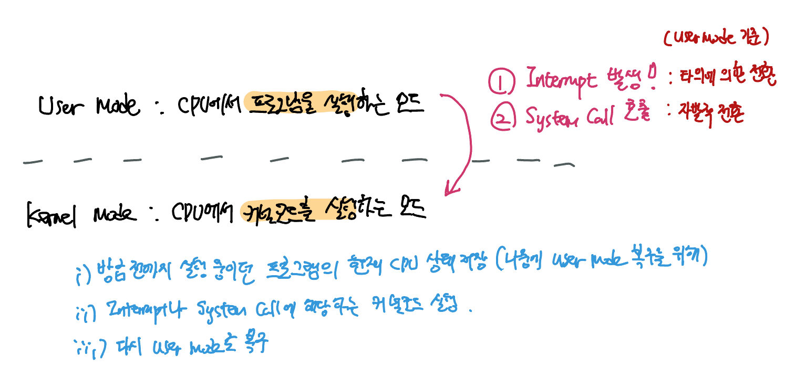

> Interrupt와 System Call은 유저모드에서 커널모드로 전환되는 (= 통제권이 넘어가는) trigger이다. Interrupt와 System Call이 발생하면 즉각적으로 커널모드로 통제권이 넘어가게 된다.

##### 유저모드는 뭐고 커널모드는 무엇인가요?

유저모드란 CPU에서 우리가 작성한 코드, 즉, 프로그램을 실행하는 모드를 말한다. 반대로 커널모드란 CPU에서 커널 코드를 실행하는 모드를 말한다. 

유저모드에서 커널 모드로 전환되는 시점이 두가지 있는데, 이 두 trigger가 바로 Interrupt와 System Call이다.

커널모드에 진입하면 커널은 다음 세 가지를 수행한다. (이 것도 context switching)

1. 방금전까지 실행중이었던 프로그램의 현재 CPU 상태를 저장한다. (유저모드 복구를 위해)
2. 자신을 trigger한 Interrupt나 System Call에 해당하는 작업을 직접 처리한다.
3. 다시 유저모드의 프로그램이 실행된 CPU 상태를 복원하고, 통제권을 유저모드에 반환한다.

##### 그럼 커널은 뭐고 커널 모드는 왜 필요한가?

커널은 운영체제의 핵심으로 시스템의 전반을 관리/감독하는 역할을 수행한다. HW와 관련된 작업을 직접 수행하기도 하고! 

커널 모드를 만든 이유는 시스템을 보호하기 위해서이다. 커널 없이 개발자가 코딩한 프로그램이 임의로 시스템을 조작하다간 터질 가능성이 농후하므로··· 커널을 통해서만 제한적으로 접근할 수 있도록 한 것이다. 

##### 그럼 System Call은 뭔가?

커널을 조작할 수 있는 일종의 인터페이스이다! 개발자는 System Call을 통해 커널이 제공하는 시스템 조작 기능을 이용할 수 있다. system call을 이용해 시스템 조작을 감췄다고 할 수 있지.

프로세스를 생성/kill하거나 파일 I/O, 소켓 관련 (네트워크 관련해서 Socket 라이브러리 기억나지? 그거야.) 디바이스에 접근하거나, 프로세스간 통신 (IPC)에 필요한 메서드 등등··· 커널은 다양한 system call을 제공한다.

우리가 직접 sys call을 호출하지 않는 이유는 대부분의 고수준언어는 본인만의 컨셉으로 system call을 래핑하고 있기 때문이다. 사실 네트워크 I/O 코드를 까보면 다 그 안에 system call을 호출하고 있다.

##### 그럼 Interrupt는 뭔가?

인터럽트는 일종의 이벤트, 알림이라고 생각하면 된다. Interrupt에 어떤 종류가 있는지 알아보자:

- 전원 (Power)에 문제가 생겼을 때
- I/O 작업이 완료되었을 때
- 시간이 다 되었을 때 (컴퓨터에는 timer 하드웨어가 있는데 이 친구가 얘가 timeout이 났을 때 알려준다)
  - time slicing을 통해서 중간에 시간이 다되었다는 걸 알려줄 때도 이 timer를 쓴다.
- 프로그래밍상에서 0으로 나누었을 때도  
- 잘못된 메모리 공간에 접근을 시도할 때

