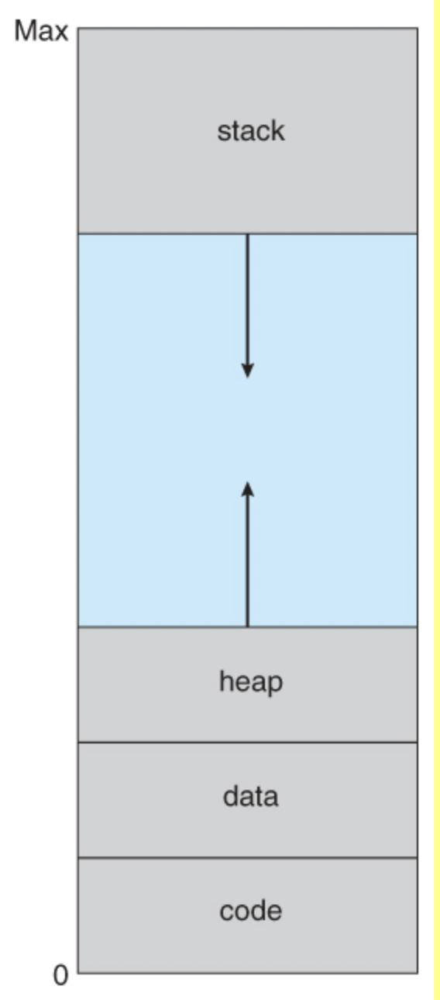

##### physical 메모리와 virtual 메모리

physical 메모리는 컴퓨터의 구성요소인 메인 메모리의 <u>HW상의 주소</u>를 말한다. 메인 메모리 내 random access가 가능한 개별 셀들을 식별하기 위한 address이다.

반면 가상 메모리는 실제 HW상의 주소가 아니며, <u>CPU가 생성하는 주소</u>이다. 

> **Virtual Memory**는 운영체제의 커널이 관리하는 주요 역할 중 하나이다. 실제 물리적인 주소가 아닌, 각 프로세스가 접근 가능한 논리적인 주소를 가지게 된다.

프로세스 메모리 공간을 설명해보세요~ 하면 질리도록 보는 이 그림이 바로 Virtual Address Space를 시각화한 것이다. 

가상 메모리 공간은 offset이 0부터 시작하며, 연속적으로 이루어져 있다. 실제 물리 메모리 속에는 한 프로세스가 연속적으로 할당되지 않으며, 각 프로세스의 물리적 주소 시작 공간 역시 0이 아니다. (가장 먼저 실행되는 OS가 0번지를 차지하겠다.)

요 공간들이 페이지 단위로 분할되어서, 실제 물리 메모리에 필요한 순간에 차곡차곡 로딩되는 것이다. 

##### Memory Virtualization이 왜 필요할까? 

게임과 같은 비교적 큰 크기의 프로그램을 생각해보자. 일반적인 노트북의 RAM 사양이 8GB인데, 게임이라는 하나의 프로세스를 돌리는데만 메모리 공간의 절반 이상을 할당하는 일은 꽤나 비효율적이다. 

<u>실행 중인 프로그램의 모든 부분이 RAM에 통째로 올라가있을 필요는 없다.</u> RAM에 올라와있어야 하는 프로그램의 fragment는 다음과 같다.

- 지금 현재 필요한 데이터 
- 가까운 미래에 필요한 데이터

즉, 프로그램의 실행을 위해 메인 메모리에 데이터를 로드할 때 필요한만큼만 잘게 쪼개서 메인 메모리에 로드하고 나머지는 보조기억장치(HDD/SDD)에서 대기하고 있게 된다.

이를 위해서 물리 메모리의 실제 위치와는 구별되는, 해당 프로세스에 할당되는 가상의 address 개념이 필요한 것이다. 

##### 메모리 가상화의 장점은 무엇일까? 

각 프로세스에 가상의 메모리 공간을 부여하고 필요한 일부만을 물리 메모리에 로드하므로

- 메인 메모리 공간을 효율적으로 이용할 수 있다.
- 동시에 작업할 수 있는 프로세스가 늘어나는 만큼 CPU의 Idle 타임을 줄일 수 있다. (CPU Utilization 최적화)

또한 메모리 가상화를 통해 Shared 메모리 구현을 가능케 한다. 

##### 논리적 주소 ↔️ 물리적 주소의 매핑은 어떻게 하지? => MMU

이 부분을 소프트웨어적으로 해결할 수는 없다. (만약 SW로 해결했다면 Map 자료구조를 사용했겠다.) 메모리 엑세스는 수도 없이 일어나는 일이므로 HW 수준에서 해결해야한다.

이를 위한 CPU의 하드웨어 유닛이 바로 MMU이다.

##### MMU(Memory Management Unit)란

가상 메모리 시스템을 관리하는 하드웨어 유닛이다. 별도의 칩으로 된 경우도 있지만 일반적으로 CPU의 일부로 탑재된다. 페이지 테이블을 위한 아주 작은 메모리를 갖는다.

MMU는 다음과 같은 역할을 수행한다:

1. <u>논리적인 주소와 물리적인 주소를 매핑</u>(변환)한다. 
2. <u>프로세스간 메모리 접근 제어</u>
   - 프로세스 A를 실행 중일 때 프로세스 B에 할당된 메모리 공간을 access하지 못하도록 방어한다.
3. 캐시 메모리 관리 등 
   - TLB (Table Look-aside Buffer)

MMU에는 realocation register가 있다. 이게 MMU의 base register 역할을 한다.

- 만약 CPU가 346의 논리적 주소를 주고 MMU의 realocation register가 14000이라는 값을 저장하고 있다면, 물리적인 주소는 14346이 되는 것이다.

##### 메모리 스페이스의 보호 메커니즘

<u>프로세스는 메모리 공간을 할당 받을 때 분리된 공간을 보장</u>받는다. 보호 메커니즘을 위해 CPU는 다음 2개의 레지스터를 가지고 있다.

- <u>base 레지스터</u>: 할당된 주소의 시작점 
- <u>limit 레지스터</u>: 할당된 주소의 크기

만약 CPU가 메모리의 특정 메모리 address에 접근하고자 한다면, 해당 address가 각각 base, limit 레지스터에 저장된 base 값과 base + limit 값 사이에 존재하는지 판단하게된다. 

이 때 `base ~ base + limit` 구간에 없는 address라면 해당 프로세스에게 할당되지 않은 메모리 구간에 접근하려는 시도이므로 segmentation failure를 얻게 된다.

- interrupt를 걸어서 이상한 짓을 하려고 한다고 OS에게 일러바치면 OS가 해당 프로세스를 메모리에서 쫓아낸다.

> ##### Legal한 메모리 접근과 Ilegal한 메모리 접근
>
> 만약 address가 현재 실행 중인 process에게 할당된 메모리를 가리킨다면 legal, 그렇지 않은 범위의 메인 메모리 주소를 가리킨다면 illegal이다.

OS가 가장 먼저 메모리 영역을 차지해서 실행이 될 것이고, 그 밑으로 프로세스들을 위한 메모리들이 할당되겠지? 

##### Dynamic Loading

프로그램 전체를 메모리에 올리는 게 아니라 필요할 때 (해당 루틴이 불려질 때마다) 해당 루틴을 메모리에 올리는 것.

<u>운영체제가 지원하는 것은 페이징이라고 하고, dynamic loading의 경우엔 개발자가 직접 지정</u>하게 된다.

##### Dynamic Linking

DLLs: Dynimically Linked Libraries

- 쉽게 말하면 <u>shared library</u>이다. 프로그램이 <u>실행되는 도중에</u> 링킹 되는 시스템 라이브러리들을 말한다. 

Dynamic Linking을 이용하면 <u>라이브러리 코드가 실행 중인 프로세스의 가상메모리 영역의 Text (코드) 영역에 포함되지 않는다</u>. 단지 라이브러리를 가리키는 포인터만 실행파일에 두게 된다.

프로그램이 실행되다가 라이브러리를 이용해야할 때, 라이브러리의 위치를 가리키는 포인터를 이용해 별도의 공간에 로드된 라이브러리 코드를 실행하게 되는 것이다. 

100가지의 프로그램이 printf에 대한 코드를 각자의 text 스페이스에 저장하지 않는 것과 같다.

반대로 static linking의 경우 라이브러리 코드가 해당 프로그램의 text space안에 저장되어있는 방식을 의미한다.

> Virtual Memory Management에서 계속...