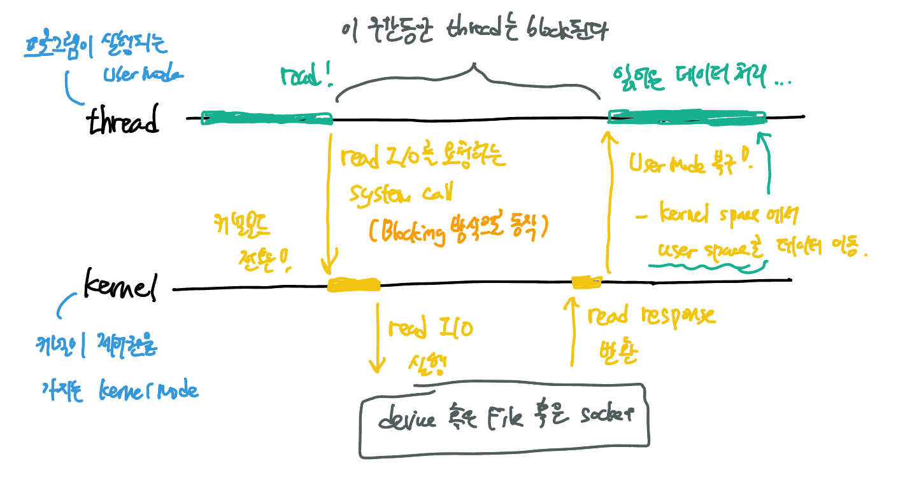
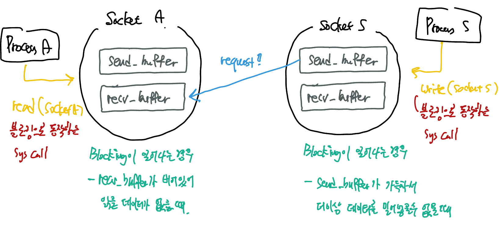
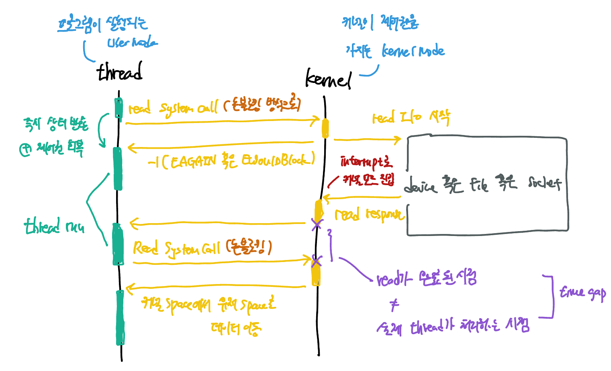
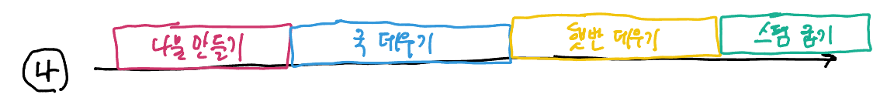
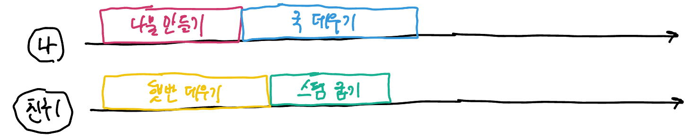
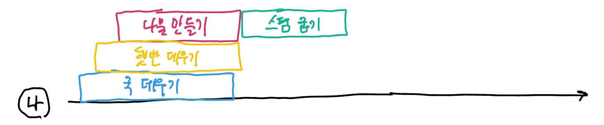
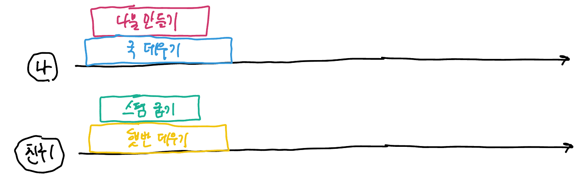

# Blocking I/O와 Non-Blocking I/O

Blocking I/O와 Non-blocking I/O에 대해 알아보기 전에 I/O가 무엇인지, 그 종류는 무엇이 있는지 알아보자. 

**I/O**란, Input/Output의 약자로, **데이터의 입출력**을 의미한다. I/O의 종류는 다음과 같다:

- 네트워크 I/O (= Socket I/O)
- 파일 I/O: HDD 혹은 SDD의 파일 시스템에 접근해 입출력을 진행하는 I/O 
- 파이프 I/O: 프로세스 간 통신을 수행할 때 사용되는 개념이다. 
- 디바이스 I/O: 모니터, 키보드와 같은 입출력 장치들에 의한 I/O 

##### 

이 중 백엔드 개발자가 가장 많이 마주할 네트워크 I/O에 대해 좀 더 알아보자. 

> **왜 네트워크 I/O를 Socket I/O라고 부를까?** 
>
> 서로 통신하는 양 극단 Host 속 프로세스들은  Socket을 통해서 데이터를 주고 받기 때문이다. 즉, 프로세스의 네트워크 I/O를 위해 존재하는 것이 Socket이다. 

Backend 서버 프로세스는 어떻게 멀리 떨어진 여러 Client 프로세스들과 통신할 수 있을까? 연결된 Client 프로세스와의 통신을 위한 Socket을 각각 열고, 연결해서 통신하게 된다. 만약 처리 중인 client request가 8개라면, 현재 열려있는 socket은 8개가 된다.

## Blocking I/O란?

I/O 작업을 요청한 프로세스/스레드가 I/O 작업이 완료될 때까지 block되는 것을 말한다. 다음 그림을 확인하자. 

- Blocking I/O 방식의 system call을 이용할 경우 thread는 I/O가 완료되어 user mode로 제어권을 가져오기 전까지 아무것도 하지 못하는 "blocking" 상태에 처하게 된다.

I/O 요청이 적은 CPU bound 프로세스에는 적합하겠지만, 만약 I/O 요청이 많아진다면 한 작업 당 한번의 kernel mode로 context switching이 발생하기 때문에 비효율을 초래하게 된다. 또한 block된 user process는 CPU를 사용하지 않고 kernel 응답만 기다리게 되는데, I/O 작업은 CPU 자원을 거의 쓰지 않기에 CPU utilization에 좋지 않은 결과를 가져온다.

#### Socket I/O에서 Blocking I/O는 무슨 의미일까? 

양 극단의 Process A와 Process S가 존재하고, 이 둘을 잇는 Socket으로 각각 Socket A와 Socket S가 있다고 가정하자. Process S는 Socket S을 이용해 Process A에게 데이터를 보내고자 한다.

Socket에는 데이터 입출력을 위한 두가지 buffer가 존재한다:

- `send_buffer`: 전송할 데이터를 임시로 모아두는 임시 버퍼
- `recv_buffer`: 수신한 데이터를 임시로 모아두는 임시 버퍼

Blocking I/O call에서 Blocking 상황이 나타나는 경우는 다음 두가지 상황이다. 

1. read system call을 수행 중인데, `recv_buffer`가 비어있어 읽어들일 데이터가 없는 경우
2. write system call을 수행 중인데, `send_buffer`가 가득차있어 더이상 데이터를 밀어넣을 수 없는 경우.

이러한 상황을 I/O가 준비되어있지 않은 상황이라고 한다. 위와 같은 상황 속에서 Socket은 일단 기다리게 된다. Blocking I/O 형태의 system call을 호출한 프로세스/스레드는 이 기간동안 아무것도 하지 못하고 "blocking" 상태에서 대기하게 된다.

## Non-Blocking I/O란? 

<u>프로세스/스레드를 block 시키지 않고 요청에 대한 현재 상태를 즉시 반환하는 메커니즘</u>을 말한다. I/O system call이 thread를 block하지 않고 즉시 return하기 때문에 thread가 다른 작업을 수행할 수 있다.

다음 그림은 가장 단순한 메커니즘의 Non-blocking I/O 동작을 그림으로 나타낸 것이다:

- read I/O를 수행하는 system call을 했지만, read I/O를 대기하지 않고 즉시 현재 상황을 반환하여 user mode로 제어권을 반환하게 된다.

#### Socket I/O에서 Non-blocking I/O란 무슨 의미일까.

기본적인 상황과 Socket의 구성은 Blocking I/O의 상황과 동일하다. 

버퍼에서 읽어들이는 상황이나, 버퍼에 데이터를 쓰는 상황에서 blocking 상황을 마주하면, 적절한 에러코드와 함께 system call은 반환된다. 버퍼가 비거나, 버퍼가 채워지기를 기다리며 thread를 블로킹 상태로 만들지 않는다는 말이다.

#### 그렇다면, Non-blocking I/O는 I/O의 작업 완료를 어떻게 확인할까? 

I/O system call을 할 때 I/O 버퍼에 읽거나 쓸 준비가 되어있지 않는 상황에서 에러코드만 반환한다면, thread는 어떻게 I/O 작업완료를 알 수 있을까? 3가지 메커니즘에 대해 알아보자:

##### 1. Busy Waiting 

위 그림과 같이 I/O가 준비되었는지 반복적으로 확인하는 방식이다. read I/O가 준비되어있지 않다면 (= `recv_buffer`가 채워지지 않았다면) 적절한 에러코드를 반환한다. (linux의 경우 -1)

thread는 주기적으로 read I/O가 준비되었는지 확인하기 위해 read system call을 polling한다. 어느 순간에 read I/O가 준비되었다면 해당 데이터를 buffer로부터 읽어들인다.

이러한 방식은 구현은 간단하겠지만, 처리속도가 느려진다는 큰 단점이 있다.

- read I/O가 준비된 시점과 실제로 read I/O를 수행하는 시점에 시간적 차이가 생기게 되어 처리속도가 느려질 수 있다.
- 게다가 반복적으로 system call을 호출하며 kernel 모드로 전환하므로 CPU time 낭비를 야기한다.

일반적인 백엔드 서버는 많은 수의 요청을 동시에 처리하고, 그 말인즉 많은 수의 socket의 연결을 유지하며 I/O를 수행할텐데, 각 socket 마다 I/O가 준비되었는지 주기적으로 확인하는 것은 대단한 낭비가 될 것이다.

##### 2. I/O Multiplexing

I/O Multiplexing이란 관심있는 I/O 작업들을 동시에 모니터링하고, 그 중에 완료된 I/O 작업들을 한번에 알려주는 방식이다. 

I/O  Multiplexing을 구현한 종류는 다음과 같다:

- select (성능면에서 좋지 않아 자주 이용되지 않는다.)
- poll (성능면에서 좋지 않아 자주 이용되지 않는다.)
- epoll: linux에서 사용됨
- kqueue: maxOS에서
- IOCP (I/O Completion Port): window나 solaris에서 이용됨.

linux epoll의 경우를 통해 I/O multiplexing에 대해 알아보자. 

백엔드 서버에 통신을 위해 8개의 socket이 열려있다고 가정하자. epoll을 통해 8개의 socket에 대해 하나라도 read event가 발생하면 알려달라고 등록하게 된다.

- 이 때 만약에 앞선 영상에서 배운 thread pool을 활용하게 된다면, 미리 생성해둔 thread들에 대해서, 지금 데이터가 들어왔다고 event가 발생한 socket에 대해서 request들을 thread pool의 task queue에 데이터를 넣어서 thread poool의 thread들의 thread들이 각각의 요청을 받아서 동시에 처리할 수 있겠다.

I/O 멀티플렉싱은 네트워크 통신에 많이 사용된다. 물론 우리가 직접 개발할 일은 없다. 톰캣이던 엔진엑스던 이미 만들어진 소프트웨어 위에서 개발을 하고 있기 때문에. 

##### 3. Callback 혹은 Signal

Nonblocking I/O에 대해 I/O 작업이 완료되었을 때 이를 처리할 callback을 등록하는 방식. 널리 사용되는 방법은 아니라고 한다.

핵심은 non-block I/O를 통해 I/O 요청 완료 전에도 다른 일을 할 수 있다는 것! CPU를 더 잘 활용할 수 있다는 점.

# Asynchronous와 Synchronous

동기적으로 처리할 것인가? 비동기적으로 처리할 것인가? 프로그래밍을 개발하는 방법론이다. 

프로그래밍 관점에서 **Synchronous Programming**를 살펴보자. <u>주어진 여러 task들을 차례대로 실행</u>하도록 개발하는 방법론이다. 

**Asynchronous Programming**이란, 순차적으로 실행할 필요가 없는 <u>여러 task들을 독립적으로 동시에 실행</u>하도록 개발하는 방법론을 말한다.

### 예시를 통해 살펴보자

예를들어, "점심 준비하기" 라는 하나의 큰 작업이 있다고 치자. 해당 작업은 다음과 같은 세부 작업들로 이루어져 있다.

- 나물 만들기
- 국 끓이기
- 햇반 데우기
- 스팸 굽기

각 세부 task들은 독립적으로 실행 가능한 분리된 task들이며, 실행 순서에 서로 영향을 주지 않는다.

##### 동기적으로 프로그래밍하기 

1. 그럼, "점심 준비하기" 라는 전체 작업(프로그램)을 동기적으로 프로그래밍해보자.

- 겁나 오래걸린다. 

2. 나 말고 음식을 준비해줄 1명을 더 부르는 방식으로 프로그래밍 해보는 건 어떨까? 

- "점심 준비하기" 프로세스의 실행 시간이 절반 가까이 줄었다! 
- 더 빨리 끝내려면? 음식 준비하는 것을 도울 친구를 두 명 더 불러오면 된다. 독립적인 작업을 1개씩 맡으면 끝나기 때문이다.

##### 비동기적으로 프로그래밍하기

그런데, 생각해보면 국을 데우거나 햇반을 데우는 작업은 사람이 굳이 지켜보고 있지 않아도 된다. 국을 데우는건 가스렌지가 하는 작업이고 햇반을 데우는 작업은 전자렌지가 수행하는 것이므로, 사람은 국을 올려놓고 가스렌지를 켜고 햇반을 전자렌지에 넣고 시간 설정 후 돌리는 작업만 하면 된다.

1. 이번에는 "점심 준비하기"라는 전체 작업(프로그램)을 비동기적으로 프로그래밍해보자.

- 나물 만들기와 스팸굽기는 사람이 직접 지켜보고 수행해야하는 작업이므로 동기적으로 수행할 수 밖에 없다.
- 하지만 국 데우니가 햇반 데우기는 비동기적으로 프로그래밍해서, 혼자서도 더 일찍 작업을 끝낼 수 있었다.

2. 비동기적으로 프로그래밍하면서도 친구 한 명을 더 부른다면 어떨까? 

- 작업 분배를 잘 하고나니 준비시간이 매우 빨라졌다.

### 예제의 상황을 OS의 자원이나 개념에 대입해보자

- 각 사람이 의미하는 것은 thread이다. 

- 햇반 데우기, 국 끓이기와 같이 사람이 직접 지켜보고 있지 않아도 되는 작업들은 I/O task들이다.

- 반면 스팸 굽기, 나물 만들기와 같이 사람이 직접 해야하는 작업들은 CPU task들이다.

- 햇반데우기와 나물 만들기를 같이하는 것은 Non-blocking I/O 방식이라고 볼 수 있다.

### Async Programming을 가능하게 하는 것은 다음 두가지 이다

1. Multi-threading
   - 멀티 코어를 활용할 수 있다는 장점이 있다.
   - 스레드를 너무 많이 만들면 context switching에 비용이 들고, race condition이 발생할 가능성이 있기 때문에 동기화 문제를 잘 처리해주어야 한다.
2. Non-blokcing I/O

> ##### Async Programming != Multi-threading
>
> 둘은 다른 개념이다. Async Programming은 여러 작업을 동시에 실행하는 프로그래밍 방법론을 말하는 것이고, Multi-threading은 async programming을 실제로 구현하는 방법의 한 종류이다.

백엔드 프로그래밍의 추세는 스레드를 적게 쓰면서도 non-blocking I/O를 통해서 전체 처리량을 늘리는 방향으로 발전하고 있다. 즉, 멀티 스레딩과 논블로킹 I/O를 조합하여 비동기 프로그래밍을 극대화하는 방향으로.

## References
- [유튜브 쉬운코드](https://www.youtube.com/watch?v=mb-QHxVfmcs&list=PLcXyemr8ZeoQOtSUjwaer0VMJSMfa-9G-&index=13)