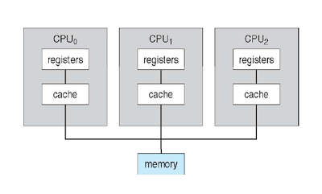

# Chpt 1, 2 운영체제의 개념과 구조

운영체제란? 

- computor system을 operate (운영)하는 소프트웨어 

그럼 컴퓨터란?

- 정보를 처리하는 기계 (machine that processes the *information*)

그럼 정보란?

- quantative representation that measures the uncertainty
- 불확실성을 수치적으로 표현한 것 -> 확률

- 

- $$
  l(x) = -log_2P(x)
  $$

- 사건 x의 정보량 = l(x)은 사건 x가 발생할 확률 = P(x) 의 -1승의 log_2
- 정보 = l(x) 의 최소 단위는 1/2 확률이다. 
  - -log_2 1/2 = 1이므로 
  - 동전 던지기, binary ! 
  - 정보의 최소 단위 1bit = 1/2 확률의 binary case를 말한다.

범용 컴퓨터 (general-purpose computor)

- 컴퓨터는 저 binary case를 조합한 연산만으로 모든 정보처리가 가능하다.
  - NAND 게이트 만으로 모든 계산을 할 수 있다.
- HW 하나만 있으면 그 위에 어떤 software를 설치하느냐에 따라 기능이 정해지는 것을 범용 컴퓨터라고 한다.
- 특정한 목적을 가지고 태어난, 예를 들면 전화기나 계산기는 SW에 따라서 기능이 바뀌지 않는다.

컴퓨터는 누가 만들었나?

- 엘런 튜링 - 컴퓨터의 할아버지 (튜링 머신)
  - Head, Tape, Turing Machine, Universal Turing Machine 의 구조가 현대 컴퓨터의 
  - CPU, RAM, Application Programs, Operating System의 구조와 동일하기 때문
  - 엘런 튜링의 논문인 "튜링 머신"이 현대적 컴퓨터의 전신
- 존 폰 노이만 - 컴퓨터의 아버지 (ISA: Instruction Set Architecture)
  - stored program computor, 즉 프로그램을 메모리에 저장하고 fetch-execute 메커니즘으로 작동하는 방식을 고안함.

프로그램 (Program)이란

- set of instructions = 컴퓨터 하드웨어에게 task를 실행하도록 하는 instruction들의 집합

운영체제란?

- 정확한 정의는 없지만 common definition을 말하자면
  - 컴퓨터에서 항상 실행 중인 *프로그램* 을 운영체제라고 한다.
  - 가장 핵심적인 것은 kernel이므로 kernel이라고 불리기도 한다

- 하드웨어를 감싸고 응용프로그램들이 하드웨어에 접근/활용할 수 있도록 interface 역할을 해준다.
- 그 과정에서 process들, resource들 (file infra등), user interface(마우스, 키보드등), 등등에 대한 관리를 해주어야 하는데 이들이 운영체제의 역할이다.

- 이렇게 HW를 운영하는 컴퓨터 프로그램을 SW 적으로 구현한 것을 운영체제라 한다.

### 운영체제가 수행해야하는 일

##### UI (User Interface)를 제공한다

- CLI, GUI, Batch 등 유저와 소통할 수 있는 창구를 제공한다.

##### Program execution

- 프로세스 생성과 같이 프로그램 실행에 필요한 자원들을 적절하게 할당한다.

##### I/O operations

- 입출력 장치에 대해 buffering, spooling, caching으로 적절하게 관리

##### File-System manipulation

- 파일의 생성, 삭제나 디렉토리와 같은 기능 지원
- open, close, read, write, create, delete 같은 것들임

##### Communications 

- 프로세스 간, 컴퓨터 간, 네트워크에서 실제로 통신을 통해 정보 교환.
- 프로세스들은 한 컴퓨터 내에서, 혹은 네트워크를 이용해 컴퓨터 간 정보를 교환할 수도 있다.
- communication들은 shared memory를 통해 이루어 질 수도 있고, message passing (OS에 의해 보내지는 패킷)으로 이루어 질 수도 있다.

##### Error Detection 

- OS는 항상 가능한 에러에 대해 aware하고 있어야 한다.
- CPU나 memory, I/O 디바이스, 유저 프로그램 등 어디서든 error가 발생할 수 있음.

##### Resource Allocation

- 여럿의 유저나 여러개의 job이 concurrently하게 실행될 때, 그들에게 적절하게 resource가 적절하게 할당되어야 한다.

##### Accounting 

- 어떤 user가 어떤 computor resource를 얼만큼 이용하고 있는지 tracking해야함
- 자원 사용량 추적 가능

##### Protection and Security

- 보안

### 운영체제가 탄생한 배경

- HW가 문제 해결을 위해 만들어졌으나, HW 처리속도가 계속 빨라지는 반면 이를 다루는 사람에는 한계가 있었다
  - 그래서 만들어진 것이 Program! = application program이라고 한다.
  - 이들은 처음엔 특정한 하드웨어 위에서만 작동했다.
- 이러한 프로그램들은 비효율적이었고, I/O device를 관리하고 자원도 할당할 수 있는 프로그램을 만들기로 했다.
  - 이게 바로 OS
- "The one program running at all time on the computor" is the kernel

Kernel 

- 운영체제의 핵심 부분으로, 자원할당, 하드웨어 인터페이스, 보안 등을 담당함.

시스템 프로그램 VS 응용 프로그램 

- system program
  - 운영체제와 관련되어 있으나 Kernel이 아닌 부분
  - i.e.) 컴파일러, 어셈블러 등
- application program
  - 시스템 운영과 상관 없는 모든 프로그램을 말한다.

컴퓨터의 4가지 구성요소

- 하드웨어 
  - 입출력 장치, 메모리, CPU 같은 것들
- 운영체제 (OS) -
- 프로그램 (시스템 프로그램 - 컴파일러, 어셈블러 | 응용 프로그램 - 텍스트 에디터, DB 시스템)
  - 운영체제를 통해서 하드웨어와 소통한다. 운영체제가 이들을 위한 자원을 관리하고, 제공해준다.
- 유저 
  - 각각의 응용 프로그램을 통해서 OS, 그리고 그 너머의 하드웨어와 소통한다.

Bootstrap 프로그램이란

- OS를 load하는 프로그램으로, firmware라고도 한다.
- 이 프로그램을 시작으로 모든 것이 순차적으로 진행된다.
- 읽기전용 메모리인 ROM, EEPROM에 저장한다.
- 이를 RAM에 저장해놓을 경우 컴퓨터가 꺼지면 다시 킬 수가 없다. OS도 안켜지니까. (RAM은 휘발성)

- 운영체제를 적재하는 방법과 실행, 시작하는 방법도 알고 있어야 한다.
  - 이 프로그램이 운영체제의 Kernel을 찾아 메모리에 load 시킨다 -> 그러면 computor가 켜져있는 동안 운영체제는 꺼지지 않고 컴퓨터를 운영하게 된다.
  - 그 이후 운영체제는 어떤 사건 (event)가 일어나길 기다린다.

## Storage Structure

- 프로그램은 실행되기 전에 memory에 load가 되어야 한다.
- memory에 불러오는 과정까지가 프로그램의 일부

#### Primary Storage (휘발성)

##### CPU (registers)

##### Cache 

- 주기억 장치에 읽어들인 명령이나 프로그램들로 채워지는 버퍼 형태의 고속 기억 장치
- 주기억장치와 CPU 사이에 존재하며, 주기억장치보다 빠르다.
- 접근 속도를 줄이기 위해 있다 >> 성능 향상

##### Main memory

- rewritable memory라고도 불린다.
- 휘발성으로 전원이 꺼지면 데이터를 잃는다.
- 대표적으로 RAM (Random Access Memory)라 부른다. semiconductor를 이용한 main memory는 DRAM이라고 부른다.

Load

- main memory에서 CPU의 register로 가져오는 작업 

Store

- register에서 main memory로 가져가는 작업 

  

#### Secondary storage (비휘발성)

- main memory의 extension으로 속도는 느리지만 거대한 비휘발성 저장 공간을 제공한다.

- 보조저장 장치 

##### NVMe (Nonvolatile Memory Express)

##### SSD (Solid State Disk)

- 반도체를 이용한 하드 디스크

##### HDD (Hard Disk Drive)

- 실제 디스크를 이용한 하드 디스크 

Spool 스풀

- 버퍼에 데이터를 저장해 주기억 장치와 주변 장치의 효율을 증가시키는 기술

Buffer 버퍼 

- 주기억 장치와 주변 장치 사이에서 데이터를 주고 받을 때, 둘 사이의 전송 속도 차이를 해결하기 위한 임시 저장용 고속 기억 장치

### 입출력 구조 (I/O Structure)

저장장치 또한 입출력장치 중 하나.

컴퓨터 시스템은 공통 bus에 의해 연결된 여러 개의 장치 제어기와 CPU들로 구성된다.

장치 제어기 (device controller)가 특정 타입의 장치 (device)를 담당한다.

#### I/O 작업의 과정 (Interrupt 구동 방식)

1. I/O 작업이 시작하려면 device driver가 device controller에 load되어야 한다.

2. device controller가 어떠한 action을 취할지 정하고 그러한 데이터를 device에서 local buffer로 보낸다. 

3. 보내는 작업 (transfer)가 끝나면, *device controoler는 **interrupt**을 이용해서 device driver에게 "작업 다했다"라고 알려준다.*

4. device driver는 OS에 제어권을 주고, 그 작동이 읽기였다면 데이터를 반환하거나 포인터를 데이터에 반환할 수 있다.

interrupt 구동방식의 입출력은 대량의 데이터를 전송할 때 높은 오버헤드 (overhead)를 초래한다.

그래서 직접 메모리 접근 (DMA - Direct Memory Access) 장치를 사용하게 되었다.

## Interrupt

하드웨어와 OS간의 상호작용 수단이다.

일반적으로 I/O device, 예를들어 키보드가 눌렸다고하자. cpu한테 a가 눌렸다고 알려주어야 하는데 이를 interrupt로 알려준다.

Event가 발생하면 HW나 SW로부터 발생한 interrupt에 의해 신호가 보내진다

 ** event는 일반적으로 I/O를 뜻한다.

HW는 언제든지 system bus를 통해 CPU에 신호를 보내 interrupt를 발생시킬 수 있다.

- system bus는 main communication path로 주요 요소들과 연결되어있다.

SW는 시스템 콜을 이용해 interrupt를 발생시킬 수 있다.

- SW로부터 생긴 interrupt는 Trap이라고 한다.

System Call

- 사용자 프로그램이 운영체제의 서비스를 받기 위해 커널 함수를 호출하는 것을 의미

일반적으로 CPU가 interrupted 되면

- 즉시 하던 일을 멈추고 고정된 위치 (fixed location)으로 execution을 전환한다.
  - fixed location이란, 그 interrupt에 관한 서비스 루틴의 start address를 말한다.
- 그리고 interrupt service routine이 실행된다.
- 실행이 완료되면 CPU는 interrupt하느라 멈추었던 연산을 다시 진행한다.
  - interrupt architecture는 다시 돌아오기 위해 현재 실행하고 있던 프로그램의 주소를 저장한다.

interrupt는 컴퓨터 구조에서 아주 중요한 역할을 한다.

- 각각의 컴퓨터는 고유의 interrupt mechanism을 가지고 있다. (물론 공통 부분도 있다)

interrupt는 제어권을 알맞는 interrupt serice routine에게 맡긴다.

- 이러한 제어권 관리를 하는 것을 interrupt-specific handler라고 한다.

interrupt는 매우 빠른 속도와 빈번하게 처리되어야 한다.

- 차라리 A table of pointers (interrupt 주소)를 쓰는게 낫다고 사람들은 생각했다.

A table of pointers는 하위 메모리 (low memory)에 저장되었다.

- 그리고 다양한 장치들의 interrupt service routine들의 주소를 저장했다.

이러한 주소들의 배열을 우린 interrupt vector (= A table of pointers)라고 부른다.

- 얘네 주소들은 unique number로 indexed 되어있다.
- 즉, interrupt service routine의 주소가 unique number에 indexed 되어있다.

만약 interrupt routine이 프로세서 state을 수정하게 될 때에는 현재 상태를 저장하고, 반환하기 전의 상태를 다시 받아온다 .

interrupt service가 끝나면 저장되었던 return address가 다시 program counter에 load되고 interrupted computation은 다시 수행된다.

### Interrupt의 종류 

하드웨어 인터럽트 

- 일반적으로 이야기하는 interrupt. 각종 I/O 디바이스에서 발생한다.
- 하드웨어 인터럽트는 CPU 외부의 디스크 컨트롤러나 주변 장치로부터 요구되는 것으로, OS의 처리를 요하는 상황을 알리기 위해 전기적인 신호를 사용해 구현된다

소프트웨어 인터럽트 (= Trap 혹은 Exception)

- 시스템 코드 실행 중 예외상황 (Exception) 시 발생한다.
- SW interrupt는 외부가 아닌 CPU 내부에서 자신이 실행한 명령이나 CPU의 명령 실행에 관련된 모듈이 변화하는 경우 발생한다.
- 프로그램 실행 중 프로그램 상의 처리 불가능한 오류나 이벤트를 알리기 위한 경우 발생하는데, 이를 Trap혹은 Exception이라 부르기도 한다.
- 또한 프로그램 내에서 특별한 서비스를 요하거나 감시(supervisor)를 목적으로 의도적으로 프로그램이 발생시킨 특별한 명령어에 의해 발생되기도 한다.

### Interrupt의 수행 과정

## 1.3 Computor System Architecture

컴퓨터 시스템에 대한 정의들

- CPU: instruction을 실행하는 하드웨어
  - 코어, 코프로세서, MMU, 캐시 등으로 구성되어있다. 
- 프로세서
  - 한 개 이상의 CPU를 포함하는 물리적인 칩
  - 디바이스가 해야할 일을 총 지휘하는 프로세서를 CPU 라고 하며, CPU의 기능을 보조하는 프로세서를 보조프로세서(Coprocessor라고 한다.)
  - 그러나 Processor라는 용어는 점차 CPU라는 용어를 대체했다.
- 코어
  - CPU의 back computation 유닛
  - 각종 연산을 하는 CPU의 핵심요소.
- 멀티코어: 동일한 CPU에 여러개의 computing core가 있는 것
- 멀티프로세서: 여러 개의 프로세서 (= CPU)가 존재하는 것

### 멀티 프로세서 시스템

CPU가 여러 대가 있는 시스템을 말하며, 그 중에서 SMP는 하나의 메인 메모리를 여러 CPU가 공유하는 시스템 

- 메인메모리에 CPU 하나가 붙어있는 구조는 더 이상 사용하지 않는다.

##### SMP (Symmetric MultiProcessing)

- 가장 보편적인 멀티 프로세서 시스템

- 각 CPU 프로세서가 동일한 task를 수행하는 것

- AMP (Asymmetric Multiprocessing)은 잘 이용하지 않는다.
  - 각 프로세서가 서로 다른 특정한 task를 진행하는 것 
- 여러 개의 CPU가 각각의 register와 cache를 가지고 메모리에 연결되어있다.

### 멀티 코어 시스템

하나의 CPU에 여러 개의 코어가 붙은 것을 말한다.

CPU를 여러 개 다는 것은 비용 부담이 크니, 하나의 CPU 칩안에 CPU Core만 

> ##### CPU vs 코어
>
> - CPU
>   - 코어를 포함하여 pc register 등을 다룰 수 있는 것 
> - Core 
>   - 각 명령어를 수행하기 위한 ALU (Arithmetic Logic Unit)
> - CU (Control Unit)
>   - 레지스터를 가지는 것 

#### 멀티프로세서 vs 멀티코어

> 멀티 프로세서와 멀티 코어 방식은 동시에 적용될 수 있는 사항이다

멀티프로세서

- 명령어를 병렬로 수행한다.

멀티 코어

- 명령어의 마이크로 연산을 병렬로 수행한다.

## 1.4 Operating System Operations

#### 멀티 프로그래밍 (= 멀티 태스킹)

- 한 번에 1개 이상의 프로그램을 실행하는 것 
- 여러 개의 program을 메모리에 load 해놓고 (= 여러개의 process) 동시에 실행시키는 것을 멀티 프로그래밍이라고 한다.
  - Concurrency = Simultaneously
- CPU utilization을 높일 수 있다.
- CPU 가 스케줄링을 통해 실행중인 job을 빈번하게 바꿔서 유저가 느끼기에 여러 개의 프로세스가 동시에 실행되는 것처럼 느낄 수 있다.

> Process
>
> - 메인 메모리에 loading 된 program

