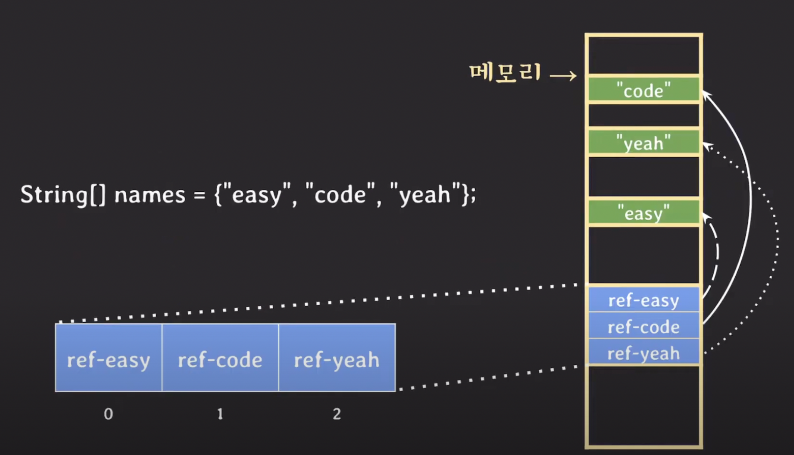

# Array

<u>같은 타입의 데이터</u>에 대해서 <u>연속된 메모리 공간</u>에 저장하는 가장 기본적인 선형 자료구조이다. 

index로 random access (`O(1)`)가 가능하다.

##### 논리적 저장 순서와 물리적 저장 순서가 일치한다. (바로 옆에 저장됨)

배열은 <u>연속된 메모리 공간에 한꺼번에 할당</u>된다. 이 특성에 따라 얻는 장점이 있다:

- **index**를 이용해 특정 element에 `O(1)`의 시간복잡도로 접근할 수 있다. 즉, random access가 가능하다.
  - index가 시작하는 메모리 지점에서부터의 offset 역할을 하는 셈.

- CPU의 cache locality (캐시 지역성)을 활용할 수 있다. 즉, cache hit의 확율이 크므로 캐시 효율이 좋다.

- 데이터의 갯수가 명확히 정해져있고, 접근이 빈번할수록 array 자료구조를 활용하는게 효율적이다.

> ##### Cache Locality 캐시 지역성이란?
>
> 운영체제에서는 물리적으로 근접한 위치의 데이터가 주로 활용되기 때문에 연속된 메모리 블록을 미리 캐시에 로딩함으로서 CPU의 성능을 향상시킨다. (메인메모리까지의 엑세스타임을 아끼는 셈) 배열은 물리적으로 연속된 공간을 할당받기 때문에 이러한 cache locality를 잘 활용할 수 있다.

##### N차원 배열 역시 저장될 때 메모리 모양은 똑같다.

연속된 메모리 공간을 할당 받는 것은 동일하며, 약간 modular 연산을 하듯 위치를 계산한다고 보면 된다.

##### String 타입의 array를 저장하면 어떻게 될까? 

값 자체는 메모리의 어딘가에 산재해 있다. 연속적으로 저장되는 것은 해당 메모리들을 가리키는 reference들이다.

즉, array에는 값이 저장된 <u>메모리 공간을 가리키는 reference가 연속적으로 저장</u>된다고 보면 된다.

##### 순차 탐색에서도 linked list보다 빠른 속도를 보여준다.

linked list의 경우 각 node는 분산되어서 저장될 확률이 크다. array의 경우 연속된 메모리 공간에 할당되므로 순차적으로 방문할 때 cache를 더 잘 활용하므로 linear 탐색에도 좋은 효율을 보여준다.

##### 삽입 및 삭제 연산에 평균적으로 O(N)의 시간복잡도가 소요된다.

index가 특정 원소의 위치를 가리키므로, 탐색까지는 `O(1)`에 끝낼 수 있다. 문제는 삽입을 한다면 그 뒤에 선형으로 저장된 자료들을 모두 한 칸씩 밀어주어야 하며, 삭제를 한다면 선형으로 저장된 자료들을 한 칸씩 당겨주어야 한다는 점이다.

이 때문에 삽입 및 삭제 연산에 `O(N)`의 시간 복잡도가 소요된다.

##### 배열의 크기는 고정되어있어 변경할 수 없다.

처음 크기를 10으로 할당한다고 하면, array의 5칸 만큼을 활용한다고 하더라도 해당 array는 10 만큼을 차지하게 된다. 따라서 array를 활용하는 경우 그 capacity를 올바르게 동적으로 조정하는 것이 중요하다.

특정 자료구조에서 배열을 사용해 자료를 저장한다고 할 때, 배열의 용량을 늘리고자 한다면 늘어난 용량의 배열을 새로 할당하고 기존의 자료를 복사하는 방식으로 확장하게 된다.

array는 컴파일 타임에 그 메모리가 할당된다고 볼 수 있지만, 특정 조건 하에 배열의 크기를 재조정하는 활동은 런타임에 이뤄진다.

##### Dynamic Array란? 

기본적인 Array 자료구조는 크기가 고정되어있다. dynamic array는 크기를 동적으로 조정할 수 있도록 구현한 array를 말한다.

- array list, resizable array 등으로 불린다.

물론 이는 위의 방식처럼 직접 구현해야한다.

# List (ADT)

순서대로 값들을 저장하는 추상 자료형 (ADT)이다.

- 순서가 있으며
- 중복을 허용한다

List를 다른 이름으로 Sequence라고도 부른다.

### Array List (구현체)

Array를 사용하여 List를 구현한 구현체이다. 동시에 Dynamic Array를 구현한 구현체이기도 하다! 

Array의 크기를 내부적으로 조절하며 동적으로 필요한 공간을 동적으로 확장해나간다.

##### 내부적으로 Array를 활용하므로 Array의 특성을 모두 물려받는다.

삽입, 삭제에 `O(N)`의 시간복잡도가 들며, index를 활용한다면 `O(1)`의 시간복잡도로 random access가 가능하다.

다만 다른 점은 내부적으로 동적 array를 구현했다는 점. 삽입 연산 시 threshold를 넘어선다면 더 큰 크기의 array를 재할당하고 붙여넣는다.

> Python의 list는 기본적으로 ArrayList 형식으로 구현했다.

### Linked List (구현체)

List를 서로를 가리키는 pointer를 가진 노드 기반으로 구현한 구현체. 

내부적으로 Array를 활용하지 않으므로 ArrayList와 몇가지 다른 특성을 보인다.

##### 논리적 저장 순서와 물리적 저장 순서가 일치하지 않는다.

이 말은 LinkedList의 경우 <u>불연속적으로 메모리 공간을 차지한다</u>는 뜻이다. 언뜻 보기에는 단점만 있을 것 같지만 장점 역시 존재한다. 단점 먼저 살펴보자.

- 순차성을 보장하지 못하기 때문에 spacial locality 보장이 되지 않아 cache hit가 어렵다.

> spacial locality: 프로그램 실행 시 접근하는 메모리 영역은 이미 접근이 이루어진 영역의 근처일 확률이 높다는 프로그램 성격

다음은 장점이다.

- 이 곳 저 곳에 산재하여 데이터를 저장할 수 있으므로 더 알뜰하게 메모리를 사용할 수 있다. Array의 경우 한 뭉텅이씩 공간을 할당받으므로 뭉텅이가 클 수록 메모리 적재에 빈 공간이 생길 수 있다.
- 런타임에 메모리를 동적으로 할당/해제하므로 해제된 메모리 공간을 즉시 재사용할 수 있다는 것 역시 장점이다.

##### 리스트의 크기를 동적으로 조절할 수 있다.

사실 동적으로 조절한다기보다는 <u>애초에 크기라는 개념이 없다</u>. 연결된 노드의 개수가 곧 크기인 셈. Array는 compile 타임에 메모리가 할당되는 반면, list의 경우 새로운 node가 추가되는 런타임에 메모리가 동적으로 추가 할당/회수 된다.

##### 탐색은 O(N)의 시간복잡도를 가진다. 

index를 활용할 수 없다보니 random access가 불가능하다. 따라서 값 비교를 통한 탐색이던, n번째 노드를 찾는 index 색인이던 첫번째 root node로부터 시작해서 linear하게 돌아다녀야한다.

##### 삭제와 삽입 연산도 역시 O(N)

물론 특정 node를 가리키는 참조값을 이미 획득한 상황이라면 `O(1)`의 시간복잡도로 삽입과 삭제 연산을 수행할 수 있다. 앞 뒤의 pointer의 값만 바꿔주면 되는 것이므로.

하지만 애초에 삭제와 삽입을 수행할 node를 탐색하는데 `O(N)`의 시간을 써버리므로 전체적인 연산 속도는 `O(N)`을 벗어나지 못한다.

### 둘 중에 무엇을, 언제 써야할까? 

사실 성능 면에서 큰 차이는 없다. 

ArrayList는 삽입/삭제 시 data shift가 발생하고 사이즈 확장 시 새 배열 할당 및 복사의 추가시간이 발생하지만, CPU cache의 이점을 활용할 수 있다.

그런데, 최근의 개발 동향을 보면 data shift나 배열 복사 등의 작업이 많이 최적화되었다고 한다.

그래서 웬만하면 ArrayList 구현체를 이용하는게 낫다고 한다. LinkedList를 개발한 개발자도 트윗으로 'LinkedList 쓰는 사람 있음? 나도 안씁니다 ㅎ' 라는 트윗을 남겼다고 한다. 

