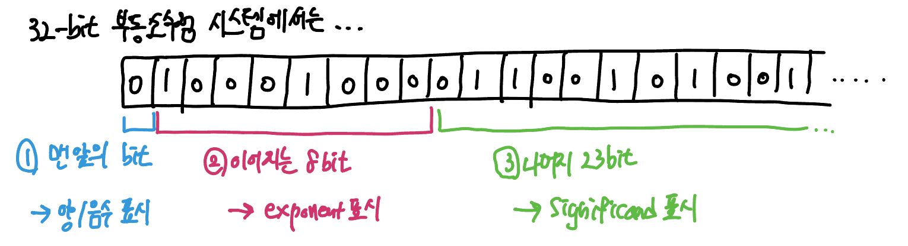

> 컴퓨터는 실수를 어떻게 표현할까? 

## 실수 표현하기 - 고정 소수점 

고정소수점 방식은 실수를 정수형 data에 **소수점의 위치를 고정**시켜서 표현하는 방식이다. 소수점의 위치는 사전에 정의되고 변경되지 않는다.

소수를 32bit로 표현한다고 가정했을 때, 고정소수점은 다음과 같이 구간을 나눈다:

1. 맨 앞의 1bit: 부호를 표시함
2. 15bit: 정수부를 표시함 
3. 16bit: 실수부를 표시함

직관적으로 정수부와 실수부를 분리하기 때문에 모든 계산을 기본적으로 정수 연산으로 수행한다. (방법에 따라 다르지만 소수점으로 계산하는 방식도 기본적으로 정수연산을 수행하고, 최종 결과에 다시 10^n^으로 나눈다.) 

그렇기에 *계산 속도*와 *리소스 사용면에서 효율적*이라는 장점이 있지만, <u>표현할 수 있는 숫자의 범위와 정밀도가 제한적</u>이라는 단점이 있다. 이에 대부분의 현대 프로그래밍 언어는 실수를 표현하는 방식으로 부동 소수점 방식을 채택한다.

그럼 언제 고정 소수점을 활용하는게 유리할까? 고정소수점은 리소스 요구가 적고 연산이 빠르다. 

- 임베디드 시스템과 같이 리소스가 제한적인 시스템은 고정 소수점 연산이 일반적이다. 부동 소수점 연산을 지원하는 HW가 없거나, 부동소수점 연산에 자원을 소모하는 것이 아깝기 때문이다. 
- 실시간 시스템에서도 고정 소수점 연산이 자주 이용된다

## 실수 표현하기 - 부동 소수점 (floating points)

*소수점이 동동 떠다니는 기법*이라고 해서 floating points이다. 부동소수점에 대한 국제표준은 **IEEE754** 에 정의되어있다. 해당 표준에는 어느 정도의 정밀도로 부동소수점을 표현하는지에 대해서도 분류가 되어있다. 즉, 실수를 표현할 때 얼마만큼의 data를 할애할 것인지에 대한 척도이다. 다음과 같다:

- Single Presision: 32bit
- Double Precision: 64bit 
- Quadruple Precision, Extended Precision···: 더욱 정밀한 실수 표현을 위해 사용된다. 기본 128bit이상

> **프로그래밍 언어들은 어떤 precision을 사용해서 실수를 표현할까?**
>
> 대부분의 old한 프로그래밍 언어들은 실수를 표현하는 자료형을 2개 지원한다. `float`과 `double` 자료형인데, 이 중 `float`은 single precision을 채택하기에 32bit이고, `double`은 double precision을 활용하기에 64bit의 공간을 차지한다.
>
> 만약 실수를 표현하는 자료형이 하나밖에 없을 경우, 이 때는 double precision을 활용한 실수표현일 가능성이 높다. Python과 Javascript 등이 이에 해당한다. (Javascript는 사실 실수 뿐 아니라 모든 숫자 타입을 64bit Double Precision으로 처리하긴 한다.)

#### 부동 소수점을 이루는 3가지 정보

우선 보다 단순한 single precision의 경우로 이해해보자. 총 32bit로 실수를 표현할 것이고, floating point를 표현하는데에는 3가지 정보가 필요하다. 

1. **부호 bit**: 맨 앞의 1bit가 부호를 표시한다.
2. **exponent bit**: 뒤이어 오는 8bit가 지수 부분을 표시한다.
3. **significand bit**: 나머지 23bit로 가수 부분을 표시한다.

#### 부동소수점을 직접 표현해보자 (10진수로, 2진수로)

이 세 파트를 이해하기 위해 2진수보다는 우선 10진수의 예시를 확인해보자: 

625.9라는 소수를 표현해보자. 먼저, 1의 자리를 남긴채로 소수점을 앞으로 쭉 밀어준다. 그리고 이를 10의 배수로 곱한 형태를 취하도록 만들어야 한다.

=> 6.259 * 10^3^ 으로 표시한다.

- 여기서 6259 부분은 <u>significand</u>이다
- 3은 <u>exponent</u>이다
- 그리고 생략되어있지만, 음/양수를 표기하는 <u>sign</u> bit가 존재한다

이번에는`123.625`라는 수를 binary를 이용해서 실제 floating point를 어떻게 계산하는지 확인해보자: 

1. 먼저, binary로 변환해주어야 한다.

   `1111011.101`이 된다. 정수부는 당연히 치환할 줄 알 것이고, *소수부는 2의 `-` 승*으로 계산하여 나타내면 된다. 즉, 여기서의 `0.101`은 1 * 2^-1^ + 0 * 2^-2^ + 1 * 2^-3^ 로 표현이 되는 것이다.

2. 소수점을 맨 앞 1의 자리를 남긴 채 쭉 밀어준다. (significand)

   `1.111011101`이 된다. 어떤 수를 표현하던지 0이 아닌 숫자라면 맨 앞자리수는 무조건 1일 수 밖에 없다. 그렇기에 해당 앞자리는 floating point 계산을 할 때 저장하지 않는다.

3. 2^n^을 곱해서 원래의 binary를 표현한다. (exponent)

   `1.111011101 * 2^6^` 으로 표현할 수 있다.

#### 부동 소수점은 고정 소수점보다 더 큰 범위의 소수를 표현할 수 있다.

고정 소수점은 물리적으로 정수부와 소수부를 절반씩 나누어 사용했다. 하지만 부동소수점 방식은 실수의 값 자체를 significand (23bit)에 넣어 표현하기 때문에 보다 큰 bit의 범위를 가진다. 

정수가 크든 작든 모두 significand에 밀어넣은 뒤에 전체 실수를 표현하기 때문에 공간 낭비도 해결되는 것이다.

## 컴퓨터가 0.1을 올바르게 표현하지 못하는 이유

대부분의 현대 컴퓨터가 IEEE754 표준인 부동소수점을 이용해 실수를 표현하기 때문이다. 고정소수점은 소수부 역시 정수처럼 연산하지만, 부동소수점 방식은 *소수부 역시 소수 그대로 binary로 표현*하게 된다.

정수 부분을 2진수로 변환하는 과정은 쉬웠다. 

- 15 = 1 * 2^3^ + 1 * 2^2^ + 1*  2^1^ + 1 * 2^0^ = 1111 (2)

하지만 소수점 아래의 숫자 (실수부)를 정확하게 2진수로 변환하는 것은 쉽지 않다. 2의 마이너스 승의 덧셈 조합으로 소수점의 값을 도출해내야 하는데, 모든 경우의 수를 표현하는 것이 불가능하기 때문이다.

- 예를들어, 0.625 라는 숫자는 2진수로 깔끔하게 표현할 수 있다.
  - 1 * 2^-1^ + 0 * 2^-2^ + 1* 2^-3^ = 1 * 0.5 + 0 * 0.25 + 1 * 0.125
    - 0.101 (2)
- 하지만, 0.1이라는 숫자는 2진수로 깔끔하게 표기할 수 없다.
  - 값이 올바르게 나누어 떨어지지 않고, `0.0001100110011···`을 반복하는 현상이 나타난다.

이러한 소수들을 **무한소수**라고 한다. 

> 소수의 끝이 5가 아닌 수를 2진수로 표현하고자 할 경우 무한 소수가 발생한다고 보면 된다. 

무한소수는 소수부의 표현 범위가 더 넓은 부동소수점 표현 방식으로도 감당할 수 없다. 아울러 이는 프로그래밍 언어에 귀속되는 특성이 아니라, 컴퓨터가 소수를 표현하는 메커니즘에서 오는 문제점이기에 모든 프로그래밍 언어는 실수 표현에 애로사항이 있다.

##### 이러한 실수 연산의 오차를 해결하려면? 

소수를 정수형 타입으로 치환하고 사용하거나, 실수 표기를 위한 클래스를 활용하면 된다. Java의 경우 `BigDecimal`이 있다.

